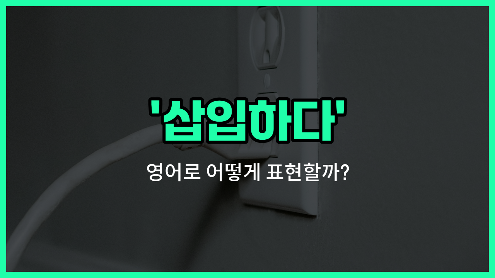

## 🌟 영어 표현 - insert

안녕하세요 👋 오늘은 영어로 '삽입하다'라는 뜻을 가진 표현, '**insert**'에 대해 알아보려고 해요. 'insert'는 어떤 물건이나 내용을 다른 것 안에 **끼워 넣거나, 집어넣는** 상황에서 자주 쓰이는 단어예요.

예를 들어, USB를 컴퓨터에 꽂을 때나, 문장에 단어를 추가할 때 모두 'insert'라는 표현을 사용할 수 있어요. 일상생활뿐만 아니라 컴퓨터, 기술, 문서 작업 등 다양한 분야에서 널리 쓰이는 단어예요!

'insert'는 동사로 '끼워 넣다', '넣다'라는 의미로도 활용할 수 있으니 상황에 맞게 사용해 보세요~

## 📖 예문

1. "카드를 기계에 삽입해 주세요."

   "Please insert your card into the machine."

2. "문장에 단어를 하나 삽입했어요."

   "I inserted a word into the sentence."

## 💬 연습해보기

<ul data-interactive-list>

  <li data-interactive-item>
    문서에 사진 좀 넣어줄래요? 어떻게 하는지 전혀 모르겠어요.
    Can you insert the picture into the <a href="/blog/in-english/824.document/">document</a> for me? I <a href="/blog/in-english/187.have-no-idea/">have no idea</a> how to do it.
  </li>

  <li data-interactive-item>
    이메일에 잘못된 파일을 실수로 넣어버렸어요. 잠깐만요, 금방 고칠게요.
    I <a href="/blog/in-english/314.accidentally/">accidentally</a> inserted the <a href="/blog/in-english/316.wrong/">wrong</a> file into the email. Oops, let me <a href="/blog/in-english/524.fix/">fix</a> that real <a href="/blog/in-english/439.quick/">quick</a>.
  </li>

  <li data-interactive-item>
    치과의사가 이빨에 작은 충전물을 넣어야 할 수도 있다고 했어요.
    The dentist said he might have to insert a small <a href="/blog/in-english/365.fill-in/">filling in</a> my tooth.
  </li>

  <li data-interactive-item>
    이 휴대폰에 SIM 카드 넣는 방법 아세요? 고장내기 싫거든요.
    Do you know how to insert a SIM card into this phone? I don't want to break it.
  </li>

  <li data-interactive-item>
    신용카드를 넣을 때는 칩이 위로 오게 해야 해요.
    When you insert your <a href="/blog/in-english/763.credit-card/">credit card</a>, <a href="/blog/in-english/232.make-sure/">make sure</a> the chip side is facing up.
  </li>

  <li data-interactive-item>
    계정에 접속하려면 비밀번호를 먼저 입력해야 해요.
    You have to insert your password before you can <a href="/blog/vocab-1/041.access/">access</a> the account.
  </li>

  <li data-interactive-item>
    대화 중간에 농담 하나 넣어봤는데 아무도 안 웃더라고요.
    I <a href="/blog/in-english/117.try-to/">tried to</a> insert a joke into the conversation, but nobody <a href="/blog/in-english/321.laugh/">laughed</a>.
  </li>

  <li data-interactive-item>
    선생님이 제 생각을 더 잘 설명하려면 단락 하나 더 넣으래요.
    My teacher told me to insert <a href="/blog/in-english/513.another/">another</a> paragraph to <a href="/blog/in-english/909.explain/">explain</a> my idea better.
  </li>

  <li data-interactive-item>
    컴퓨터 뒤쪽에 USB 드라이브 좀 꽂아줄래요? 손이 안 닿아요.
    Could you insert the USB drive into the back of the computer? I can't reach it.
  </li>

  <li data-interactive-item>
    새 행을 추가하고 싶으면 지금 행 아래에 그냥 넣으면 돼요.
    If you want to add a new row, just insert it below the current one.
  </li>

</ul>

## 🤝 함께 알아두면 좋은 표현들

### put in

'put in'은 '삽입하다'와 비슷하게 어떤 물건이나 내용을 안에 넣는다는 뜻이에요. 일상 대화에서는 물리적으로 무언가를 집어넣을 때 자주 쓰여요.

- "Can you put in the batteries before [turning on](/blog/in-english/310.turn-on/) the remote?"
- "리모컨을 켜기 전에 배터리를 넣어줄래요?"

### remove

'remove'는 '삽입하다'의 반대말로, '제거하다' 또는 '빼다'라는 뜻이에요. 이미 안에 들어가 있는 것을 꺼내거나 없애는 상황에서 사용해요.

- "Please remove the old files from the folder before adding new ones."
- "새 파일을 추가하기 전에 기존 파일들을 폴더에서 빼주세요."

### embed

'embed'는 '삽입하다'와 비슷하게, 어떤 것을 다른 것 안에 깊이 넣거나 고정시키는 의미예요. 주로 기술, 컴퓨터, 미디어 분야에서 많이 쓰여요.

- "You can embed a video into your presentation to [make it](/blog/in-english/244.make-it/) more engaging."
- "프레젠테이션에 동영상을 삽입하면 더 흥미롭게 만들 수 있어요."

---

오늘은 '삽입하다'라는 뜻을 가진 영어 표현 'insert'에 대해 알아봤어요. 앞으로 무언가를 끼워 넣거나 추가할 때 이 단어를 떠올려 보세요~ 😊

오늘 배운 표현과 예문들을 꼭 소리 내서 여러 번 읽어보세요. 다음에도 더 유익한 영어 표현으로 찾아올게요! 감사합니다~
