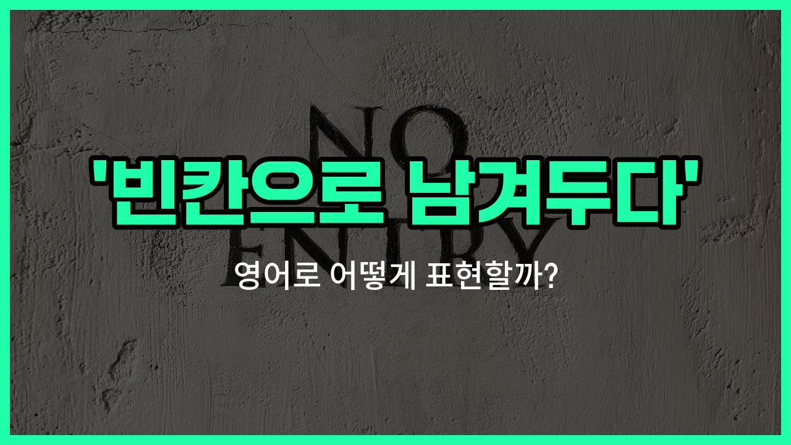

## 🌟 영어 표현 - leave blank

안녕하세요 👋 오늘은 영어로 '빈칸으로 남겨두다'라는 표현을 어떻게 하는지 알아볼 거예요. 바로 '**[leave](/blog/in-english/402.leave/) blank**'라는 표현을 사용해요.

'**leave blank**'는 말 그대로 어떤 칸이나 공간을 채우지 않고 비워두는 것을 의미해요. 시험지, 설문지, 양식 등에서 자주 볼 수 있는 표현이에요. 예를 들어, 답을 모르는 문제의 칸을 그냥 두거나, 특별히 입력하지 않아야 할 부분을 비워둘 때 사용할 수 있어요.

이 표현은 일상생활뿐만 아니라 공식적인 문서나 시험에서도 자주 쓰이니 꼭 알아두면 좋아요!

## 📖 예문

1. "이 부분은 빈칸으로 남겨두세요."

   "Please leave this section blank."

2. "답을 모르면 빈칸으로 두어도 돼요."

   "If you don't know the answer, you can leave it blank."

## 💬 연습해보기

<ul data-interactive-list>

  <li data-interactive-item>
    답을 모르면 그냥 빈칸으로 놔둬요.
    When you don't know the answer, just leave it blank.
  </li>

  <li data-interactive-item>
    폼에서 그 부분을 깜빡하고 안 적어서 빈칸으로 뒀어요.
    I <a href="/blog/in-english/023.forget/">forgot</a> to <a href="/blog/in-english/560.fill-out/">fill out</a> that part of the form, so I left it blank.
  </li>

  <li data-interactive-item>
    설명서에 안 해당되면 여기 빈칸으로 두라고 나와 있어요.
    The instructions say to leave this section blank if it doesn't apply to you.
  </li>

  <li data-interactive-item>
    답하기 불편한 질문은 빈칸으로 남겨도 돼요.
    You can leave blank any questions that you don't feel comfortable answering.
  </li>

  <li data-interactive-item>
    보통 제출할 준비 됐을 때까지 서명란은 빈칸으로 놔둬요.
    I usually leave the signature line blank until I'm ready to <a href="/blog/in-english/961.submit/">submit</a>.
  </li>

  <li data-interactive-item>
    빈칸으로 두면 요청 처리가 안 될 수도 있어요.
    If you leave it blank, they might not process your request.
  </li>

  <li data-interactive-item>
    선생님이 시간 안 되면 못 푼 부분은 빈칸으로 두라고 하셨어요.
    My teacher told us to leave blank any parts we couldn't <a href="/blog/in-english/295.finish/">finish</a> in time.
  </li>

  <li data-interactive-item>
    피드백 공간이 비어 있던데, 괜찮아요?
    I <a href="/blog/in-english/061.notice/">noticed</a> you left the <a href="/blog/in-english/897.feedback/">feedback</a> space blank. Is everything okay?
  </li>

  <li data-interactive-item>
    잘 몰라도 우선은 그냥 빈칸으로 두세요.
    Just leave blank anything you're not sure about for now.
  </li>

  <li data-interactive-item>
    수표 작성 중 금액 모르면 빈칸으로 두는 게 좋아요.
    If you're filling out a check and don't know the amount yet, it's better to leave it blank.
  </li>

</ul>

## 🤝 함께 알아두면 좋은 표현들

### fill in

'[fill in](/blog/in-english/365.fill-in/)'은 "빈칸을 채우다" 또는 "작성하다"라는 뜻이에요. 주로 서류나 양식, 시험지 등에서 빈칸에 필요한 정보를 적을 때 사용해요. 'leave blank'의 반대되는 의미로, 빈칸을 그냥 두지 않고 내용을 입력하는 상황에서 자주 써요.

- "Please fill in all the [required](/blog/in-english/155.require/) fields on the form before submitting it."
- "제출하기 전에 양식의 필수 항목을 모두 채워주세요."

### skip a question

'[skip](/blog/in-english/369.skip/) a question'은 "질문을 건너뛰다"라는 뜻이에요. 시험이나 설문지 등에서 어떤 문제나 질문에 답하지 않고 넘어가는 상황을 말해요. 'leave blank'와 비슷하게, 답을 적지 않고 그냥 지나치는 경우에 사용돼요.

- "If you don't know the answer, you can skip the question and come back to it later."
- "답을 모르면 그 문제는 건너뛰고 나중에 다시 돌아와도 돼요."

### complete the form

'complete the form'은 "양식을 완전히 작성하다"라는 의미예요. 빈칸 없이 모든 항목을 빠짐없이 채우는 것을 강조할 때 써요. 'leave blank'의 반대 개념으로, 모든 정보를 다 입력해야 할 때 자주 사용돼요.

- "[Make sure](/blog/in-english/232.make-sure/) to complete the form before the [deadline](/blog/in-english/830.deadline/)."
- "마감일 전에 양식을 빠짐없이 작성해 주세요."

---

오늘은 '빈칸으로 남겨두다'라는 뜻의 영어 표현 '**leave blank**'에 대해 알아봤어요. 앞으로 문서나 시험지를 작성할 때 이 표현을 떠올려 보세요 😊

오늘 배운 표현과 예문들을 꼭 최소 3번씩 소리 내서 읽어보세요. 다음에도 더 재미있고 유익한 영어 표현으로 찾아올게요! 감사합니다!

