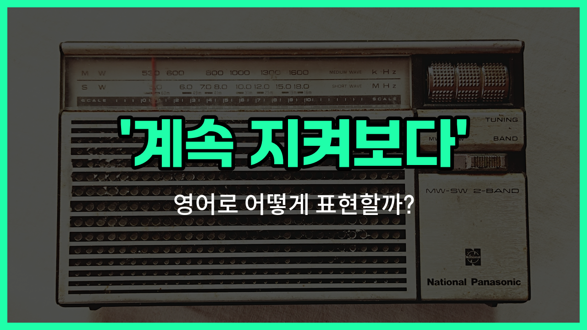

## 🌟 영어 표현 - stay tuned

안녕하세요 👋 오늘은 영어 표현 '**stay tuned**'에 대해 알아보려고 해요. 이 표현은 '계속 지켜보다', '계속 주목하다', '계속 관심을 가지다'라는 뜻을 가지고 있어요.

'**stay tuned**'는 원래 라디오나 TV 방송에서 채널을 바꾸지 말고 계속 들어달라는 의미로 많이 쓰였어요. 하지만 요즘에는 어떤 소식이나 업데이트, 새로운 정보가 곧 나올 예정이니 계속 관심을 가져달라는 의미로도 자주 사용돼요!

예를 들어, 회사에서 새로운 제품이 곧 출시될 예정일 때 "Stay tuned for more updates!"라고 할 수 있어요. 또는 유튜브 영상 끝에서 "다음 영상도 기대해 주세요!"라는 의미로 "Stay tuned for the next episode!"라고 말할 수 있어요.

이처럼 '**stay tuned**'는 앞으로 있을 일이나 소식에 대해 계속 관심을 가져달라고 할 때 정말 유용하게 쓸 수 있는 표현이에요.

## 📖 예문

1. "새로운 소식이 곧 공개될 예정이니 계속 지켜봐 주세요."

   "Stay tuned for more exciting [news](/blog/in-english/536.news/)."

2. "다음 주에 더 많은 정보를 알려드릴 테니 계속 주목해 주세요."

   "Stay tuned for more information next week."

## 💬 연습해보기

<ul data-interactive-list>

  <li data-interactive-item>
    제 브이로그 봐주셔서 감사해요. 다음 주에 더 많은 영상으로 만나요!
    Thanks for watching my vlog. Stay tuned for more videos next week!
  </li>

  <li data-interactive-item>
    곧 우승자를 발표할 거예요. 놓치지 말고 계속 지켜봐 주세요.
    We're about to <a href="/blog/in-english/816.announce/">announce</a> the winner. Stay tuned so you don't <a href="/blog/in-english/339.miss/">miss</a> it.
  </li>

  <li data-interactive-item>
    신나는 업데이트가 곧 찾아올 거예요. 계속 기대해 주세요!
    There are some exciting updates coming soon. Stay tuned!
  </li>

  <li data-interactive-item>
    잠깐 쉬는 시간 후에 바로 돌아올게요. 계속 기다려 주세요.
    Stay tuned. We'll be right back after this short break.
  </li>

  <li data-interactive-item>
    콘서트 티켓 판매 시작 시간을 잘 모르겠지만, 업데이트 있으면 알려드릴게요. 계속 봐 주세요.
    I'm not sure when the concert tickets go <a href="/blog/in-english/449.on-sale/">on sale</a>, but stay tuned for updates.
  </li>

  <li data-interactive-item>
    여기서 가시지 마세요, 여러분. 더 많은 정보 곧 알려드릴게요. 계속 지켜봐 주세요.
    Don't go anywhere, folks. Stay tuned for more details.
  </li>

  <li data-interactive-item>
    최신 소식은 저희 SNS에서 확인하세요. 계속 주목해 주세요!
    Stay tuned to our social media for the latest news.
  </li>

  <li data-interactive-item>
    새 시즌이 거의 다 왔어요, 기대해 주세요!
    The new season is <a href="/blog/in-english/854.almost/">almost</a> here, so stay tuned!
  </li>

  <li data-interactive-item>
    아직 모든 정보를 공개할 순 없지만, 기다릴 만한 가치 있을 거예요. 계속 지켜봐 주세요~
    I can't <a href="/blog/in-english/248.share/">share</a> all the info yet, but stay tuned—it'll be worth the wait.
  </li>

  <li data-interactive-item>
    준비 마치는 동안 잠깐만 기다려 주세요.
    Stay tuned while we <a href="/blog/in-english/295.finish/">finish</a> setting things up.
  </li>

</ul>

## 🤝 함께 알아두면 좋은 표현들

### keep an eye on

'[keep an eye on](/blog/in-english/225.keep-an-eye-on/)'은 "계속 주시하다" 또는 "계속 지켜보다"라는 뜻이에요. 어떤 상황이나 사람, 혹은 정보를 놓치지 않고 계속해서 관찰하거나 신경 쓰고 있다는 의미로 자주 사용돼요.

- "Keep an eye on our website for the latest updates."
- "최신 소식이 올라오니까 저희 웹사이트를 계속 지켜봐 주세요."

### lose interest

'[lose](/blog/in-english/457.lose/) interest'는 "관심을 잃다"라는 뜻이에요. 더 이상 어떤 일이나 정보에 신경을 쓰지 않거나, 지켜보지 않게 되는 상황에서 쓰는 반대 표현이에요.

- "Some viewers lost interest after the first episode."
- "몇몇 시청자들은 첫 번째 에피소드 이후로 관심을 잃었어요."

### stay in the loop

'stay in the loop'은 "정보를 계속 받다" 또는 "상황을 계속 파악하다"라는 뜻이에요. 중요한 소식이나 변화가 있을 때, 계속해서 관련 정보를 받아보고 싶을 때 자주 쓰는 표현이에요.

- "If you want to stay in the loop, sign up for our newsletter."
- "계속 소식을 받고 싶으시면 저희 뉴스레터에 가입해 주세요."

---

오늘은 '계속 지켜보다', '계속 주목하다', '계속 관심을 가지다'라는 뜻을 가진 영어 표현 '**stay tuned**'에 대해 알아봤어요. 앞으로 새로운 소식이나 업데이트가 있을 때 이 표현을 꼭 활용해 보세요! 😊

오늘 배운 표현과 예문들을 꼭 최소 3번씩 소리 내서 읽어보세요. 다음에도 더 재미있고 유익한 영어 표현으로 찾아올게요! 감사합니다!
