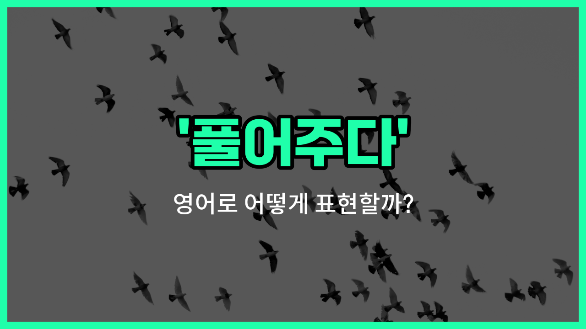

## 🌟 영어 표현 - release

안녕하세요 👋 오늘은 영어로 '**풀어주다**'라는 뜻을 가진 표현 '**release**'에 대해 알아보려고 해요.

'**release**'는 무언가를 자유롭게 놓아주거나, 억류되어 있던 것을 풀어주는 상황에서 자주 쓰이는 단어예요. 예를 들어, 동물을 자연으로 돌려보내거나, 누군가를 감옥에서 석방할 때 사용할 수 있어요.

또한, 감정이나 정보, 영화, 음악 등을 '공개하다', '발표하다'라는 의미로도 널리 쓰여요. 하지만 오늘은 주로 '풀어주다', '석방하다', '놓아주다'라는 의미에 집중해서 설명해볼게요!

## 📖 예문

1. "그는 새를 풀어주었어요."

   "He released the bird."

2. "경찰이 용의자를 석방했어요."

   "The police released the suspect."

3. "그녀는 손을 놓아주었어요."

   "She released his hand."

## 💬 연습해보기

<ul data-interactive-list>

  <li data-interactive-item>
    영화가 끝나고 나서야 드디어 새 예고편이 온라인에 나왔어요. 모두가 그걸 엄청 기다리고 있었거든요.
    After the movie ended, they <a href="/blog/in-english/182.finally/">finally</a> released the new trailer online. Everybody had been <a href="/blog/in-english/377.wait-for/">waiting for</a> it.
  </li>

  <li data-interactive-item>
    경찰이 나타나자 파티에 있던 사람들을 그냥 경고만 하고 다 풀어줬어요. 사람들이 걱정했거든요, 뭐라도 큰일 날까 봐.
    When the cops <a href="/blog/in-english/381.show-up/">showed up</a>, they released everyone from the party with just a warning. People were worried they'd get in trouble.
  </li>

  <li data-interactive-item>
    우리 강아지가 울타리에 끼었는데 다행히 다치기 전에 겨우 꺼냈어요.
    My dog got <a href="/blog/in-english/389.stuck/">stuck</a> in the fence, but luckily I <a href="/blog/in-english/175.manage-to/">managed to</a> release him before he got hurt.
  </li>

  <li data-interactive-item>
    이번 달에 새 아이폰이 나온대요. 벌써 사람들이 줄 서서 기다리고 있더라고요.
    They'll release the new iPhone next month. People are already lining up to get it.
  </li>

  <li data-interactive-item>
    주차 브레이크 좀 풀어줄래요? 익숙하지 않은 차 운전할 때마다 깜빡하거든요.
    Can you release the parking brake for me? I keep <a href="/blog/in-english/023.forget/">forgetting</a> to do that when I drive an <a href="/blog/in-english/337.unfamiliar/">unfamiliar</a> car.
  </li>

  <li data-interactive-item>
    회사가 이번 상황에 대해 공식 입장을 발표하기로 했대요. 소문이 엄청 많았거든요.
    The company <a href="/blog/in-english/062.decide-to/">decided to</a> release a statement about the situation. There had been a lot of <a href="/blog/in-english/798.rumor/">rumors</a> going around.
  </li>

  <li data-interactive-item>
    그가 크게 심호흡을 하고 일 스트레스 다 풀려고 노력했어요. 어떤 날은 정말 힘들더라고요.
    He took a <a href="/blog/in-english/428.deep/">deep</a> breath and <a href="/blog/in-english/117.try-to/">tried to</a> release all the stress from work. Some days are harder than others.
  </li>

  <li data-interactive-item>
    의사가 내일 상태가 괜찮으면 병원에서 퇴원시켜줄 수 있다고 했어요.
    The <a href="/blog/in-english/563.doctor/">doctor</a> said he can release you from the hospital tomorrow if everything looks good.
  </li>

  <li data-interactive-item>
    그 음료 한정판 맛 새로 나온대요. 너무 기대돼서 빨리 먹어보고 싶어요.
    I heard they're going to release a limited edition flavor of that drink. I can't wait to try it.
  </li>

  <li data-interactive-item>
    등산하다 다치지 않게 밧줄을 꽉 잡은 손을 놓아야 했어요. 안전이 제일이니까요.
    She had to release her grip on the rope so she wouldn't get hurt while climbing. Safety first.
  </li>

</ul>

## 🤝 함께 알아두면 좋은 표현들

### set free

'set free'는 "자유롭게 해주다" 또는 "석방하다"라는 뜻이에요. 누군가나 무언가를 구속이나 감금 상태에서 풀어주는 상황에서 자주 쓰여요. 감정적으로도 억눌린 상태에서 벗어나게 해줄 때 사용할 수 있어요.

- "The rescue team set the trapped animals free after the flood."
- "구조팀이 홍수 이후에 갇혀 있던 동물들을 풀어줬어요."

### confine

'confine'은 "가두다" 또는 "제한하다"라는 뜻으로, 'release'의 반대말이에요. 누군가를 공간이나 상황에 묶어두거나 자유를 제한할 때 사용해요.

- "The dog was confined to a small cage for several hours."
- "그 강아지는 몇 시간 동안 작은 우리에 갇혀 있었어요."

### let go

'let go'는 "놓아주다" 또는 "풀어주다"라는 뜻이에요. 물리적으로 잡고 있던 것을 놓거나, 감정적으로 집착하던 것을 내려놓을 때도 쓸 수 있어요. 일상 대화에서 자주 쓰이는 표현이에요.

- "She finally decided to let go of her worries and enjoy the [vacation](/blog/in-english/516.vacation/)."
- "그녀는 결국 걱정을 내려놓고 휴가를 즐기기로 했어요."

---

오늘은 '**풀어주다**', '**석방하다**', '**놓아주다**'라는 뜻을 가진 영어 표현 '**release**'에 대해 알아봤어요. 누군가를 자유롭게 해주거나, 억류된 것을 풀어줄 때 이 표현을 떠올리면 좋겠어요 😊

오늘 배운 표현과 예문들을 꼭 최소 3번씩 소리 내서 읽어보세요. 다음에도 더 재미있고 유익한 영어 표현으로 찾아올게요! 감사합니다!

