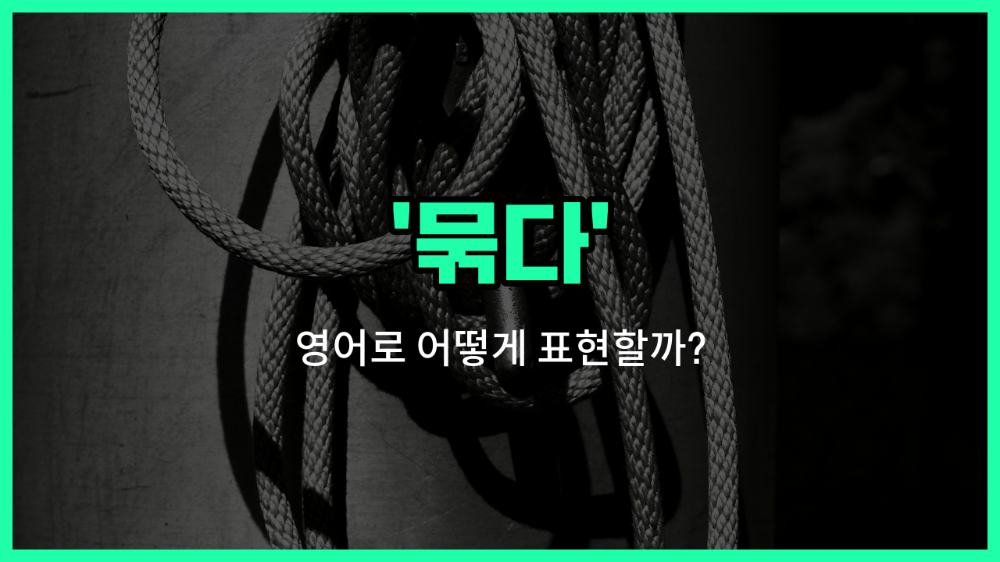

## 🌟 영어 표현 - bind

안녕하세요 👋 오늘은 '묶다'라는 뜻을 가진 영어 표현 '**bind**'에 대해 알아보려고 해요. 'bind'는 무언가를 함께 묶거나 결속시키는 상황에서 자주 쓰이는 단어예요.

예를 들어, 책을 제본할 때 여러 장의 종이를 하나로 묶는 것도 'bind'라고 할 수 있어요. 또, 사람들 사이의 관계나 약속을 '결속하다', '연결하다'라는 의미로도 사용할 수 있답니다!

이 단어는 실생활에서 다양하게 활용할 수 있어서 알아두면 정말 유용해요. 예를 들어, 밧줄로 상자를 묶거나, 계약서로 서로의 약속을 결속할 때 모두 'bind'를 쓸 수 있어요.

## 📖 예문

1. "그는 밧줄로 상자를 단단히 묶었어요."

   "He bound the box tightly with a rope."

2. "계약은 우리를 서로 결속시켜요."

   "The contract binds us [together](/blog/in-english/374.together/)."

## 💬 연습해보기

<ul data-interactive-list>

  <li data-interactive-item>
    요리사가 허브를 묶으려고 실을 썼는데, 나중에 꺼내기 더 편하게 해요.
    The chef <a href="/blog/in-english/171.used/">used</a> a piece of string to bind the herbs together. It makes them easier to <a href="/blog/in-english/362.take-out/">take out</a> later.
  </li>

  <li data-interactive-item>
    호치키스 없으면 클립으로 종이 묶어도 되니까, 빠지지만 않게 잘 챙기면 돼요.
    You can bind the papers with a clip if you don't have a stapler. Just <a href="/blog/in-english/232.make-sure/">make sure</a> they don't fall out.
  </li>

  <li data-interactive-item>
    가끔 선들이 여기저기 흩어지지 않게 모아서 묶어야 하는데, 그래야 훨씬 깔끔해 보여요.
    <a href="/blog/in-english/270.sometimes/">Sometimes</a> you have to bind the wires together so they're not all over the place. It looks neater that way.
  </li>

  <li data-interactive-item>
    이사할 때 엄마가 골판지 박스들 줄로 단단히 묶으라고 하셨는데, 안 그러면 들어 올릴 때 박스가 터질 수 있대요.
    Mom told me to bind the cardboard boxes with some rope before we moved. Otherwise they'll pop open when you pick them up.
  </li>

  <li data-interactive-item>
    이 책들 좀 묶는 거 도와줄래요? 수업 때 같이 있어야 해서요.
    Can you help me bind these books? I need them to stay together for class.
  </li>

  <li data-interactive-item>
    부러진 의자 다리를 테이프로 붙여보려 했는데 오래 못 가서, 진짜 공구가 필요할 것 같아요.
    He <a href="/blog/in-english/117.try-to/">tried to</a> bind the broken chair leg with some tape, but it didn't last long. Looks like we'll need real tools.
  </li>

  <li data-interactive-item>
    신발끈 급하게 묶으면 금방 풀리니까 조심하는 게 좋아요.
    It's not <a href="/blog/in-english/857.safe/">safe</a> to just bind your shoelaces <a href="/blog/in-english/174.in-a-hurry/">in a hurry</a>. They'll come undone again.
  </li>

  <li data-interactive-item>
    묶음이 흐트러지지 않도록 가지들을 꽉 묶었어요.
    We had to bind the branches together to make sure the bundle didn't fall apart.
  </li>

  <li data-interactive-item>
    헤드폰 가방에 넣을 때 정리하려면 묶어야 엉키지 않아요.
    Bind your headphones when you put them in your bag or they'll get all tangled up.
  </li>

  <li data-interactive-item>
    신문들이 바람에 날아가지 않게 줄로 묶었어요.
    They bound the newspapers with string so they wouldn't blow away in the wind.
  </li>

</ul>

## 🤝 함께 알아두면 좋은 표현들

### tie up

'[tie](/blog/in-english/396.tie/) up'은 '묶다', '매다'라는 뜻으로, 물리적으로 끈이나 줄로 무언가를 단단히 고정하거나 묶는 상황에서 자주 써요. 'bind'와 비슷하게 사용되지만, 좀 더 일상적이고 구체적인 상황에서 많이 쓰여요.

- "Can you tie up the boxes before we move them?"
- "박스들 옮기기 전에 좀 묶어줄래요?"

### untie

'untie'는 '묶인 것을 풀다'라는 뜻이에요. 'bind'의 반대말로, 끈이나 줄로 묶여 있던 것을 다시 풀어주는 상황에서 사용해요.

- "Could you help me untie this [knot](/blog/in-english/1022.knot/)?"
- "이 매듭 좀 풀어줄 수 있어요?"

### fasten

'fasten'은 '단단히 고정하다', '잠그다', '채우다'라는 뜻이에요. 꼭 끈이나 줄로 묶는 것뿐만 아니라, 단추나 벨트, 안전벨트 등 다양한 것을 단단히 고정할 때 쓸 수 있어요.

- "Please fasten your seatbelt before the plane [takes off](/blog/in-english/737.take-off/)."
- "비행기가 이륙하기 전에 안전벨트 꼭 매주세요."

---

오늘은 '묶다', '결속하다', '연결하다'라는 뜻을 가진 영어 표현 'bind'에 대해 알아봤어요. 일상에서 무언가를 묶거나, 사람들 사이의 관계를 표현할 때 이 단어를 떠올려 보세요 😊

오늘 배운 표현과 예문들을 꼭 소리 내서 여러 번 읽어보세요. 다음에도 더 유익한 영어 표현으로 찾아올게요! 감사합니다!

