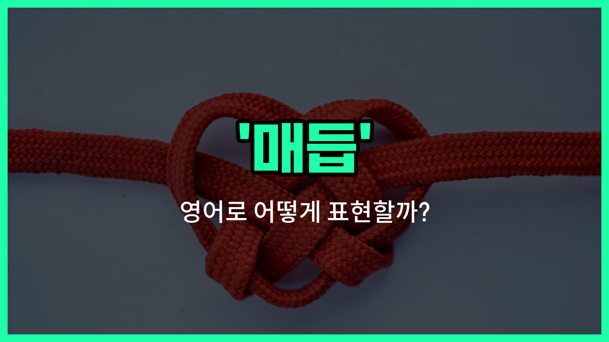

## 🌟 영어 표현 - knot

안녕하세요 👋 오늘은 '매듭'이라는 뜻을 가진 영어 단어 '**knot**'에 대해 알아보려고 해요.

'**knot**'는 줄이나 끈을 묶어서 생기는 '매듭'을 의미해요. 우리가 신발끈을 묶거나, 선물을 포장할 때 끈을 묶는 그 동작에서 만들어지는 모양이 바로 'knot'이에요.

이 단어는 명사로 '매듭'이라는 뜻뿐만 아니라, 동사로 '묶다', '매듭을 짓다'라는 의미로도 자주 사용돼요. 또, 비유적으로는 '얽히다', '복잡하게 되다'라는 뜻으로도 쓰여서 다양한 상황에서 활용할 수 있어요!

예를 들어, 신발끈이 풀렸을 때 "[Tie](/blog/in-english/396.tie/) your shoelaces in a knot."라고 할 수 있어요. 또는, 머리가 복잡할 때 "My thoughts are all in knots."라고 표현할 수도 있어요.

## 📖 예문

1. "나는 줄에 단단한 매듭을 만들었어요."

   "I made a tight knot in the rope."

2. "신발끈을 매듭지어 묶어 주세요."

   "Please tie your shoelaces in a knot."

3. "그 문제는 너무 복잡하게 얽혀 있어요."

   "The problem is all tied up in knots."

## 💬 연습해보기

<ul data-interactive-list>

  <li data-interactive-item>
    내 신발끈에 있는 매듭이 너무 꽉 묶여서 풀 수가 없어요.
    I can't get this knot out of my shoelace, it's so tight.
  </li>

  <li data-interactive-item>
    암벽등반하기 전에 밧줄 매듭이 튼튼히 묶였는지 꼭 확인해요.
    Before you go rock climbing, <a href="/blog/in-english/232.make-sure/">make sure</a> your rope knot is <a href="/blog/in-english/492.secure/">secure</a>.
  </li>

  <li data-interactive-item>
    어릴 때 스카우트 활동하면서 정매듭 묶는 법 배웠어요.
    I <a href="/blog/in-english/245.learn/">learned</a> how to tie a square knot in Scouts when I was a kid.
  </li>

  <li data-interactive-item>
    넥타이 매는 거 할 줄 알아요? 인터뷰 전에 항상 헷갈려서 못하겠어요.
    Do you know how to knot a tie? I always mess it up before interviews.
  </li>

  <li data-interactive-item>
    사람들 앞에서 말할 때마다 속이 울렁거리면서 매듭이 지는 기분이에요.
    There's a knot in my stomach every time I have to speak in public.
  </li>

  <li data-interactive-item>
    목걸이 줄에 작은 매듭이 생겼는데, 풀어줄 수 있어요?
    The necklace chain has a tiny knot. Could you help me untangle it?
  </li>

  <li data-interactive-item>
    결과 기다리면서 긴장돼서 손가락을 매듭처럼 꼭 꼬았어요.
    He nervously knotted his fingers <a href="/blog/in-english/374.together/">together</a> as he <a href="/blog/in-english/377.wait-for/">waited for</a> the results.
  </li>

  <li data-interactive-item>
    헤드폰은 꼭 가방에서 꺼낼 때마다 선이 하나는 꼬여 있어서 풀어야 해요.
    My headphones always come out of my bag with <a href="/blog/in-english/167.at-least/">at least</a> one knot in the wire.
  </li>

  <li data-interactive-item>
    뛰러 가기 전에 머리를 빵끗 묶었어요.
    She knotted her hair up in a bun before going for a run.
  </li>

  <li data-interactive-item>
    실에 단단한 매듭이 있을 때 푸는 꿀팁 알려줄게요.
    Let me show you a trick to <a href="/blog/in-english/398.get-rid-of/">get rid of</a> that stubborn knot in your thread.
  </li>

</ul>

## 🤝 함께 알아두면 좋은 표현들

### tie a knot

'tie a knot'은 "매듭을 묶다"라는 뜻이에요. 실제로 끈이나 실을 이용해 매듭을 만드는 행위뿐만 아니라, 결혼하다(비유적으로)라는 의미로도 자주 쓰여요.

- "Can you help me tie a knot in this rope?"
- "이 밧줄에 매듭 좀 묶는 거 도와줄 수 있어요?"

### untie a knot

'untie a knot'은 "매듭을 풀다"라는 뜻이에요. 실이나 끈에 묶인 매듭을 풀 때 쓰는 표현이고, 비유적으로는 복잡한 문제나 상황을 해결한다는 의미로도 사용돼요.

- "It took me ten minutes to untie the knot in my shoelaces."
- "신발끈에 묶인 매듭을 푸는 데 10분이나 걸렸어요."

### tangled up

'tangled up'은 "엉키다" 또는 "얽히다"라는 뜻이에요. 실이나 머리카락, 줄 등이 서로 꼬여서 풀기 힘든 상태를 말할 때 자주 써요. 비유적으로는 상황이나 관계가 복잡하게 꼬였을 때도 사용돼요.

- "My headphones always get tangled up in my bag."
- "제 이어폰은 가방 안에서 항상 엉켜버려요."

---

오늘은 '매듭', '묶다', '얽히다'라는 뜻을 가진 영어 단어 '**knot**'에 대해 알아봤어요. 일상에서 줄이나 끈을 묶을 때, 또는 복잡한 상황을 설명할 때 이 표현을 떠올려 보세요 😊

오늘 배운 표현과 예문들을 꼭 최소 3번씩 소리 내서 읽어보세요. 다음에도 더 재미있고 유익한 영어 표현으로 찾아올게요! 감사합니다!

