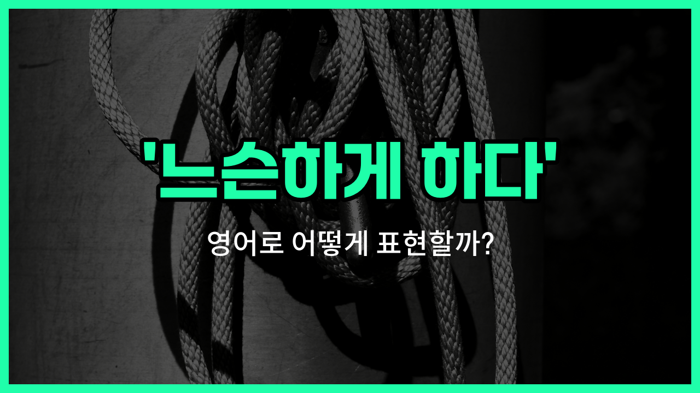

## 🌟 영어 표현 - loosen

안녕하세요 👋 오늘은 무언가를 '느슨하게 하다', '풀다', '완화하다'라는 뜻을 가진 영어 표현을 소개해드릴게요. 바로 '**loosen**'이에요.

'**loosen**'은 어떤 물건이나 상태를 더 느슨하게 만들거나, 단단히 묶여 있던 것을 풀어주는 상황에서 자주 사용돼요. 예를 들어, 신발끈이 너무 꽉 묶여 있을 때, 혹은 넥타이가 너무 답답할 때 'loosen'이라는 단어를 쓸 수 있어요.

또한, 규칙이나 제한을 완화할 때도 'loosen'을 사용할 수 있어요. 예를 들어, 엄격한 규칙을 조금 더 유연하게 바꿀 때도 이 표현이 쓰인답니다!

## 📖 예문

1. "신발끈을 좀 느슨하게 해도 돼요."

   "You can loosen your shoelaces a bit."

2. "회의 분위기를 좀 풀어볼까요?"

   "Shall we loosen up the atmosphere in the meeting?"

3. "정부가 규제를 완화했어요."

   "The [government](/blog/in-english/608.government/) has loosened the regulations."

## 💬 연습해보기

<ul data-interactive-list>

  <li data-interactive-item>
    병뚜껑이 너무 꽉 끼어서 수건으로 풀어야 했어요. 진짜 꽉 조였더라구요!
    The jar lid was <a href="/blog/in-english/389.stuck/">stuck</a>, so I had to loosen it with a <a href="/blog/in-english/555.towel/">towel</a>. It was way too tight!
  </li>

  <li data-interactive-item>
    조금만 힘을 빼줄래요? 너무 꽉 잡고 있어요.
    Can you loosen your grip a little? You're <a href="/blog/in-english/388.hold/">holding</a> on too tight.
  </li>

  <li data-interactive-item>
    보통 퇴근하면 넥타이를 바로 푸는데 그렇게 하면 훨씬 편해요.
    I usually loosen my <a href="/blog/in-english/396.tie/">tie</a> as soon as I get home from work. It feels so much better.
  </li>

  <li data-interactive-item>
    전체 분해하기 전에 나사를 먼저 좀 풀어봐요. 완전 꽉 조여져 있어요.
    <a href="/blog/in-english/117.try-to/">Try to</a> loosen the screws before you take the whole thing apart. They're really stuck.
  </li>

  <li data-interactive-item>
    코치님이 게임 전에 긴장 풀고 편하게 하라 하셨어요.
    The coach told me to loosen up and not be so <a href="/blog/in-english/115.nervous/">nervous</a> before the game.
  </li>

  <li data-interactive-item>
    신발이 좀 꽉 끼는데, 끈 좀 풀어야겠어요.
    My shoes are a bit tight. I need to loosen the laces.
  </li>

  <li data-interactive-item>
    답답하면 안전벨트를 조금만 풀어요.
    Loosen your seatbelt just a little if it's <a href="/blog/in-english/887.uncomfortable/">uncomfortable</a>.
  </li>

  <li data-interactive-item>
    저녁에 너무 많이 먹고 벨트를 느슨하게 푼 적 있어요. 진짜 배불렀거든요!
    He loosened his belt after eating too much at dinner. He was so full!
  </li>

  <li data-interactive-item>
    치과 의사쌤이 제 이 하나가 흔들리기 시작한다고 하셨어요. 좀 흔들거리거든요.
    My dentist told me that one of my teeth is starting to loosen. It's kind of wiggly.
  </li>

  <li data-interactive-item>
    머리가 아파서 포니테일을 느슨하게 풀었어요.
    She loosened her ponytail because it was giving her a headache.
  </li>

</ul>

## 🤝 함께 알아두면 좋은 표현들

### relax

'relax'는 "긴장을 풀다" 또는 "편안하게 하다"라는 뜻이에요. 몸이나 마음의 긴장 상태를 느슨하게 만들어서 편안하게 만드는 상황에서 자주 사용돼요.

- "After a long day at work, I like to relax with some music."
- "하루 종일 일하고 나면 음악 들으면서 긴장을 풀고 싶어요."

### tighten

'tighten'은 "조이다" 또는 "더 단단하게 하다"라는 뜻이에요. 무언가를 더 느슨하지 않게, 단단하게 만드는 상황에서 쓰여요. 'loosen'의 반대말이에요.

- "[Make sure](/blog/in-english/232.make-sure/) to tighten the lid so the jar doesn't leak."
- "병에서 새지 않게 뚜껑을 꼭 조여야 해요."

### let up

'let up'은 "약해지다" 또는 "느슨해지다"라는 뜻으로, 긴장이나 강도가 줄어드는 상황에서 사용돼요. 주로 날씨, 규칙, 압박 등이 약해질 때도 많이 써요.

- "The rain [finally](/blog/in-english/182.finally/) let up in the afternoon."
- "오후가 되니까 비가 드디어 약해졌어요."

---

오늘은 '느슨하게 하다', '풀다', '완화하다'라는 뜻을 가진 영어 표현 '**loosen**'에 대해 알아봤어요. 일상에서 무언가를 풀거나, 긴장을 완화하고 싶을 때 이 단어를 떠올려보세요 😊

오늘 배운 표현과 예문들을 꼭 소리 내서 여러 번 읽어보세요. 다음에도 더 유익한 영어 표현으로 찾아올게요! 감사합니다!

