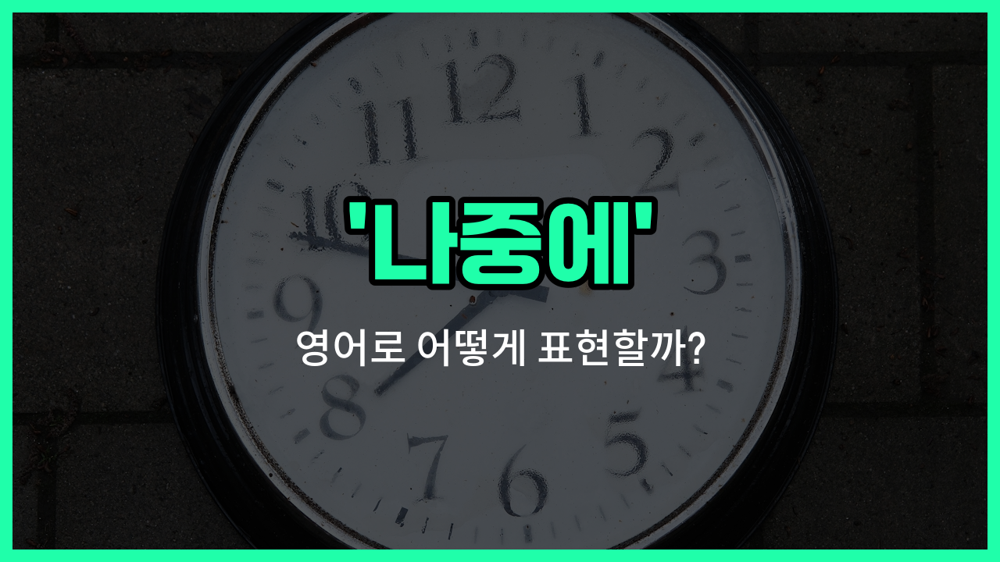

## 🌟 영어 표현 - later

안녕하세요 👋 오늘은 일상에서 정말 자주 쓰는 표현인 '**나중에**'의 영어 표현 '**later**'에 대해 알아보려고 해요.

'**later**'는 어떤 일이 지금이 아닌 **조금 뒤에** 또는 **미래의 어느 시점에** 일어날 때 사용하는 단어예요. 우리가 친구에게 "이따가 보자" 또는 "나중에 이야기하자"라고 말할 때 바로 이 'later'를 쓸 수 있어요!

이 표현은 약속을 미루거나, 어떤 일을 잠시 뒤로 미뤄둘 때 아주 자연스럽게 사용할 수 있어요. 예를 들어, 누군가가 지금 바쁘냐고 물어봤을 때 "나중에 할게"라고 답하고 싶다면 "I'll do it later."라고 말하면 돼요.

또한, 'later'는 시간뿐만 아니라 순서상으로도 뒤에 오는 것을 의미할 때 쓸 수 있어요. 예를 들어, "뒤에 설명할게"라고 할 때도 사용할 수 있답니다.

## 📖 예문

1. "나중에 전화할게요."

   "I'll call you later."

2. "이따가 다시 만나요."

   "Let's meet again later."

3. "뒤에 더 이야기해요."

   "Let's talk more later."

## 💬 연습해보기

<ul data-interactive-list>

  <li data-interactive-item>
    지금은 좀 어려운데, 나중에 전화해도 돼요?
    I can't talk <a href="/blog/in-english/525.right-now/">right now</a>, but can I call you later?
  </li>

  <li data-interactive-item>
    이번 주에 시간 괜찮으면 저녁 같이 먹어요.
    Let's grab dinner later this week if you're free.
  </li>

  <li data-interactive-item>
    숙제는 나중에 할게요, 지금은 잠깐 쉬어야겠어요.
    I'll <a href="/blog/in-english/295.finish/">finish</a> my homework later, I just need a break right now.
  </li>

  <li data-interactive-item>
    나중에 꼭 얘기 좀 해요, 진짜 오랜만이에요.
    We should <a href="/blog/in-english/021.catch-up-on/">catch up</a> later. It's been a while since we talked.
  </li>

  <li data-interactive-item>
    생각 좀 해보고 나중에 결정 알려줄게요.
    I'll let you know my decision later once I think it over.
  </li>

  <li data-interactive-item>
    미안, 지금 좀 바빠요. 이건 나중에 얘기할래요?
    Sorry, I'm <a href="/blog/in-english/372.busy/">busy</a> at the <a href="/blog/in-english/490.moment/">moment</a>. Can we discuss this later?
  </li>

  <li data-interactive-item>
    저녁에 하는 파티에 나중에 올 거예요?
    Hey, are you coming to the party later tonight?
  </li>

  <li data-interactive-item>
    나중에 갚아도 돼요, 별거 아니니까요.
    You can pay me back later. It's not a big deal.
  </li>

  <li data-interactive-item>
    그 문제는 나중에 처리해요. 지금은 더 중요한 일이 있어요.
    Let's <a href="/blog/in-english/157.deal-with/">deal with</a> that problem later. Right now, we have bigger issues.
  </li>

  <li data-interactive-item>
    나중에 꼭 알려줘요, 안 그러면 잊어버릴 수도 있거든요.
    <a href="/blog/in-english/114.remind/">Remind</a> me about it later. I might <a href="/blog/in-english/023.forget/">forget</a> if you don't.
  </li>

</ul>

## 🤝 함께 알아두면 좋은 표현들

### eventually

'eventually'는 "결국에는" 또는 "마침내"라는 뜻이에요. 어떤 일이 시간이 좀 걸리더라도 결국 일어난다는 뉘앙스를 담고 있어요. 'later'와 비슷하게 미래의 어느 시점에 일어나는 일을 말하지만, 보통 오랜 시간이 지난 후에 결과가 나타날 때 자주 써요.

- "She kept [practicing](/blog/in-english/247.practice/) every day, and eventually she became a great pianist."
- "그녀는 매일 연습을 계속했고, 결국에는 훌륭한 피아니스트가 되었어요."

### right away

'right away'는 "즉시" 또는 "바로"라는 뜻이에요. 어떤 일을 미루지 않고 곧바로 한다는 의미로, 'later'의 반대되는 표현이에요. 누군가에게 빨리 행동해 달라고 요청할 때 자주 사용해요.

- "If you need help, let me know right away."
- "도움이 필요하면 바로 말해줘요."

### postpone

'[postpone](/blog/in-english/790.postpone/)'은 "미루다" 또는 "연기하다"라는 뜻이에요. 어떤 일을 나중으로 넘긴다는 의미로, 'later'와 비슷한 상황에서 쓸 수 있어요. 공식적인 자리나 일정, 약속 등을 뒤로 미룰 때 자주 사용해요.

- "We had to postpone the meeting until next week."
- "우리는 회의를 다음 주로 미뤄야 했어요."

---

오늘은 '**나중에**', '**이따가**', '**뒤에**'라는 뜻을 가진 영어 표현 '**later**'에 대해 알아봤어요. 일상 대화에서 정말 자주 쓰이는 표현이니 꼭 기억해두세요 😊

오늘 배운 표현과 예문들을 소리 내서 여러 번 읽어보면 더 자연스럽게 쓸 수 있을 거예요. 다음에도 더 유익한 영어 표현으로 찾아올게요! 감사합니다!

