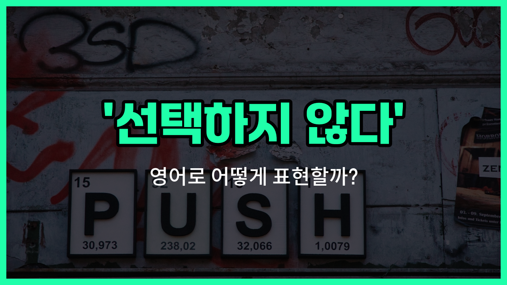

## 🌟 영어 표현 - make no choice

안녕하세요 👋 오늘은 '선택하지 않다'라는 뜻을 가진 영어 표현을 소개해드릴게요

바로 '**make no [choice](/blog/in-english/399.choice/)**'라는 표현이에요. 이 표현은 말 그대로 **아무것도 선택하지 않는 상황**을 나타낼 때 사용해요. 즉, 여러 가지 옵션이나 대안이 있을 때 그 중 어느 것도 고르지 않았다는 의미로 쓰여요!

예를 들어, 메뉴판에서 음식을 고르지 않거나, 여러 제안 중 아무것도 결정하지 않은 상황에서 자연스럽게 사용할 수 있어요. 일상 대화뿐만 아니라 공식적인 상황에서도 쓸 수 있는 표현이에요.

## 📖 예문

1. "그는 아무것도 선택하지 않았어요."

   "He made no choice."

2. "학생들은 답을 고르지 않았어요."

   "The students made no choice."

## 💬 연습해보기

<ul data-interactive-list>

  <li data-interactive-item>
    솔직히 가끔은 후회할 일에 급하게 뛰어들기보단 아무 결정 안 하는 게 더 낫다 생각해요.
    <a href="/blog/in-english/336.honestly/">Honestly</a>, <a href="/blog/in-english/270.sometimes/">sometimes</a> it's better to make no choice than to rush into something you might regret.
  </li>

  <li data-interactive-item>
    나쁜 선택지 두 개면 차라리 아무 결정도 안 하는 게 낫겠더라고요.
    When faced with two bad options, I'd rather make no choice at all.
  </li>

  <li data-interactive-item>
    그는 그냥 결정하지 않고 상황이 좀 더 명확해질 때까지 기다리기로 했어요.
    He <a href="/blog/in-english/062.decide-to/">decided to</a> make no choice and just wait until things got clearer.
  </li>

  <li data-interactive-item>
    가끔 너무 벅차서 그냥 아무 결정도 안 할 때 있어요.
    Sometimes I just make no choice because I'm too overwhelmed.
  </li>

  <li data-interactive-item>
    선거 때는 일부러 표를 안 찍고 투표 용지를 비워두는 사람도 있더라고요.
    During the <a href="/blog/in-english/614.election/">election</a>, some people make no choice and <a href="/blog/in-english/402.leave/">leave</a> their ballots blank.
  </li>

  <li data-interactive-item>
    피자랑 버거 둘 중에 고민하다 그냥 아무 결정도 안 하고 저녁을 건너뛰었어요.
    I couldn't decide between pizza or burgers, so I just made no choice and skipped dinner.
  </li>

  <li data-interactive-item>
    그녀는 지금은 동아리에 가입할지 말지 그냥 결정을 보류했어요.
    She chose to make no choice about joining the club for now.
  </li>

  <li data-interactive-item>
    진짜 못 고르겠으면 확실해질 때까지 아무 결정 안 해도 괜찮아요.
    If you really can't pick, it's okay to make no choice until you're sure.
  </li>

  <li data-interactive-item>
    때론 결정 안 하는 게 오히려 가장 현명한 선택일 때도 있어요.
    There are times when making no choice is actually the wisest thing to do.
  </li>

  <li data-interactive-item>
    마음이 안 정해질 때는 그냥 아무 결정 안 하고 상황 지켜보는 편이에요.
    Whenever I can't make up my mind, I just make no choice and see how things play out.
  </li>

</ul>

## 🤝 함께 알아두면 좋은 표현들

### sit on the fence

'sit [on the fence](/blog/in-english/213.on-the-fence/)'는 "어느 쪽도 선택하지 않고 중립적인 태도를 유지하다"라는 뜻이에요. 어떤 결정이나 논쟁에서 한쪽 편을 들지 않고 망설이거나 결정을 미루는 상황에서 자주 써요.

- "When it came to the new [policy](/blog/in-english/623.policy/), many [employees](/blog/in-english/700.employee/) chose to sit on the fence rather than voice their [opinions](/blog/in-english/527.opinion/)."
- "새로운 정책에 대해서 많은 직원들이 의견을 내기보다는 중립적인 태도를 유지했어요."

### make up one's mind

'[make up one's mind](/blog/in-english/083.make-up-one's-mind/)'는 "결정을 내리다"라는 뜻이에요. 오랫동안 고민하다가 드디어 선택을 하거나 마음을 굳힐 때 쓰는 표현이에요. 'make no choice'와는 반대되는 의미예요.

- "After weeks of thinking, she [finally](/blog/in-english/182.finally/) made up her mind to move abroad."
- "몇 주 동안 고민한 끝에 그녀는 결국 해외로 이사하기로 결심했어요."

### leave it to chance

'leave it to chance'는 "아무것도 정하지 않고 운에 맡기다"라는 뜻이에요. 스스로 선택하지 않고 상황이 어떻게 흘러가는지에 맡기는 태도를 나타낼 때 사용해요.

- "[Instead of](/blog/in-english/169.instead-of/) planning every detail, he decided to leave it to chance and see what happens."
- "모든 걸 꼼꼼히 계획하는 대신, 그는 그냥 운에 맡기고 어떻게 되는지 보기로 했어요."

---

오늘은 '선택하지 않다'라는 뜻의 영어 표현 '**make no choice**'에 대해 알아봤어요. 앞으로 선택을 하지 않은 상황이 있을 때 이 표현을 떠올려보세요 😊

오늘 배운 표현과 예문들을 꼭 소리 내서 여러 번 읽어보세요. 다음에도 더 유익한 영어 표현으로 찾아올게요! 감사합니다!

