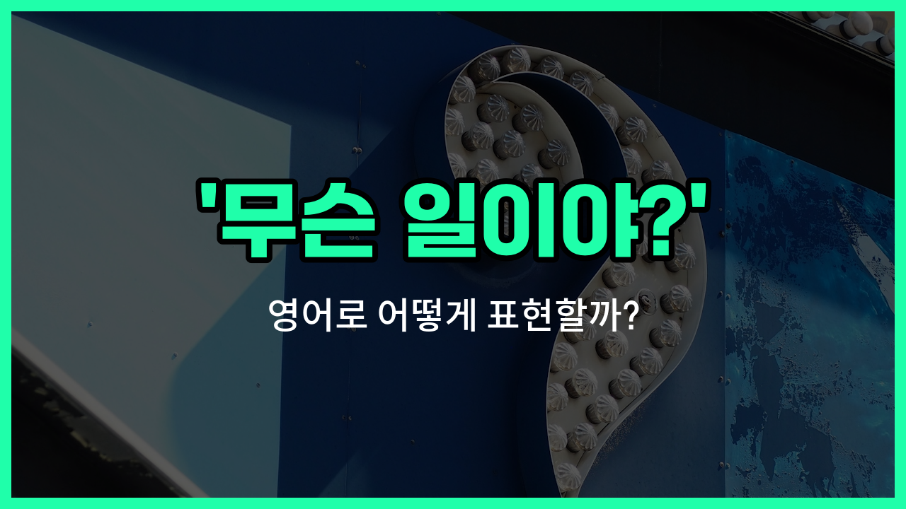

## 🌟 영어 표현 - What's going on?

안녕하세요 👋 오늘은 일상에서 정말 자주 쓰는 표현인 '**무슨 일이야?**', '**무슨 일 있어?**', '**무슨 상황이야?**'를 영어로 어떻게 말하는지 알아볼 거예요.

바로 '**What's going on?**'이라는 표현이에요. 이 표현은 상대방에게 지금 어떤 일이 벌어지고 있는지, 혹은 무슨 문제가 있는지 궁금할 때 자연스럽게 쓸 수 있어요.

예를 들어, 친구가 갑자기 심각한 표정으로 전화를 걸었을 때, "What's going on?"이라고 물어볼 수 있어요. 또는, 시끄러운 소리가 들려서 상황을 파악하고 싶을 때도 이 표현을 쓸 수 있답니다.

이 표현은 공식적인 자리보다는 친구, 가족, 동료 등 가까운 사이에서 더 자주 사용돼요. 상황에 따라 걱정, 놀람, 궁금증 등 다양한 감정을 담아 쓸 수 있으니 정말 유용해요!

## 📖 예문

1. "무슨 일이야? 왜 이렇게 조용해?"

   "What's going on? Why is it so [quiet](/blog/in-english/958.quiet/)?"

2. "밖에서 무슨 일 있어?"

   "What's going on [outside](/blog/in-english/974.outside/)?"

## 💬 연습해보기

<ul data-interactive-list>

  <li data-interactive-item>
    복도에 다들 모여 있는 거 봤어요. 무슨 일이에요?
    I saw everyone gathered in the hallway. What's going on?
  </li>

  <li data-interactive-item>
    야, 기분 안 좋아 보여요. 무슨 일이에요?
    Hey, you look <a href="/blog/in-english/395.upset/">upset</a>. What's going on?
  </li>

  <li data-interactive-item>
    일주일 동안 안 있었는데, 지금 이러고 있네요. 무슨 일이에요?
    I've been gone for a week, and now all this is happening. What's going on?
  </li>

  <li data-interactive-item>
    계속 이상한 이모지 보내는데, 무슨 일이에요?
    You keep texting me random emojis. What's going on?
  </li>

  <li data-interactive-item>
    옆집 사람들이 소리 지르고 있어요. 무슨 일이에요?
    The neighbors have been yelling next door. What's going on?
  </li>

  <li data-interactive-item>
    방금 왔는데 다들 진지해 보여요. 무슨 일이에요?
    I just got here, and you all look <a href="/blog/in-english/146.serious/">serious</a>. What's going on?
  </li>

  <li data-interactive-item>
    누가 전화했다가 바로 끊었어요. 무슨 일이에요?
    Someone just called and hung up. What's going on?
  </li>

  <li data-interactive-item>
    부엌에서 이상한 냄새가 나요. 무슨 일이에요?
    There's a <a href="/blog/in-english/296.weird/">weird</a> smell coming from the kitchen. What's going on?
  </li>

  <li data-interactive-item>
    오늘 좀 멍한 것 같아요. 무슨 일이에요?
    You seem distracted today. What's going on?
  </li>

  <li data-interactive-item>
    인터넷이 엄청 느려요. 무슨 일이에요?
    The internet is super slow <a href="/blog/in-english/525.right-now/">right now</a>. What's going on?
  </li>

</ul>

## 🤝 함께 알아두면 좋은 표현들

### What's happening?

'What's happening?'은 '무슨 일이 일어나고 있나요?'라는 뜻으로, 'What's going on?'과 비슷하게 현재 상황이나 사건에 대해 묻는 표현이에요. 일상 대화에서 자주 쓰이며, 상황을 파악하고 싶을 때 자연스럽게 사용할 수 있어요.

- "Hey, what's happening here? Why is everyone so excited?"
- "이봐요, 여기서 무슨 일이 일어나고 있나요? 왜 모두가 그렇게 신나 있나요?"

### Nothing's wrong.

'Nothing's [wrong](/blog/in-english/316.wrong/).'은 '아무 문제 없어요.'라는 뜻으로, 'What's going on?'에 대한 반대 표현이에요. 상대방이 걱정하거나 상황을 물어볼 때, 문제가 없음을 알리고 안심시키는 표현으로 사용돼요.

- "Don't worry, nothing's wrong. Everything is fine."
- "걱정하지 마세요, 아무 문제 없어요. 모든 게 괜찮아요."

### What's the matter?

'What's the matter?'은 '무슨 문제 있나요?'라는 뜻으로, 'What's going on?'과 비슷하지만 좀 더 문제나 어려움이 있는 상황을 묻는 표현이에요. 누군가가 걱정하거나 슬퍼 보일 때 상황을 물어볼 때 자주 사용돼요.

- "You look upset. What's the matter?"
- "기분이 안 좋아 보이네요. 무슨 문제 있나요?"

---

오늘은 '**무슨 일이야?**', '**무슨 일 있어?**', '**무슨 상황이야?**'라는 뜻을 가진 영어 표현 '**What's going on?**'에 대해 알아봤어요. 앞으로 궁금한 상황이 생기면 이 표현을 꼭 활용해 보세요 😊

오늘 배운 표현과 예문들을 소리 내서 여러 번 연습해 보세요. 다음에도 더 유용한 영어 표현으로 찾아올게요! 감사합니다!

