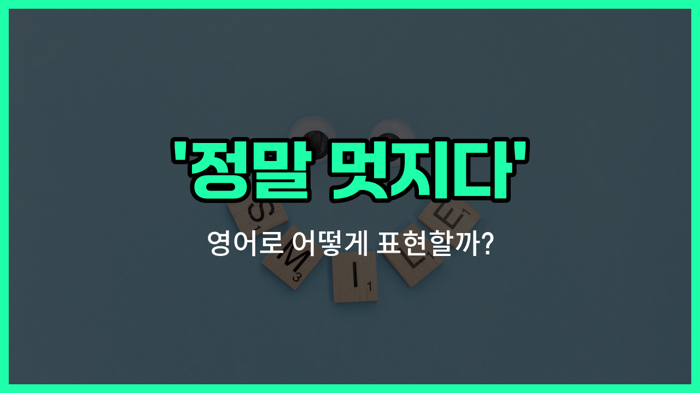

## 🌟 영어 표현 - That's awesome!

안녕하세요 👋 오늘은 누군가의 소식이나 성과를 듣고 감탄할 때 자주 쓰는 영어 표현을 소개해드릴게요. 바로 '**That's awesome!**'이에요.

'**That's awesome!**'은 '정말 멋지다', '대단하다', '굉장하다'라는 뜻으로, 상대방의 좋은 소식이나 멋진 일에 대해 진심으로 감탄하거나 축하할 때 자연스럽게 사용할 수 있어요.

이 표현은 친구, 가족, 동료 등 누구에게나 쓸 수 있어서 일상 대화에서 정말 자주 등장해요. 예를 들어, 친구가 시험에서 좋은 성적을 받았거나, 누군가 새로운 일을 시작했다고 할 때 'That's awesome!'이라고 말하면 상대방도 기분이 좋아질 거예요.

## 📖 예문

1. "나 이번에 취업했어!"

   "That's awesome! 축하해요!"

2. "네가 만든 그림 정말 멋지다!"

   "That's awesome! You did a great job!"

## 💬 연습해보기

<ul data-interactive-list>

  <li data-interactive-item>
    드디어 꿈꾸던 직장에 취직했어요? 진짜 대단해요! 축하해요.
    You <a href="/blog/in-english/182.finally/">finally</a> landed your dream job? That's awesome! Congrats, man.
  </li>

  <li data-interactive-item>
    콘서트 티켓 구했어요? 완전 부러워요! 운 진짜 좋네요.
    You got tickets to the concert? That's awesome! You're so lucky.
  </li>

  <li data-interactive-item>
    진짜 멋져요! 진심으로 축하해요.
    That's awesome! I'm really happy for you.
  </li>

  <li data-interactive-item>
    결승에 진출했어요? 대단해요! 못할 줄 알았는데 역시네요.
    You <a href="/blog/in-english/244.make-it/">made it</a> to the finals? That's awesome! I knew you could do it.
  </li>

  <li data-interactive-item>
    강아지 입양했어요? 너무 귀여워요! 강아지가 짱이죠.
    Oh, you adopted a puppy? That's awesome! Puppies are the best.
  </li>

  <li data-interactive-item>
    프로젝트 혼자서 다 끝냈다니 대단해요! 엄청 노력했나 봐요.
    You finished the whole project by yourself? That's awesome! Must have taken a lot of effort.
  </li>

  <li data-interactive-item>
    시험에서 A 받았어요? 대단해요! 노력한 보람 있네요.
    You got an A on your exam? That's awesome! All your hard work <a href="/blog/in-english/199.pay-off/">paid off</a>.
  </li>

  <li data-interactive-item>
    정말 멋져요! 혹시 또 도움이 필요하면 꼭 알려줘요.
    That's awesome! Let me know if you ever need help with anything else.
  </li>

  <li data-interactive-item>
    다음 달에 하와이 가요? 부러워요! 저도 가고 싶네요.
    Wait, you're going to Hawaii next month? That's awesome! <a href="/blog/in-english/118.i-wish/">I wish</a> I could go too.
  </li>

  <li data-interactive-item>
    운전면허 시험 통과했어요? 대단해요! 이제 운전할 때예요.
    You just passed your driving test? That's awesome! <a href="/blog/in-english/1055.time/">Time</a> to <a href="/blog/in-english/1046.hit-the-road/">hit the road</a>.
  </li>

</ul>

## 🤝 함께 알아두면 좋은 표현들

### That's fantastic!

'That's fantastic!'은 '정말 멋지다!' 또는 '대단하다!'라는 뜻으로, 'That's awesome!'과 비슷하게 긍정적인 감탄을 표현할 때 사용해요. 상대방의 좋은 소식이나 성과에 대해 감탄할 때 자주 쓰여요.

- "You got the promotion? That's fantastic!"
- "승진했어요? 정말 멋지네요!"

### That's terrible!

'That's terrible!'은 '그거 끔찍하다!' 또는 '정말 안 좋다!'라는 뜻으로, 'That's awesome!'의 반대 의미를 가진 표현이에요. 나쁜 소식이나 안 좋은 상황에 대해 안타까움이나 실망을 표현할 때 사용해요.

- "You [lost](/blog/in-english/457.lose/) your wallet? That's terrible!"
- "지갑을 잃어버렸다고요? 정말 안됐네요!"

### That's great!

'That's great!'은 '정말 좋아!' 또는 '멋지다!'라는 뜻으로, 'That's awesome!'과 비슷한 의미를 가진 표현이에요. 긍정적인 상황이나 좋은 소식에 대해 기쁨이나 칭찬을 나타낼 때 자주 사용해요.

- "You finished the project early? That's great!"
- "프로젝트를 일찍 끝냈다니 정말 좋네요!"

---

오늘은 '정말 멋지다', '대단하다', '굉장하다'라는 뜻을 가진 영어 표현 '**That's awesome!**'에 대해 알아봤어요. 앞으로 누군가에게 좋은 소식을 들었을 때 이 표현을 꼭 사용해보세요 😊

오늘 배운 표현과 예문들을 소리 내서 여러 번 연습해보면 더 자연스럽게 쓸 수 있을 거예요. 다음에도 더 유용한 영어 표현으로 찾아올게요! 감사합니다!

