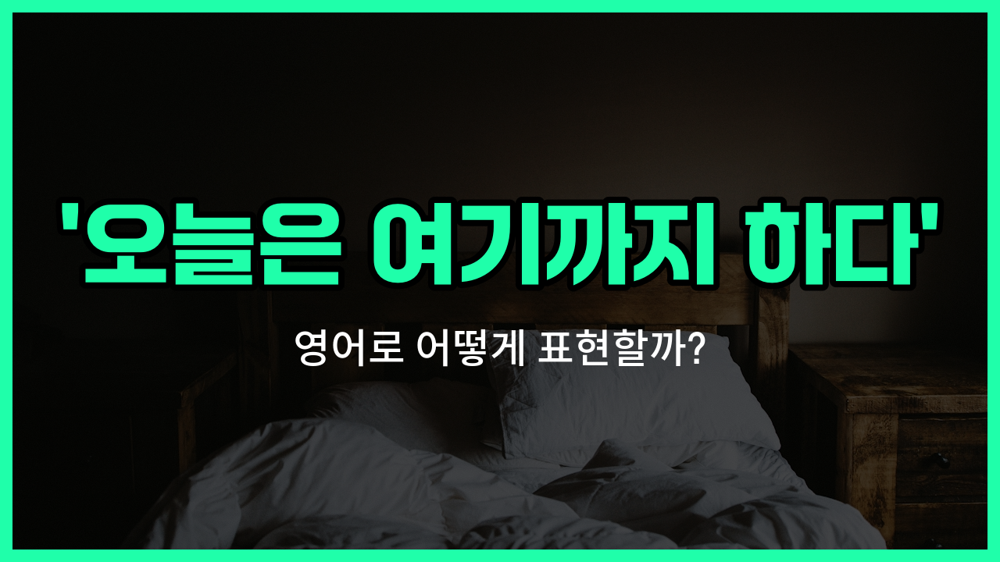

## 🌟 영어 표현 - call it a night

안녕하세요 👋 오늘은 영어에서 자주 쓰이는 표현인 '**call it a night**'에 대해 알아보려고 해요. 이 표현은 직역하면 "오늘 밤을 부르다"이지만, 실제로는 **오늘은 여기까지 하다**, **마무리하다**, **끝내다**라는 의미로 사용돼요.

예를 들어, 친구들과 늦게까지 놀다가 이제 집에 가야 할 때 "오늘은 여기까지 하자"라고 말하고 싶을 때 쓸 수 있어요. 또는, 회사에서 야근을 하다가 더 이상 일을 하지 않고 퇴근할 때도 자연스럽게 사용할 수 있답니다!

이 표현은 특히 **하던 일을 마치고 집에 가거나, 더 이상 활동을 하지 않을 때** 자주 쓰여요. 꼭 밤에만 쓰는 건 아니지만, 주로 저녁이나 밤에 일을 마무리할 때 많이 사용돼요.

## 📖 예문

1. "오늘은 여기까지 하자."

   "Let's call it a night."

2. "우리 너무 피곤하니까 이제 끝내자."

   "We're too tired, so let's call it a night."

## 💬 연습해보기

<ul data-interactive-list>

  <li data-interactive-item>
    벌써 늦었네요. 오늘은 여기서 마무리할래요.
    It's getting <a href="/blog/in-english/391.late/">late</a>. I think I'm gonna call it a night.
  </li>

  <li data-interactive-item>
    계속 몇 시간째 공부했으니까, 오늘은 그만하고 내일 다시 시작하는 게 좋겠어요.
    We've been studying for hours. Maybe we should call it a night and <a href="/blog/in-english/178.pick-up/">pick up</a> tomorrow.
  </li>

  <li data-interactive-item>
    너무 피곤해서 오늘은 여기서 끝낼게요. 아침에 봐요!
    I'm exhausted, so I'm gonna call it a night. See you guys in the morning.
  </li>

  <li data-interactive-item>
    그 마지막 에피소드 보고 나서 오늘은 그만하기로 했어요.
    After that last episode, I <a href="/blog/in-english/062.decide-to/">decided to</a> call it a night.
  </li>

  <li data-interactive-item>
    피곤해 보여요. 오늘은 그만할 준비 됐나요?
    You look tired. Ready to call it a night?
  </li>

  <li data-interactive-item>
    무리하기 싫어서 이제 그냥 끝낼 거예요.
    I don't want to overdo it, so I'm just gonna call it a night now.
  </li>

  <li data-interactive-item>
    파티는 정말 재밌었는데, 이제 슬슬 마무리해야 할 시간이에요.
    We had a great time at the party, but it's time to call it a night.
  </li>

  <li data-interactive-item>
    분위기가 별로라서 일찍 자려고 해요.
    I'm not really feeling the <a href="/blog/in-english/773.vibe/">vibe</a> here, so I'm gonna call it a night early.
  </li>

  <li data-interactive-item>
    6시부터 나와 있었으니까 너무 피곤해지기 전에 끝내죠.
    We've been out since six. Let's call it a night before we get too tired.
  </li>

  <li data-interactive-item>
    네가 재미있게 놀고 있는 거 알지만, 저는 내일 일찍 회의 있어서 그만할게요.
    I know you're having fun, but I've gotta call it a night. Early meeting tomorrow.
  </li>

</ul>

## 🤝 함께 알아두면 좋은 표현들

### turn in

'[turn in](/blog/in-english/315.turn-in/)'은 "잠자리에 들다" 또는 "자러 가다"라는 뜻이에요. 하루 일과를 마치고 휴식을 취하기 위해 잠자리에 들 때 주로 사용해요. 'call it a night'와 비슷하게 하루를 마무리하는 상황에서 많이 쓰여요.

- "I'm really tired, so I think I'll turn in early tonight."
- "정말 피곤해서 오늘 밤에는 일찍 자러 갈 것 같아요."

### stay up late

'stay up late'는 "늦게까지 깨어 있다"라는 뜻이에요. 보통 잠자리에 들지 않고 밤늦게까지 활동하거나 일을 하는 상황을 나타내요. 'call it a night'의 반대 의미로, 밤을 일찍 마무리하지 않고 계속 깨어 있는 경우에 사용해요.

- "She stayed up late finishing her project."
- "그녀는 프로젝트를 끝내느라 늦게까지 깨어 있었어요."

### call it quits

'call it quits'는 "그만두다" 또는 "끝내다"라는 뜻이에요. 어떤 활동이나 일을 중단하고 마무리할 때 쓰는 표현이에요. 'call it a night'처럼 어떤 것을 끝내는 의미를 가지고 있지만, 더 일반적인 상황에서 사용돼요.

- "After hours of [arguing](/blog/in-english/132.argue/), they decided to call it quits."
- "몇 시간 동안 논쟁한 후에 그들은 그만두기로 결정했어요."

---

오늘은 '**오늘은 여기까지 하다**', '**마무리하다**', '**끝내다**'라는 뜻을 가진 영어 표현 '**call it a night**'에 대해 알아봤어요. 앞으로 늦은 시간에 일을 마치거나 모임을 끝낼 때 이 표현을 꼭 한번 써보세요 😊

오늘 배운 표현과 예문들을 꼭 최소 3번씩 소리 내서 읽어보세요. 다음에도 더 재미있고 유익한 영어 표현으로 찾아올게요! 감사합니다!

