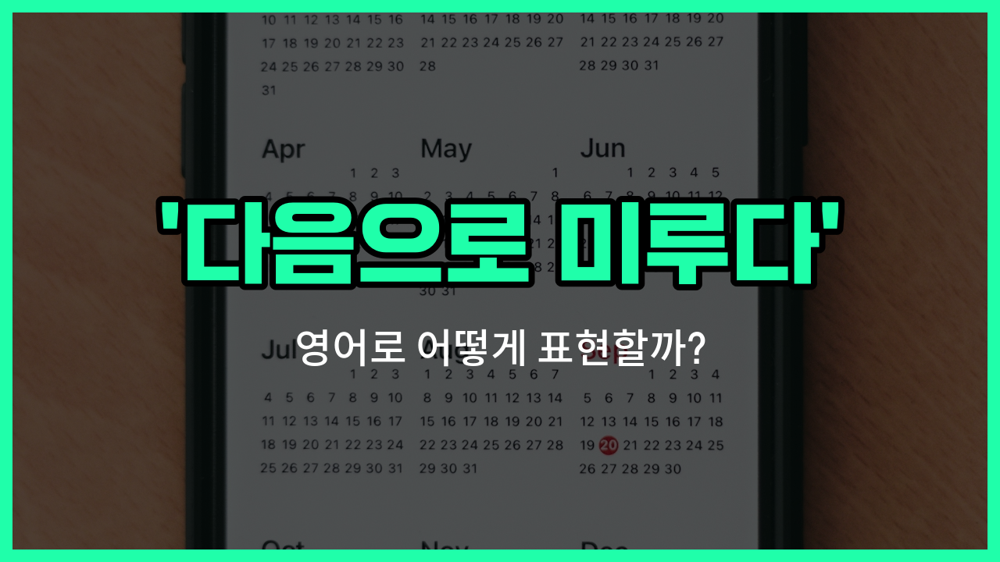

## 🌟 영어 표현 - Take a rain check

안녕하세요 👋 오늘은 일상 대화에서 자주 쓰이는 재미있는 영어 표현을 소개해드릴게요. 바로 '**Take a rain check**'라는 표현이에요. 이 표현은 직역하면 '비가 오면 표를 다시 준다'는 뜻이지만, 실제로는 **약속이나 제안을 정중하게 다음으로 미루고 싶을 때** 사용하는 표현이에요.

예를 들어, 친구가 저녁을 먹자고 했는데 오늘은 시간이 안 될 때, "오늘은 어렵지만 다음에 꼭 같이 하자"라는 의미로 'Can I take a rain check?'라고 말할 수 있어요. 즉, **지금은 어렵지만 다음 기회에 하고 싶다**는 뜻이에요!

이 표현은 특히 거절의 뉘앙스를 부드럽게 전달하고 싶을 때 정말 유용해요. 상대방에게 부담을 주지 않으면서도 다음 기회를 약속하는 느낌을 줄 수 있답니다~

## 📖 예문

1. "오늘 영화는 힘들 것 같아요. 다음에 볼 수 있을까요?"

   "I don't think I can [make it](/blog/in-english/244.make-it/) to the movie tonight. Can I take a rain check?"

2. "저녁 약속을 다음으로 미뤄도 될까요?"

   "Can I take a rain [check on](/blog/in-english/106.check-on/) dinner?"

## 💬 연습해보기

<ul data-interactive-list>

  <li data-interactive-item>
    "오늘 저녁에 약속 미뤄도 될까요? 일이 너무 많아서요."
    Hey, can I take a rain check on dinner tonight? I've got way too much work to <a href="/blog/in-english/295.finish/">finish</a>.
  </li>

  <li data-interactive-item>
    "경기 초대 고마워요. 몸이 안 좋아서 이번엔 다음에 할게요."
    Thanks for <a href="/blog/in-english/347.invite/">inviting</a> me to the game. Can I take a rain check? I'm not feeling great.
  </li>

  <li data-interactive-item>
    "이번 주말 브런치는 엄마가 오셔서 미뤄야 할 것 같아요."
    Sorry, I have to take a rain check on brunch this weekend. My mom's coming into town.
  </li>

  <li data-interactive-item>
    "그 콘서트 정말 좋은데, 이번에는 다음에 할게요."
    That concert sounds awesome, but I think I have to take a rain check this time.
  </li>

  <li data-interactive-item>
    "진짜 만나고 싶은데, 오늘은 너무 지쳐서 미뤄도 될까요?"
    I really want to <a href="/blog/in-english/127.hang-out/">hang out</a>, but can I take a rain check? I'm totally wiped out.
  </li>

  <li data-interactive-item>
    "갑자기 일이 생겨서 약속 취소해야 할 것 같아요. 정말 미안해요."
    I <a href="/blog/in-english/392.hate/">hate</a> to bail, but I'm gonna have to take a rain check. Something came up <a href="/blog/in-english/221.at-the-last-minute/">at the last minute</a>.
  </li>

  <li data-interactive-item>
    "해피아워 초대 고마운데, 다음에 같이해요!"
    I'd love to join you for happy hour, but I'll have to take a rain check. Maybe next time?
  </li>

  <li data-interactive-item>
    "그 제안은 지금 좀 어려울 것 같아요. 다음에 꼭 할게요."
    Can I take a rain check on that offer? Things are just a little <a href="/blog/vocab-1/029.hectic/">hectic</a> for me <a href="/blog/in-english/525.right-now/">right now</a>.
  </li>

  <li data-interactive-item>
    "초대 감사한데, 오늘은 집에서 쉬고 싶어서 미뤄도 될까요?"
    Thanks for asking, but I'll take a rain check if that's cool. I need a night in.
  </li>

  <li data-interactive-item>
    "조만간 꼭 만나고 싶으니까 약속 미뤄서 다른 날 계획해요."
    I definitely want to <a href="/blog/in-english/021.catch-up-on/">catch up</a> soon, so let's take a rain check and plan for <a href="/blog/in-english/513.another/">another</a> day.
  </li>

</ul>

## 🤝 함께 알아두면 좋은 표현들

### postpone

'[postpone](/blog/in-english/790.postpone/)'은 "일정을 미루다" 또는 "연기하다"라는 뜻이에요. 어떤 약속이나 계획을 나중으로 늦추는 상황에서 사용해요. 'take a rain check'과 비슷하게 약속을 연기할 때 쓸 수 있지만, 좀 더 공식적이고 직접적인 표현이에요.

- "We had to postpone the meeting until next week [due to](/blog/in-english/335.due-to/) unforeseen circumstances."
- "예기치 못한 상황 때문에 회의를 다음 주로 미뤄야 했어요."

### confirm the plan

'confirm the plan'은 "계획을 확정하다"라는 뜻이에요. 약속이나 계획을 확실히 정하고 변경 없이 진행하는 것을 의미해요. 'take a rain check'과 반대로, 약속을 연기하지 않고 그대로 진행할 때 쓰는 표현이에요.

- "Let's confirm the plan for dinner tomorrow so everyone is on the same page."
- "내일 저녁 약속을 확정해서 모두가 같은 생각을 하도록 해요."

### reschedule

'reschedule'은 "일정을 다시 잡다"라는 뜻이에요. 원래 예정된 약속이나 계획을 다른 시간이나 날짜로 바꾸는 것을 의미해요. 'take a rain check'과 비슷하게 약속을 연기하거나 변경할 때 자주 사용돼요.

- "Due to the bad weather, we need to reschedule our outdoor event."
- "날씨가 안 좋아서 야외 행사를 다시 일정 잡아야 해요."

---

오늘은 '다음으로 미루다', '다음 기회에'라는 뜻을 가진 영어 표현 '**Take a rain check**'에 대해 알아봤어요. 앞으로 약속을 정중하게 미루고 싶을 때 이 표현을 꼭 활용해보세요~ 😊

오늘 배운 표현과 예문들을 소리 내서 여러 번 읽어보면 더 자연스럽게 쓸 수 있을 거예요. 다음에도 더 유익한 영어 표현으로 찾아올게요! 감사합니다~

