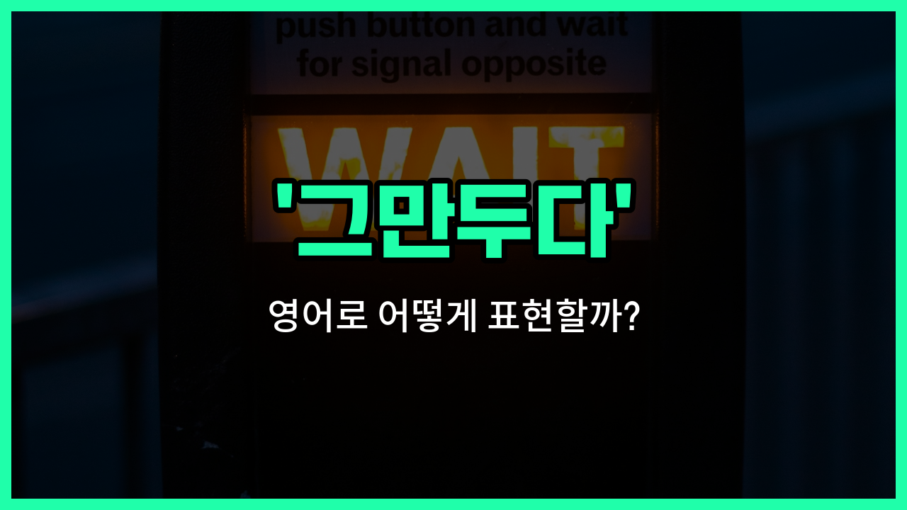

## 🌟 영어 표현 - Call it quits

안녕하세요 👋 오늘은 일이나 관계 등에서 더 이상 계속하지 않고 **'그만두다'**라는 의미를 가진 영어 표현을 소개해드릴게요. 바로 '**Call it quits**'라는 표현이에요.

'**Call it quits**'는 어떤 일을 하다가 중간에 멈추거나, 더 이상 계속하지 않기로 결정할 때 자주 쓰여요. 예를 들어, 힘든 프로젝트를 하다가 "이쯤에서 그만하자"라고 말하고 싶을 때 사용할 수 있어요.

이 표현은 친구와 게임을 하다가 "오늘은 여기까지 하자"라고 할 때도 자연스럽게 쓸 수 있어요. 또는 연인이나 동료와의 관계를 끝내기로 할 때도 사용할 수 있답니다!

## 📖 예문

1. "우리는 오늘 여기서 그만두기로 했어요."

   "We [decided to](/blog/in-english/062.decide-to/) call it quits for today."

2. "그들은 오랜 논쟁 끝에 결국 그만두기로 했어요."

   "They [finally](/blog/in-english/182.finally/) called it quits after a long argument."

## 💬 연습해보기

<ul data-interactive-list>

  <li data-interactive-item>
    그들은 밤새 싸웠어요. 이제 그만하고 잠시 쉬는 게 좋을 것 같아요.
    They've been <a href="/blog/in-english/132.argue/">arguing</a> all night. I think it's time to call it quits and <a href="/blog/in-english/202.take-a-break/">take a break</a>.
  </li>

  <li data-interactive-item>
    회사에서 10년 일한 후, 사라는 그만두고 새로운 걸 찾아보기로 했어요.
    After ten years at the company, Sarah decided to call it quits and <a href="/blog/in-english/173.look-for/">look for</a> something new.
  </li>

  <li data-interactive-item>
    우린 몇 시간째 이 프로젝트 하느라 고생했어요. 그만하고 밥 먹으러 갈래요?
    We've been <a href="/blog/in-english/370.work-on/">working on</a> this project for hours. Wanna call it quits and grab some food?
  </li>

  <li data-interactive-item>
    우리 부모님은 20년 결혼 생활 끝에 드디어 이혼했어요.
    My parents finally called it quits after twenty years of marriage.
  </li>

  <li data-interactive-item>
    내 오래된 차 고치려 했는데, 이제는 그냥 포기하고 새 차 사려고 해요.
    I tried fixing my old car, but at this point I'm just gonna call it quits and get a new one.
  </li>

  <li data-interactive-item>
    코치가 말했어요, 연습이 두 시간 넘게 늦어져서 그만 끝내자고.
    The coach told the team to call it quits after <a href="/blog/in-english/247.practice/">practice</a> ran two hours <a href="/blog/in-english/391.late/">late</a>.
  </li>

  <li data-interactive-item>
    너무 힘들어요. 오늘은 여기까지 하고 내일 마무리해요.
    I'm exhausted. Let's call it quits for today and <a href="/blog/in-english/295.finish/">finish</a> up tomorrow.
  </li>

  <li data-interactive-item>
    마이크는 세 번 연속 삼진 당하고 나서 그만하고 배팅장 떠났어요.
    After striking out three times, Mike called it quits and <a href="/blog/in-english/402.leave/">left</a> the batting cages.
  </li>

  <li data-interactive-item>
    비가 쏟아지기 시작해서 그만두고 집에 가기로 했어요.
    When the rain started <a href="/blog/in-english/497.pour/">pouring</a>, we decided to call it quits and head home.
  </li>

  <li data-interactive-item>
    그녀가 머리 맞대고 퍼즐 못 풀고 몇 시간 고생하다 결국 포기했어요.
    She was struggling with the puzzle for hours before she finally called it quits.
  </li>

</ul>

## 🤝 함께 알아두면 좋은 표현들

### give up

'[give up](/blog/vocab-1/046.give-up/)'은 '포기하다'라는 뜻으로, 어떤 일을 더 이상 계속하지 않기로 결정할 때 사용해요. 'call it quits'와 비슷하게 어떤 활동이나 노력을 중단하는 상황에서 자주 쓰여요.

- "After several failed attempts, she decided to give up on fixing the old car."
- "여러 번 실패한 후에, 그녀는 오래된 차를 고치는 것을 포기하기로 했어요."

### keep going

'[keep going](/blog/in-english/927.keep-going/)'은 '계속하다'라는 뜻으로, 어려움이 있어도 멈추지 않고 계속 노력하거나 진행하는 것을 의미해요. 'call it quits'의 반대 표현으로 볼 수 있어요.

- "Even though the project was challenging, they decided to keep going until it was finished."
- "프로젝트가 힘들었지만, 그들은 끝날 때까지 계속하기로 했어요."

### throw in the towel

'[throw](/blog/in-english/458.throw/) in the [towel](/blog/in-english/555.towel/)'은 '항복하다' 또는 '포기하다'라는 뜻으로, 더 이상 싸우거나 노력하지 않겠다는 의미를 담고 있어요. 'call it quits'와 매우 비슷한 의미로 일상 대화에서 자주 사용돼요.

- "After hours of debate, he finally threw in the towel and [agreed](/blog/in-english/342.agree/) to the proposal."
- "몇 시간 동안 토론한 후에, 그는 결국 포기하고 그 제안에 동의했어요."

---

오늘은 '**그만두다**', '**포기하다**', '**끝내다**'라는 뜻을 가진 영어 표현 '**Call it quits**'에 대해 알아봤어요. 앞으로 어떤 일을 멈추거나 끝내고 싶을 때 이 표현을 떠올려 보세요 😊

오늘 배운 표현과 예문들을 꼭 최소 3번씩 소리 내서 읽어보세요. 다음에도 더 재미있고 유익한 영어 표현으로 찾아올게요! 감사합니다!

