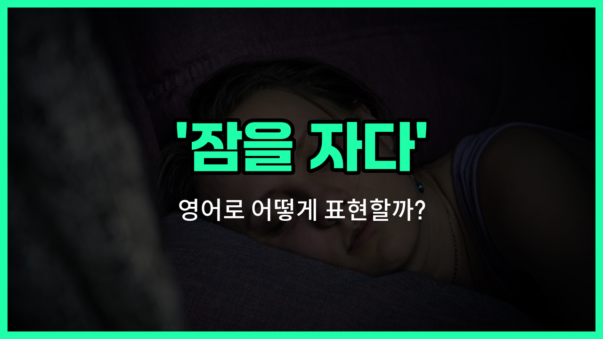

## 🌟 영어 표현 - catch some Z's

안녕하세요 👋 오늘은 영어에서 '잠을 자다', '눈을 붙이다'라는 뜻으로 자주 쓰이는 재미있는 표현을 소개해드릴게요. 바로 '**catch some Z's**'라는 표현이에요.

'**catch some Z's**'는 문자 그대로 해석하면 'Z를 잡다'라는 뜻이지만, 실제로는 **잠을 자다** 또는 **눈을 붙이다**라는 의미로 사용돼요. 영어권에서는 만화나 그림에서 잠자는 모습을 'Zzz...'로 표현하는데, 여기서 유래된 표현이에요!

이 표현은 친구나 가족끼리 일상적으로 "잠깐 자야겠다" 또는 "좀 쉬어야겠다"고 말할 때 자연스럽게 쓸 수 있어요. 예를 들어, 밤을 새우고 피곤할 때 "I need to catch some Z's."라고 하면 "나 잠 좀 자야겠어."라는 뜻이에요.

또한, 이 표현은 공식적인 자리보다는 편안한 분위기에서 더 자주 쓰인다는 점도 참고해 주세요~

## 📖 예문

1. "오늘 너무 피곤해서 잠깐 눈 좀 붙여야겠어요."

   "I'm so tired today, I need to catch some Z's."

2. "시험 끝나고 나서 푹 쉬고 싶어요."

   "After the exam, I just [want](/blog/in-english/1060.want/) to catch some Z's."

## 💬 연습해보기

<ul data-interactive-list>

  <li data-interactive-item>
    진짜 완전 피곤해요. 오늘 밤에 꼭 좀 자야겠어요.
    I'm exhausted. I really need to catch some Z's tonight.
  </li>

  <li data-interactive-item>
    파티 끝나고 집에 가서 바로 잠 좀 자고 싶었어요.
    After the party, I just wanted <a href="/blog/in-english/450.to-go/">to go</a> home and catch some Z's.
  </li>

  <li data-interactive-item>
    일 끝나기 전에 빨리 끝내고 좀 자야겠어요.
    Let's wrap this up so I can catch some Z's before work tomorrow.
  </li>

  <li data-interactive-item>
    진짜 퇴근한 것처럼 보여요, 좀 자요.
    You look beat, man. Go catch some Z's.
  </li>

  <li data-interactive-item>
    어젯밤에 잠을 충분히 못 자서 오늘 하루 종일 힘들어요.
    I didn't catch enough Z's last night, so I'm dragging today.
  </li>

  <li data-interactive-item>
    애들이 잠들면 바로 잠 좀 잘 거예요.
    Once the kids are asleep, I'm definitely catching some Z's.
  </li>

  <li data-interactive-item>
    점심 먹고 나서 조금만 눈 좀 붙일게요. 완전 지쳤어요.
    Give me a minute after lunch to catch some Z's. I'm wiped out.
  </li>

  <li data-interactive-item>
    여행 중에 잠시 차 세우고 잠 좀 잤어요.
    During the road trip, we <a href="/blog/in-english/997.pull-over/">pulled over</a> so I could catch some Z's.
  </li>

  <li data-interactive-item>
    비행기에서 잘 수 있게 베개 챙겨 왔어요.
    I brought my pillow so I can catch some Z's on the flight.
  </li>

  <li data-interactive-item>
    피곤하면 잠깐 소파에서 좀 자요.
    If you're tired, just catch some Z's on the couch for a bit.
  </li>

</ul>

## 🤝 함께 알아두면 좋은 표현들

### get some sleep

'get some sleep'은 '잠을 자다'라는 뜻으로, 'catch some Z's'와 비슷하게 휴식이나 수면을 취하는 것을 의미해요. 일상 대화에서 피곤할 때 자주 쓰이는 표현이에요.

- "I'm really tired; I need to get some sleep before the meeting tomorrow."
- "정말 피곤해서 내일 회의 전에 잠을 좀 자야 해요."

### stay awake

'stay awake'는 '깨어 있다'라는 뜻으로, 'catch some Z's'의 반대 표현이에요. 잠을 자지 않고 깨어 있으려고 노력할 때 사용해요.

- "I had to stay awake all night to [finish](/blog/in-english/295.finish/) my project."
- "프로젝트를 끝내기 위해 밤새 깨어 있어야 했어요."

### take a nap

'[take a nap](/blog/in-english/093.take-a-nap/)'은 '짧은 낮잠을 자다'라는 뜻으로, 'catch some Z's'와 비슷하지만 보통 낮에 짧게 자는 것을 의미해요. 피곤할 때 잠깐 쉬는 상황에서 자주 쓰여요.

- "I'm going to take a nap before we go out tonight."
- "오늘 밤 외출하기 전에 잠깐 낮잠을 잘 거예요."

---

오늘은 '잠을 자다', '눈을 붙이다'라는 뜻을 가진 영어 표현 '**catch some Z's**'에 대해 알아봤어요. 일상에서 피곤할 때 이 표현을 한 번 써보면 어떨까요? 😊

오늘 배운 표현과 예문들을 꼭 최소 3번씩 소리 내서 읽어보세요. 다음에도 더 재미있고 유익한 영어 표현으로 찾아올게요! 감사합니다!

