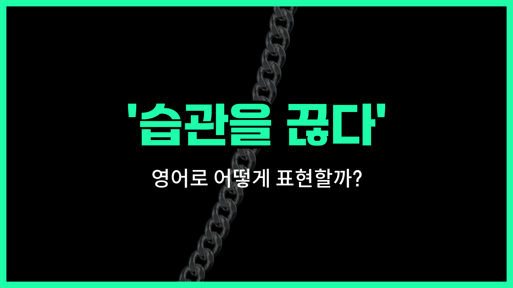

## 🌟 영어 표현 - kick the habit

안녕하세요 👋 오늘은 우리가 자주 쓰는 표현인 '**습관을 끊다**', '**버릇을 고치다**'를 영어로 어떻게 말하는지 알아볼 거예요. 바로 '**kick the habit**'이라는 표현이에요!

'**kick the habit**'은 직역하면 '습관을 발로 차버리다'라는 뜻이지만, 실제로는 **오랫동안 해오던 나쁜 습관이나 버릇을 끊다**라는 의미로 사용돼요. 주로 담배, 술, 군것질 등 건강에 좋지 않은 습관을 끊을 때 많이 쓰는 표현이에요.

예를 들어, 오랫동안 담배를 피우던 사람이 금연을 결심할 때 "I want to kick the habit."이라고 말할 수 있어요. 또는, 밤늦게까지 스마트폰을 보는 습관을 고치고 싶을 때도 쓸 수 있답니다!

## 📖 예문

1. "나는 커피를 너무 많이 마시는 습관을 끊고 싶어요."

   "I want to kick the habit of drinking too much coffee."

2. "그는 드디어 담배를 끊었어요."

   "He [finally](/blog/in-english/182.finally/) kicked the habit of [smoking](/blog/in-english/482.smoke/)."

## 💬 연습해보기

<ul data-interactive-list>

  <li data-interactive-item>
    저는 매일 탄산음료 마시는 습관을 끊으려고 노력하고 있어요. 쉽진 않지만, 해볼 만한 가치가 있는 것 같아요.
    I've been <a href="/blog/in-english/117.try-to/">trying to</a> kick the habit of drinking soda every day. It's not easy, but I know it's worth it.
  </li>

  <li data-interactive-item>
    그는 오랜 기간 담배를 피우다가 작년에 드디어 끊었어요. 가족들도 정말 자랑스러워하더라고요.
    After years of smoking, he finally kicked the habit last year. His family is so proud of him.
  </li>

  <li data-interactive-item>
    저는 늦게까지 깨어 있는 버릇을 꼭 고쳐야 해요. 수면 패턴이 완전히 엉망이 됐거든요.
    I really need to kick the habit of staying up so <a href="/blog/in-english/391.late/">late</a>. It's messing with my sleep schedule.
  </li>

  <li data-interactive-item>
    그녀는 쓴맛 나는 손톱 광택제로 손톱 물어뜯는 습관을 고쳤어요. 실제로 효과가 있었대요.
    She kicked the habit of biting her <a href="/blog/vocab-1/011.nail/">nails</a> by using bitter-tasting <a href="/blog/in-english/058.polish/">polish</a>. It actually worked for her.
  </li>

  <li data-interactive-item>
    습관을 끊는다는 건 하룻밤 사이에 할 수 있는 게 아니에요. 시간과 인내가 필요해요.
    Kicking the habit isn't something you do <a href="/blog/in-english/134.overnight/">overnight</a>. It takes time and <a href="/blog/in-english/373.patience/">patience</a>.
  </li>

  <li data-interactive-item>
    아빠는 밤늦게 야식 먹는 습관을 고치는 데 성공하셨어요. 이제 아침에 훨씬 개운하대요.
    My dad <a href="/blog/in-english/175.manage-to/">managed to</a> kick the habit of snacking late at night. Now he says he feels a lot better in the mornings.
  </li>

  <li data-interactive-item>
    계속 핸드폰을 확인하는 습관을 끊는 방법 좀 알려줄래요? 저 정말 힘들거든요.
    Do you have any <a href="/blog/in-english/901.tips/">tips</a> for kicking the habit of checking your phone all the time? I'm struggling with that.
  </li>

  <li data-interactive-item>
    그는 여러 번 시도하다가 결국 습관을 끊었어요. 꾸준함이 결국엔 다 해내게 해주더라고요.
    He tried several times before he finally managed to kick the habit. Persistence <a href="/blog/in-english/199.pay-off/">paid off</a> for him.
  </li>

  <li data-interactive-item>
    아침 거르는 습관을 고쳐서 너무 좋아요. 지금은 에너지가 훨씬 더 많아요.
    I'm so glad I kicked the habit of skipping breakfast. I have much more energy now.
  </li>

  <li data-interactive-item>
    습관을 끊고 싶어하는 사람이 많은데, 어떻게 시작해야 할지 모르는 경우가 많아요. 친구들의 응원이 큰 도움이 되죠.
    A lot of people want to kick the habit, but they don't know where to start. Support from friends can really help.
  </li>

</ul>

## 🤝 함께 알아두면 좋은 표현들

### break the habit

'break the habit'은 '습관을 끊다'라는 뜻으로, 나쁜 습관이나 반복적으로 하던 행동을 중단하는 것을 의미해요. 'kick the habit'와 매우 비슷한 의미로 자주 함께 사용돼요.

- "She finally managed to break the habit of smoking after many attempts."
- "그녀는 여러 번 시도 끝에 마침내 담배 피우는 습관을 끊었어요."

### form a habit

'form a habit'은 '습관을 들이다'라는 뜻으로, 새로운 행동이나 방식을 반복해서 자연스럽게 하게 되는 상태를 말해요. 'kick the habit'와는 반대 의미로, 좋은 습관이나 나쁜 습관 모두 새로 만들 때 쓰여요.

- "If you form a habit of exercising every morning, you'll feel healthier."
- "매일 아침 운동하는 습관을 들이면 더 건강해질 거예요."

### give up

'[give up](/blog/vocab-1/046.give-up/)'은 '포기하다'라는 뜻으로, 어떤 행동이나 노력을 중단하는 것을 의미해요. 'kick the habit'와 비슷하게 나쁜 습관이나 해로운 행동을 그만두는 상황에서 자주 사용돼요.

- "He [decided to](/blog/in-english/062.decide-to/) give up drinking for the sake of his health."
- "그는 건강을 위해 술 마시는 것을 포기하기로 결심했어요."

---

오늘은 '**습관을 끊다**', '**버릇을 고치다**'라는 뜻의 영어 표현 '**kick the habit**'에 대해 알아봤어요. 혹시 고치고 싶은 나쁜 습관이 있다면 이 표현을 꼭 기억해두세요! 😊

오늘 배운 표현과 예문들을 소리 내서 여러 번 읽어보면 더 쉽게 기억할 수 있어요. 다음에도 더 유익한 영어 표현으로 찾아올게요! 감사합니다!

