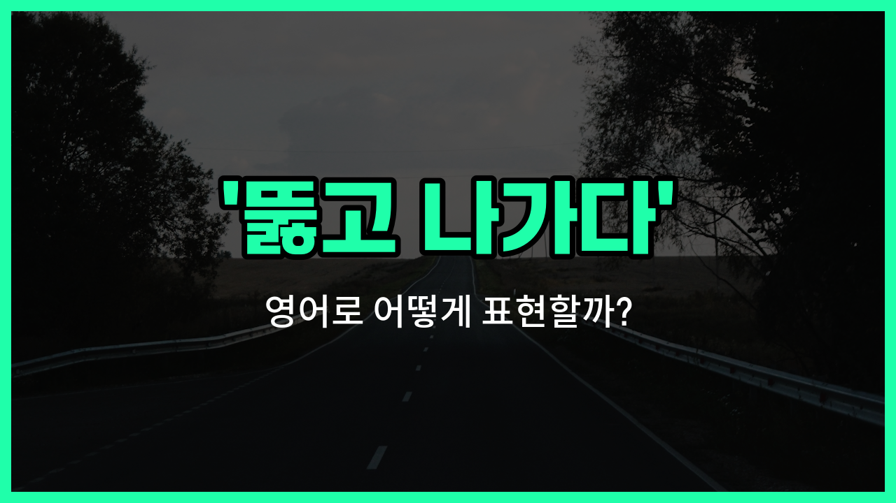

## 🌟 영어 표현 - break through

안녕하세요 👋 오늘은 '뚫고 나가다', '돌파하다', '극복하다'라는 뜻을 가진 영어 표현을 소개해드릴게요. 바로 '**break through**'라는 표현이에요.

'**break through**'는 어떤 장애물이나 어려움을 힘차게 뚫고 나가는 상황을 말할 때 사용해요. 즉, **장애물이나 한계를 극복하고 앞으로 나아가는 것**을 의미해요!

이 표현은 일상생활뿐만 아니라 비즈니스, 과학, 스포츠 등 다양한 분야에서 자주 쓰여요. 예를 들어, 오랫동안 해결하지 못했던 문제를 드디어 해결했을 때 "We [finally](/blog/in-english/182.finally/) broke through the problem."이라고 할 수 있어요.

또는, 새로운 시장에 진출하거나 경쟁자를 이겨냈을 때도 "The company [managed to](/blog/in-english/175.manage-to/) break through in the international [market](/blog/in-english/641.market/)."처럼 쓸 수 있어요.

## 📖 예문

1. "그는 어려운 시기를 뚫고 나갔어요."

   "He managed to break through the [tough](/blog/in-english/183.tough/) times."

2. "과학자들이 새로운 치료법을 개발하는 데 돌파구를 마련했어요."

   "Scientists have made a breakthrough in developing a new treatment."

## 💬 연습해보기

<ul data-interactive-list>

  <li data-interactive-item>
    이 문제로 며칠째 힘들었는데 드디어 해결책을 찾았어요.
    I've been struggling with this problem for days, but I finally managed to break through and find a solution.
  </li>

  <li data-interactive-item>
    팀원들이 정말 열심히 일한 덕분에 경쟁을 뚫고 1등을 차지했어요.
    The team worked really hard and managed to break through the <a href="/blog/in-english/668.competition/">competition</a> to <a href="/blog/in-english/456.win/">win</a> first place.
  </li>

  <li data-interactive-item>
    가끔은 자신의 의심을 뚫고 한 걸음 내딛어야 해요.
    <a href="/blog/in-english/270.sometimes/">Sometimes</a> you just need to break through your <a href="/blog/in-english/307.doubt/">doubts</a> and take the leap.
  </li>

  <li data-interactive-item>
    그녀는 질병 치료 방식에 변화가 생길 수 있는 연구에서 큰 발전을 이뤘어요.
    She made a breakthrough in her research that could change the way we treat the disease.
  </li>

  <li data-interactive-item>
    몇 시간 동안 힘든 협상 끝에 회사들이 합의에 도달했어요.
    After hours of tough negotiations, the companies were able to break through and reach an <a href="/blog/in-english/754.agreement/">agreement</a>.
  </li>

  <li data-interactive-item>
    어제 글쓰기를 하다가 막혔는데, 결국 방법을 찾아서 극복했어요.
    I hit a wall with my writing yesterday, but then I found a way to break through the block.
  </li>

  <li data-interactive-item>
    새로운 마케팅 전략 덕분에 브랜드가 젊은 층에 다가갈 수 있었어요.
    The new marketing strategy helped the brand break through to a younger audience.
  </li>

  <li data-interactive-item>
    많은 노력이 필요했지만, 예산 한계를 넘어 프로젝트를 완성했어요.
    It took a lot of effort, but we broke through the <a href="/blog/in-english/661.budget/">budget</a> limitations to complete the project.
  </li>

  <li data-interactive-item>
    그는 며칠 동안 그 레벨에 갇혀 있다가 드디어 극복하고 통과했어요.
    He was <a href="/blog/in-english/389.stuck/">stuck</a> on that level for days until he finally broke through and passed it.
  </li>

  <li data-interactive-item>
    그 예술가의 독특한 스타일 덕분에 붐비는 미술계에서 주목받았어요.
    The <a href="/blog/in-english/948.artist/">artist</a>'s unique style allowed her to break through the <a href="/blog/in-english/393.crowded/">crowded</a> art scene and gain recognition.
  </li>

</ul>

## 🤝 함께 알아두면 좋은 표현들

### overcome

'[overcome](/blog/in-english/767.overcome/)'은 "극복하다"라는 뜻으로, 어려움이나 장애물을 성공적으로 이겨내는 상황을 나타내요. 'break through'와 비슷하게 어떤 문제나 한계를 뛰어넘는 의미를 가지고 있어요.

- "She managed to overcome all the challenges and [finish](/blog/in-english/295.finish/) the project [on time](/blog/vocab-1/043.on-time/)."
- "그녀는 모든 어려움을 극복하고 프로젝트를 제시간에 끝냈어요."

### give up

'[give up](/blog/vocab-1/046.give-up/)'은 "포기하다"라는 뜻으로, 'break through'의 반대 의미예요. 어려움에 부딪혀 더 이상 시도하지 않고 중단하는 상황을 나타낼 때 사용해요.

- "He wanted to break through the barrier, but eventually he gave up."
- "그는 장벽을 뚫고 싶었지만 결국 포기했어요."

### push forward

'push forward'는 "계속 나아가다" 또는 "밀고 나가다"라는 뜻으로, 어려움을 뚫고 앞으로 나아가는 행동을 강조해요. 'break through'와 비슷하게 도전과 진전을 나타낼 때 쓰여요.

- "[Despite](/blog/in-english/341.despite/) the setbacks, the team [decided to](/blog/in-english/062.decide-to/) push forward with their plan."
- "좌절에도 불구하고 팀은 계획을 밀고 나가기로 결정했어요."

---

오늘은 '**뚫고 나가다**', '**돌파하다**', '**극복하다**'라는 뜻을 가진 영어 표현 '**break through**'에 대해 알아봤어요. 앞으로 힘든 상황이나 장애물을 만났을 때 이 표현을 떠올려보면 좋겠어요 😊

오늘 배운 표현과 예문들을 꼭 최소 3번씩 소리 내서 읽어보세요. 다음에도 더 재미있고 유익한 영어 표현으로 찾아올게요! 감사합니다!

