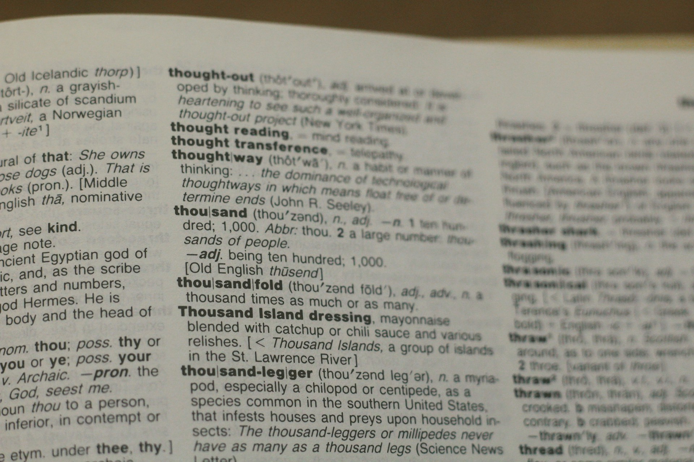

## 🌟 영어 표현 - check out

안녕하세요! 👋 오늘은 영어로 **'확인해보다', '살펴보다'** 라는 의미를 나타내는 **"check out"** 표현에 대해 알아볼게요.

"check out"은 일상생활에서 정말 자주 사용되는 표현이에요. **주로 무언가를 자세히 살펴보고 확인할 때 사용하죠**. 단순히 'check'만 사용할 때 보다 좀 더 적극적이고 꼼꼼히 살펴보는 뉘앙스를 줍니다. 이 표현은 여러 상황에서 유용하게 쓰일 수 있어요. 👀

예를 들어, 친구에게 새로운 가게를 추천할 때 이렇게 말할 수 있어요. "You should check out that new cafe downtown." (시내에 새로 생긴 카페를 한번 가봐야 해.). 여기서 "check out"은 '살펴보다' 또는 '가보다'라는 의미로 사용됐어요.

또 다른 예로, 가게에서 물건을 계산할 때나 호텔에서 퇴실할 때도 'check out' 이라는 표현을 사용할 수 있어요. 이 부분은 다음에 추가적으로 다뤄볼게요!

## 📖 예문

"이 새 책 한번 봐봐."

"Check out this new book."

"야, 내가 다운받은 새 앱 한번 봐봐. 진짜 대박이야!"

"Hey, check out this new app I downloaded. It's awesome!"

자, 이제 "check out"을 사용한 다양한 예문을 살펴볼까요? 꼭 소리내어 말하면서 연습해보세요! 🚀

## 💬 연습해보기

<ul data-interactive-list>
  <li data-interactive-item>
    우리 언젠간 시내에 새로 생긴 식당에 가봐야돼.
    We should check out that new restaurant downtown sometime.
  </li>
  <li data-interactive-item>
    그 드라마 최신 에피소드 벌써 봤어?
    Have you checked out the latest episode of that show yet?
  </li>
  <li data-interactive-item>
    오늘 밤 그 새로운 클럽에 가보자. 꽤 핫하다던데.
    Let's check out that new club tonight. I heard it's pretty wild.
  </li>
  <li data-interactive-item>
    그 소리가 뭐였는지 좀 확인해 줄래?
    Can you check out what that noise was?
  </li>
  <li data-interactive-item>
    내가 발견한 이 밴드 꼭 들어봐.
    You've gotta check out this band I <a href="/blog/in-english/955.discover/">discovered</a>.
  </li>
  <li data-interactive-item>
    상황을 확인하고 안전한지 알려줄게.
    I'm gonna check out the situation and <a href="/blog/in-english/241.let-someone-know/">let you know</a> if it's <a href="/blog/in-english/857.safe/">safe</a>.
  </li>
  <li data-interactive-item>
    할인 코너 확인하는 거 잊지 마.
    Don't forget to check out the sales rack.
  </li>
  <li data-interactive-item>
    헬스장에 가서 새로운 운동기구를 살펴볼 거야.
    I'm heading to the <a href="/blog/in-english/431.gym/">gym</a> to check out their new equipment.
  </li>
  <li data-interactive-item>
    야, 내가 찾은 이 밈 봐봐. 완전 웃겨.
    Hey, check out this meme I found. It's hilarious!
  </li>
</ul>

## 🤝 함께 알아두면 좋은 표현들

### look into

'[look into](/blog/in-english/878.look-into/)'는 **"조사하다" 또는 "알아보다"** 라는 뜻이에요. 어떤 상황이나 문제에 대해 **더 자세히 알아보거나 조사하는 행위**를 나타내요. 보통 문제 해결이나 정보 수집을 위해 사용돼요.

- "The manager promised to look into the customer's complaint."
- "매니저는 고객의 불만 사항을 조사해보겠다고 약속했습니다."

### browse through

'browse through'는 **"훑어보다" 또는 "둘러보다"** 라는 뜻이에요. 책, 웹사이트, 또는 상점 등을 **가볍게 살펴보거나 둘러보는 행위**를 나타내요. 주로 특정한 목적 없이 가볍게 정보를 훑어볼 때 사용해요.

- "I [like](/blog/in-english/1053.like/) to browse through magazines while waiting at the salon."
- "미용실에서 기다리는 동안 잡지를 훑어보는 것을 좋아해요."

---

오늘은 **'확인하다', '살펴보다'** 의 의미를 전달하는 **'check out'** 에 대해 배워봤어요. 정말 유용한 표현이죠? 일상 대화에서 자주 사용해보세요. **무언가를 자세히 확인해보는 상황에서** 이 표현을 쓰면 여러분의 영어가 한층 더 자연스러워질 거예요! 😉

여러분도 오늘 배운 "check out"을 사용해서 주변의 새로운 것들을 살펴보는 건 어떨까요? 연습이 실력을 만든답니다! 화이팅! 💪
