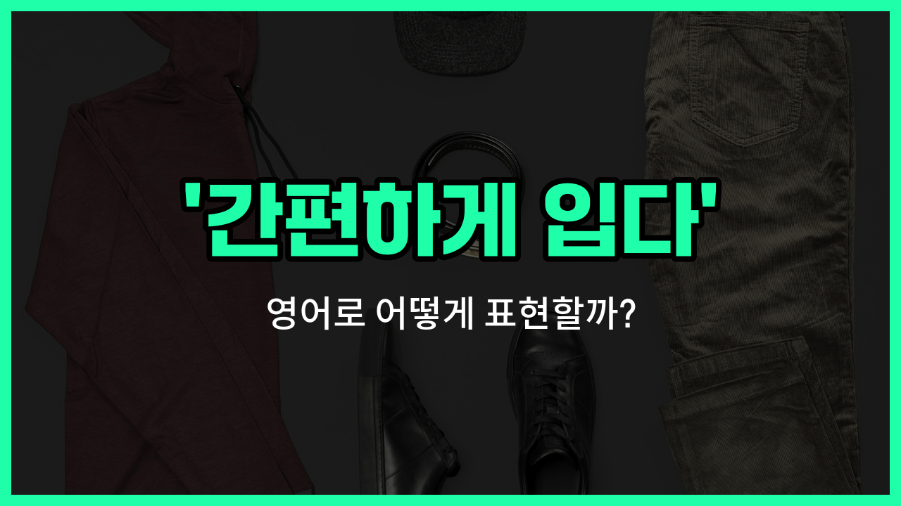

## 🌟 영어 표현 - dress down

안녕하세요 👋 오늘은 '간편하게 입다', '평상복을 입다'라는 뜻을 가진 영어 표현을 소개해드릴게요. 바로 '**dress down**'이에요. 이 표현은 보통 평소보다 덜 격식 있게, 좀 더 편안한 옷차림을 할 때 사용해요.

예를 들어, 회사에서 '[Casual](/blog/in-english/150.casual/) Friday'처럼 정장 대신 편한 옷을 입는 날이 있으면 "We can dress down on Fridays."라고 말할 수 있어요. 또는 친구들과 만날 때 너무 꾸미지 않고 자연스럽게 입고 나갈 때도 쓸 수 있답니다.

반대로, '[dress up](/blog/in-english/452.dress-up/)'은 격식을 차려서 옷을 입는다는 뜻이니 상황에 따라 구분해서 사용해 보세요!

## 📖 예문

1. "오늘은 편하게 입고 오셔도 돼요."

   "You can dress down today."

2. "주말에는 보통 평상복을 입어요."

   "I usually dress down on weekends."

## 💬 연습해보기

<ul data-interactive-list>

  <li data-interactive-item>
    회사에서 캐주얼 데이인 금요일에는 주로 편하게 입어요.
    I usually dress down on Fridays when we have casual day at the office.
  </li>

  <li data-interactive-item>
    그녀는 회의에서 더 친근해 보이려고 편한 옷으로 입기로 했어요.
    She's <a href="/blog/in-english/062.decide-to/">decided to</a> dress down for the meeting to appear more relatable.
  </li>

  <li data-interactive-item>
    비록 공식적인 행사지만, 원한다면 편하게 입어도 되어요.
    Even though it's a <a href="/blog/in-english/895.formal/">formal</a> event, <a href="/blog/얼마든지-영어표현/">feel free to</a> dress down if you want.
  </li>

  <li data-interactive-item>
    주말에는 편하게 청바지와 티셔츠만 입는 걸 좋아해요.
    On weekends, I <a href="/blog/in-english/191.prefer/">prefer</a> to dress down and just wear jeans and a t-shirt.
  </li>

  <li data-interactive-item>
    그는 회사의 느긋한 문화에 맞춰 면접에서도 편하게 입기로 선택했어요.
    He chose to dress down for the interview to fit the company's laid-back culture.
  </li>

  <li data-interactive-item>
    왜 조금 편하게 입지 않아요? 이 파티에 너무 포멀하게 보이네요.
    Why don't you dress down a bit? You look way too formal for this party.
  </li>

  <li data-interactive-item>
    팀빌딩 데이에는 편하게 입으라고들 했어요.
    They told us to dress down for the team-building day at work.
  </li>

  <li data-interactive-item>
    일주일 동안 차려입고 있었으니, 편하게 옷을 입고 쉬는 게 좋죠.
    After a long week of dressing up, it's nice to dress down and relax.
  </li>

  <li data-interactive-item>
    나는 보통 장 보러 갈 때 편하게 입어서 편안해요.
    I usually dress down when I run errands to stay comfortable.
  </li>

  <li data-interactive-item>
    어떤 사람들은 편하게 입는 게 행사를 진지하게 받아들이지 않는다고 생각해요.
    Some people think dressing down means you're not taking the event seriously.
  </li>

</ul>

## 🤝 함께 알아두면 좋은 표현들

### dress casually

'dress casually'는 "편하게 옷을 입다"라는 뜻이에요. 공식적이지 않고 편안한 옷차림을 의미하며, 친구들과 만나거나 일상적인 상황에서 자주 사용해요.

- "On Fridays, [employees](/blog/in-english/700.employee/) are allowed to dress casually at the office."
- "금요일에는 직원들이 사무실에서 편하게 옷을 입어도 돼요."

### dress formally

'dress formally'는 "정장 차림을 하다"라는 뜻이에요. 중요한 행사나 공식적인 자리에서 깔끔하고 격식을 갖춘 옷차림을 할 때 쓰는 표현이에요.

- "You need to dress formally for the wedding ceremony."
- "결혼식에서는 정장 차림을 해야 해요."

### dress up

'dress up'은 "차려 입다" 또는 "멋지게 옷을 입다"라는 뜻이에요. 특별한 날이나 파티 등에서 평소보다 더 멋지고 세련되게 옷을 입을 때 사용해요.

- "She decided to dress up for the gala event."
- "그녀는 갈라 행사에 멋지게 차려 입기로 했어요."

---

오늘은 '간편하게 입다', '평상복을 입다'라는 뜻의 영어 표현 '**dress down**'에 대해 알아봤어요. 다음에 편하게 옷을 입고 싶을 때 이 표현을 떠올려 보세요 😊

오늘 배운 표현과 예문들을 꼭 소리 내서 여러 번 읽어보시고, 일상에서 자연스럽게 사용해 보세요. 다음에도 더 유익한 영어 표현으로 찾아올게요! 감사합니다!

