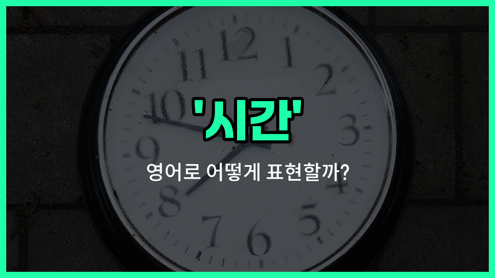

## 🌟 영어 표현 - time

안녕하세요 👋 오늘은 우리가 일상에서 정말 자주 쓰는 단어, 바로 '**시간**'을 영어로 어떻게 표현하는지 알아보려고 해요.

영어에서 '**time**'은 '시간', '때', '시기'와 같은 의미로 아주 폭넓게 사용돼요. 예를 들어, 하루 중 특정한 순간을 말할 때도 쓰이고, 어떤 일이 일어나는 시기나 기간을 나타낼 때도 자연스럽게 쓸 수 있어요.

예를 들어, "지금 몇 시야?"라고 물을 때는 "What time is it?"이라고 해요. 또, "좋은 시기야"라고 말하고 싶을 때는 "It's a good time."이라고 표현할 수 있어요.

'**time**'은 명사로 주로 쓰이지만, 때로는 동사로도 사용돼요. 예를 들어, "시간을 재다"라는 의미로 "to time something"이라고 할 수 있어요. 하지만 일상에서는 대부분 명사로 쓰인다는 점 기억해 주세요!

## 📖 예문

1. "나는 시간이 필요해요."

   "I need more time."

2. "좋은 때를 기다리고 있어요."

   "I'm [waiting for](/blog/in-english/377.wait-for/) the right time."

3. "지금 몇 시예요?"

   "What time is it?"

## 💬 연습해보기

<ul data-interactive-list>

  <li data-interactive-item>
    지금 대화할 시간이 별로 없어서 나중에 보자! 내가 자유로울 때도 좋고.
    I don't have much time to chat <a href="/blog/in-english/525.right-now/">right now</a>. Let's <a href="/blog/in-english/021.catch-up-on/">catch up</a> <a href="/blog/in-english/1024.later/">later</a> when I'm free.
  </li>

  <li data-interactive-item>
    영화 시작하기 전에 우리가 남은 시간이 얼마나 돼?
    How much time do we have before the movie starts?
  </li>

  <li data-interactive-item>
    그 책 읽으면서 시간 가는 줄 몰랐어. 정말 재밌어!
    I <a href="/blog/in-english/053.lose-track-of-time/">lost track of time</a> while <a href="/blog/in-english/436.read/">reading</a> that <a href="/blog/in-english/447.book/">book</a>. It's so good!
  </li>

  <li data-interactive-item>
    재미있을 땐 시간 진짜 빨리 가는 것 같지 않아?
    Time flies when you're having fun, doesn't it?
  </li>

  <li data-interactive-item>
    너의 제안에 대해 고민할 시간이 좀 필요해.
    I need some time to think about your offer before I decide.
  </li>

  <li data-interactive-item>
    이번 주말에 차고 청소할 시간 좀 내자.
    We should <a href="/blog/in-english/057.set-aside/">set aside</a> some time this weekend to <a href="/blog/in-english/523.clean/">clean</a> the garage.
  </li>

  <li data-interactive-item>
    시간은 돈이니까, 이 프로젝트 서둘러야겠어.
    Time is money, so we better hurry up with this project.
  </li>

  <li data-interactive-item>
    일하는 중에 빨리 커피 한 잔 할 시간을 항상 마련해.
    I always make time for a <a href="/blog/in-english/439.quick/">quick</a> coffee break during work.
  </li>

  <li data-interactive-item>
    이번 토요일에 이사 도와줄 시간 있어?
    Do you have time to help me move this Saturday?
  </li>

  <li data-interactive-item>
    드디어 나타났네! 한 시간이나 기다렸어.
    <a href="/blog/in-english/151.it's-about-time/">It's about time</a> you <a href="/blog/in-english/381.show-up/">showed up</a>! We've been waiting for an hour.
  </li>

</ul>

## 🤝 함께 알아두면 좋은 표현들

### moment (순간)

'[moment](/blog/in-english/490.moment/)'는 '시간'보다 더 짧고 특정한 '순간'을 의미해요. 어떤 일이 일어나는 아주 짧은 시점을 강조할 때 사용해요.

- "Just wait a moment, I'll be right back."
- "잠깐만 기다려 주세요, 금방 돌아올게요."

### eternity (영원)

'eternity'는 '시간'의 반대 개념으로, 끝이 없는 무한한 시간을 뜻해요. 시간이 계속 흘러도 끝나지 않는 상태를 표현할 때 쓰여요.

- "It felt [like](/blog/in-english/1053.like/) an eternity before the train [finally](/blog/in-english/182.finally/) [arrived](/blog/in-english/403.arrive/)."
- "기차가 드디어 도착하기까지 영원처럼 느껴졌어요."

### duration (지속 시간)

'duration'은 어떤 일이 계속되는 '시간의 길이'를 의미해요. 특정 사건이나 활동이 얼마 동안 이어지는지를 나타낼 때 사용해요.

- "The duration of the movie is two hours."
- "그 영화의 상영 시간은 두 시간이에요."

---

오늘은 '시간', '때', '시기'라는 뜻을 가진 영어 표현 '**time**'에 대해 알아봤어요. 일상에서 정말 자주 쓰이는 단어이니 꼭 기억해 두면 좋겠어요 😊

오늘 배운 표현과 예문들을 소리 내서 여러 번 읽어보세요. 다음에도 더 유익한 영어 표현으로 찾아올게요! 감사합니다!

