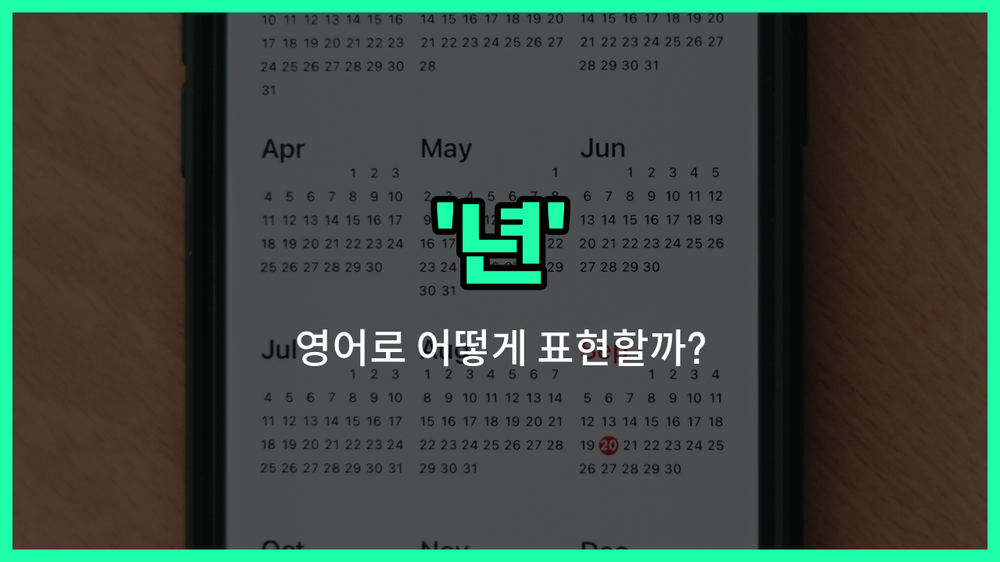

## 🌟 영어 표현 - year

안녕하세요 👋 오늘은 우리가 자주 쓰는 단어 '**년**'을 영어로 어떻게 표현하는지 알아보려고 해요. 바로 '**year**'라는 단어를 사용해요. 'year'는 **12개월이 모여서 이루어진 한 해**를 의미해요.

이 단어는 나이, 날짜, 기간 등 다양한 상황에서 정말 많이 쓰여요. 예를 들어, "나는 20살이에요"라고 말할 때 "I am 20 [years](/blog/in-english/1066.years/) old."라고 해요. 또, "2024년"은 "the year 2024"라고 표현할 수 있어요.

'year'는 단수형과 복수형이 있으니, 여러 해를 말할 때는 'years'로 바꿔서 사용해 주세요!

## 📖 예문

1. "나는 3년 동안 영어를 공부했어요."

   "I have studied English for three years."

2. "올해는 정말 특별한 해예요."

   "This year is a very special year."

## 💬 연습해보기

<ul data-interactive-list>

  <li data-interactive-item>
    이 회사에서 일한 지 벌써 1년이 됐고, 정말 많이 배웠어요.
    I've been <a href="/blog/in-english/1064.work/">working</a> at this company for a year now, and I've <a href="/blog/in-english/245.learn/">learned</a> so much.
  </li>

  <li data-interactive-item>
    그녀는 1년 전에 뉴욕으로 이사 갔고, 아직도 그곳을 아주 좋아해요.
    She moved to <a href="/blog/in-english/1056.new/">New</a> York a year ago and <a href="/blog/in-english/254.still/">still</a> loves it there.
  </li>

  <li data-interactive-item>
    유럽 여행을 다니기 위해 제 돈을 모으는 데 1년이나 걸렸어요.
    It took me a year to <a href="/blog/in-english/293.save/">save</a> enough money for my trip around Europe.
  </li>

  <li data-interactive-item>
    1년 만에 우리 일상에서 기술이 많이 발전했어요.
    In just one year, technology <a href="/blog/많이-달라졌어-영어표현/">has changed a lot</a> in our daily lives.
  </li>

  <li data-interactive-item>
    여행 제한 때문에 1년 동안 가족을 못 봤어요.
    He hasn't seen his family in a year because of travel restrictions.
  </li>

  <li data-interactive-item>
    우리 개를 입양한 지 벌써 1년이 지났다니 믿어지지가 않아요.
    I can't believe it's been a year since we adopted our dog.
  </li>

  <li data-interactive-item>
    그들은 결혼한 지 1년이 넘었고, 정말 행복하게 지내고 있어요.
    They've been married for over a year, and they're really happy <a href="/blog/in-english/374.together/">together</a>.
  </li>

  <li data-interactive-item>
    이 프로젝트는 최소 1년은 걸릴 거라서 미리 계획하고 있어요.
    The project will take <a href="/blog/in-english/167.at-least/">at least</a> a year to complete, so we're planning accordingly.
  </li>

  <li data-interactive-item>
    해외에서 1년 동안 공부한 덕분에 시야가 정말 넓어졌어요.
    A year of studying abroad really broadened my perspective.
  </li>

  <li data-interactive-item>
    우리는 1년 동안 친구였는데, 서로를 영원히 안 아는 것 같은 느낌이에요.
    We've been friends for a year, and it feels <a href="/blog/in-english/1053.like/">like</a> we've <a href="/blog/in-english/1058.know/">known</a> each other forever.
  </li>

</ul>

## 🤝 함께 알아두면 좋은 표현들

### calendar year

'calendar year'은 "**한 해, 1월 1일부터 12월 31일까지의 기간**"을 의미해요. 일반적으로 우리가 일상에서 사용하는 연도를 말할 때 쓰이며, 회계나 공식 문서에서도 자주 사용돼요.

- "The company's [profits](/blog/in-english/663.profit/) increased significantly in the calendar year 2023."
- "그 회사의 이익은 2023년 한 해 동안 크게 증가했어요."

### fiscal year

'fiscal year'는 "**회계 연도, 기업이나 정부가 재무 보고를 위해 정한 1년 기간**"을 뜻해요. 일반적인 1월부터 12월까지의 연도와 다를 수 있어서 재무나 회계 관련 대화에서 자주 등장해요.

- "The fiscal year for the company ends in June."
- "그 회사의 회계 연도는 6월에 끝나요."

### moment

'[moment](/blog/in-english/490.moment/)'는 "**순간, 아주 짧은 시간**"을 의미해요. 'year'와는 반대 개념으로, 긴 시간 단위인 '년' 대신 아주 짧은 시간을 나타낼 때 사용해요.

- "Wait a moment, I'll be [right](/blog/in-english/1063.right/) back."
- "잠깐만 기다려 주세요, 금방 돌아올게요."

---

오늘은 '**년**', '**연도**', '**해**'라는 뜻을 가진 영어 표현 '**year**'에 대해 알아봤어요. 날짜나 나이, 기간을 말할 때 꼭 필요한 단어니까 여러 번 연습해 보세요 😊

오늘 배운 표현과 예문들을 소리 내서 3번씩 읽어보면 더 기억에 남을 거예요. 다음에도 더 유익한 영어 표현으로 찾아올게요! 감사합니다!

