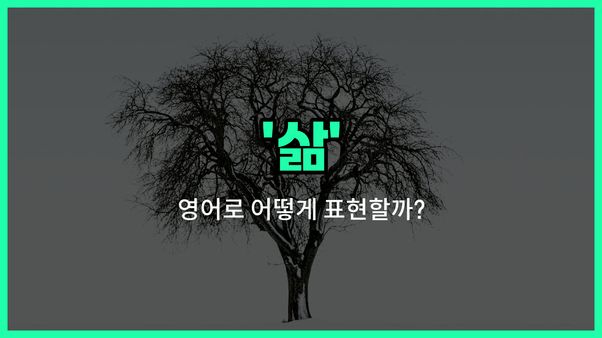

## 🌟 영어 표현 - life

안녕하세요 👋 오늘은 우리가 자주 쓰는 단어인 '**삶**'을 영어로 어떻게 표현하는지 알아보려고 해요. 바로 '**life**'라는 단어인데요, 이 단어는 '삶', '인생', '생명' 등 다양한 의미로 쓰여요.

'**life**'는 우리가 살아가는 모든 과정, 즉 태어나서부터 죽을 때까지의 전체적인 '삶'을 의미해요. 또한, '생명'이라는 뜻도 있어서 동물이나 식물 등 살아있는 모든 것에 대해 쓸 수 있어요.

예를 들어, "행복한 삶을 살고 싶어요."라고 말하고 싶을 때 "I [want](/blog/in-english/1060.want/) to live a happy life."라고 표현할 수 있어요. 또는, "생명은 소중해요."는 "Life is precious."라고 할 수 있답니다.

## 📖 예문

1. "그녀는 자신의 삶에 만족하고 있어요."

   "She is [satisfied](/blog/in-english/303.satisfied/) with her life."

2. "삶은 때때로 어렵지만, 항상 배울 점이 있어요."

   "Life is [sometimes](/blog/in-english/270.sometimes/) hard, but there is always something to [learn](/blog/in-english/245.learn/)."

## 💬 연습해보기

<ul data-interactive-list>

  <li data-interactive-item>
    인생은 예측할 수 없는 놀라움으로 가득해요.
    Life is full of surprises that you just can't predict.
  </li>

  <li data-interactive-item>
    가끔 인생에서는 예상치 못한 일이 생기고, 그에 빠르게 적응해야 해요.
    Sometimes life <a href="/blog/in-english/458.throw/">throws</a> you a curveball and you have to adapt quickly.
  </li>

  <li data-interactive-item>
    최근에 인생의 의미에 대해 많이 생각하고 있어요.
    I've been <a href="/blog/in-english/1059.think/">thinking</a> a lot about the meaning of life lately.
  </li>

  <li data-interactive-item>
    인생이 바쁘긴 하지만, 사랑하는 것들에 시간을 내는 게 중요해요.
    Life gets <a href="/blog/in-english/372.busy/">busy</a>, but it's <a href="/blog/in-english/318.important/">important</a> to make <a href="/blog/in-english/1055.time/">time</a> for the things you love.
  </li>

  <li data-interactive-item>
    내가 내리는 모든 결정은 나의 삶에 영향을 줘요.
    Every decision you make shapes your life in some <a href="/blog/in-english/1062.way/">way</a>.
  </li>

  <li data-interactive-item>
    인생에서는 성공보다 실수에서 더 많은 걸 배워요.
    In life, you learn more from your mistakes than your successes.
  </li>

  <li data-interactive-item>
    그녀는 힘든 일들을 많이 겪었지만, 긍정적인 태도로 삶을 더 쉽게 만들어요.
    She's been through a lot, but her positive attitude makes life easier.
  </li>

  <li data-interactive-item>
    인생이 항상 공평하지는 않지만, 계속 앞으로 나아가야 해요.
    Life isn't always fair, but you have to keep moving forward.
  </li>

  <li data-interactive-item>
    인생에서 균형을 찾는 것은 현재도 계속 노력 중이에요.
    Finding balance in life is something I'm <a href="/blog/in-english/254.still/">still</a> <a href="/blog/in-english/1064.work/">working</a> on.
  </li>

  <li data-interactive-item>
    인생은 짧으니까 가능한 모든 순간을 즐기려 해요.
    Life is short, so I <a href="/blog/in-english/117.try-to/">try to</a> enjoy every <a href="/blog/in-english/490.moment/">moment</a> I can.
  </li>

</ul>

## 🤝 함께 알아두면 좋은 표현들

### existence

'existence'는 "존재" 또는 "생존"을 의미해요. 'life'와 비슷하게 생명이나 살아있는 상태를 나타내지만, 좀 더 철학적이거나 추상적인 의미로 쓰일 때가 많아요.

- "The existence of life on other planets is still a [mystery](/blog/in-english/500.mystery/) to scientists."
- "다른 행성에 생명체가 존재하는지는 아직 과학자들에게 미스터리예요."

### death

'death'는 "죽음"을 뜻해요. 'life'의 반대말로, 생명이 끝나는 상태를 나타내죠. 삶과 죽음은 서로 대조되는 개념이에요.

- "He reflected deeply on the meaning of life and death."
- "그는 삶과 죽음의 의미에 대해 깊이 생각했어요."

### lifestyle

'lifestyle'은 "생활 방식" 또는 "삶의 방식"을 의미해요. 'life'가 생명 자체를 뜻한다면, 'lifestyle'은 개인이나 집단이 살아가는 구체적인 방식을 가리켜요.

- "She adopted a healthier lifestyle to [improve](/blog/in-english/394.improve/) her overall well-being."
- "그녀는 전반적인 건강을 위해 더 건강한 생활 방식을 채택했어요."

---

오늘은 '삶', '인생', '생명'이라는 뜻을 가진 영어 표현 '**life**'에 대해 알아봤어요. 일상에서 자신의 생각이나 감정을 표현할 때 이 단어를 활용해 보세요 😊

오늘 배운 표현과 예문들을 꼭 최소 3번씩 소리 내서 읽어보세요. 다음에도 더 재미있고 유익한 영어 표현으로 찾아올게요! 감사합니다!

