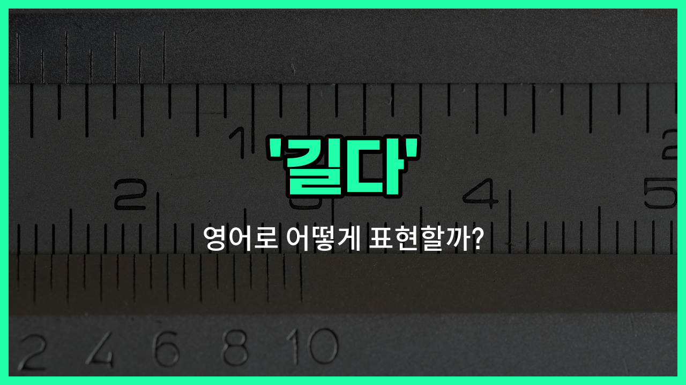

## 🌟 영어 표현 - long

안녕하세요 👋 오늘은 '길다', '오래', '긴'이라는 뜻을 가진 영어 표현을 소개해드릴게요. 바로 '**long**'이에요. 

'**long**'은 시간이나 거리, 길이 등 여러 상황에서 '길다' 또는 '오래'라는 의미로 자주 사용돼요. 예를 들어, 머리카락이 길거나, 어떤 일이 오랜 시간 동안 지속될 때 모두 쓸 수 있는 단어예요!

예를 들어, "그녀의 머리카락이 길어요."라고 말하고 싶을 때 "Her hair is long."이라고 표현할 수 있어요. 또, "오랜 시간 기다렸어요."는 "I [waited for](/blog/in-english/377.wait-for/) a long [time](/blog/in-english/1055.time/)."이라고 해요.

'**long**'은 형용사로 '길다', '오래'라는 뜻을 가지고 있어서, 다양한 문장에 자연스럽게 쓸 수 있어요. 길이뿐만 아니라 시간의 길이도 표현할 수 있으니 꼭 기억해두세요!

## 📖 예문

1. "이 강은 매우 길어요."

   "This river is very long."

2. "나는 오랫동안 그를 기다렸어요."

   "I waited for him for a long time."

## 💬 연습해보기

<ul data-interactive-list>

  <li data-interactive-item>
    그 영화 진짜 길어서 중간에 졸 뻔했어.
    That movie was so long, I <a href="/blog/in-english/854.almost/">almost</a> fell asleep halfway through.
  </li>

  <li data-interactive-item>
    오늘 회사에서 하루가 너무 길었던 게 회의가 많았거든.
    My <a href="/blog/in-english/1067.day/">day</a> at <a href="/blog/in-english/1064.work/">work</a> felt long because I had so many meetings.
  </li>

  <li data-interactive-item>
    커피숍 줄이 너무 길어서 나중에 다시 오기로 했어.
    The line at the coffee shop was long, so I <a href="/blog/in-english/062.decide-to/">decided to</a> come back <a href="/blog/in-english/1024.later/">later</a>.
  </li>

  <li data-interactive-item>
    그녀 머리카락 너무 길어서 허리까지 내려와.
    She has really long hair that reaches her waist.
  </li>

  <li data-interactive-item>
    우리가 긴 하이킹을 했고 끝날 때쯤 완전 지쳤어.
    We went for a long hike and were exhausted by the end of it.
  </li>

  <li data-interactive-item>
    그 프로젝트 끝내는 데 시간이 많이 걸렸지만, 가치 있었어.
    It took a long time to <a href="/blog/in-english/295.finish/">finish</a> that project, but it was worth it.
  </li>

  <li data-interactive-item>
    여행에 대한 모든 걸 설명한 긴 이메일 보냈어.
    I <a href="/blog/in-english/292.send/">sent</a> you a long email <a href="/blog/in-english/909.explain/">explaining</a> everything about the trip.
  </li>

  <li data-interactive-item>
    그가 말한 이야기가 길긴 했지만, 정말 흥미로웠어.
    The <a href="/blog/in-english/537.story/">story</a> he told was long, but really interesting.
  </li>

  <li data-interactive-item>
    옛 추억에 대해 친구와 긴 대화를 나눴어.
    I had a long conversation with my friend about old memories.
  </li>

  <li data-interactive-item>
    바닷가 가는 길이 길어서 차 막히기 전에 빨리 떠나야 해.
    The road to the beach is long, so we should <a href="/blog/in-english/402.leave/">leave</a> early to <a href="/blog/in-english/924.avoid/">avoid</a> <a href="/blog/in-english/384.traffic/">traffic</a>.
  </li>

</ul>

## 🤝 함께 알아두면 좋은 표현들

### lengthy

'lengthy'는 '길다'와 비슷하게 어떤 것이 시간이나 길이 면에서 상당히 길다는 뜻이에요. 주로 문서, 대화, 과정 등이 길고 지루할 때 쓰여요.

- "The meeting was so lengthy that everyone felt exhausted by the end."
- "회의가 너무 길어서 모두가 끝날 때쯤 지쳐 있었어요."

### short

'short'는 '길다'의 반대말로, 어떤 것이 길이가 짧거나 시간이 적다는 뜻이에요. 보통 길이나 시간, 거리 등이 짧을 때 사용해요.

- "The movie was surprisingly short, ending in just under an hour."
- "그 영화는 놀랍게도 짧아서 한 시간도 안 돼서 끝났어요."

### extended

'extended'는 '길게 연장된'이라는 뜻으로, 원래보다 더 길어진 상태를 나타내요. 시간이나 공간이 늘어난 경우에 주로 사용해요.

- "They took an extended break during the conference to relax."
- "그들은 회의 중에 휴식을 위해 연장된 휴식 시간을 가졌어요."

---

오늘은 '길다', '오래', '긴'이라는 뜻을 가진 영어 표현 '**long**'에 대해 알아봤어요. 일상에서 길이나 시간에 대해 말할 때 이 표현을 떠올려보면 좋겠어요 😊

오늘 배운 표현과 예문들을 꼭 최소 3번씩 소리 내서 읽어보세요. 다음에도 더 재미있고 유익한 영어 표현으로 찾아올게요! 감사합니다!

