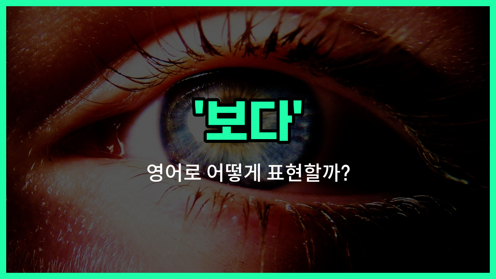

## 🌟 영어 표현 - look

안녕하세요 👋 오늘은 우리가 일상에서 정말 자주 쓰는 동사, 바로 '**보다**'의 영어 표현 '**look**'에 대해 알아보려고 해요.

'**look**'은 무언가를 주의 깊게 바라보거나, 시선을 어떤 방향으로 향하게 할 때 사용하는 단어예요. 단순히 보는 것뿐만 아니라, 집중해서 쳐다보거나 살펴볼 때도 쓸 수 있어요!

예를 들어, 누군가에게 "저기 좀 봐!"라고 말하고 싶을 때 "Look over there!"라고 할 수 있어요. 또, 무언가를 자세히 살펴볼 때도 "Let me [look at](/blog/in-english/319.look-at/) this closely."라고 표현할 수 있답니다.

'**look**'은 명령문, 질문, 설명 등 다양한 문장에서 자연스럽게 활용돼요. 특히, 'look at'처럼 전치사와 함께 쓰이면 '무엇을 보다'라는 의미가 더 명확해져요.

## 📖 예문

1. "저를 봐 주세요."

   "Please look at me."

2. "그녀는 창밖을 바라보고 있어요."

   "She is looking out the window."

3. "이 문서를 한번 살펴봐 주세요."

   "Please look over this [document](/blog/in-english/824.document/)."

## 💬 연습해보기

<ul data-interactive-list>

  <li data-interactive-item>
    이 사진 한번 보고, 너 생각을 좀 말해줄 수 있어?
    Can you look at this picture and tell me what you <a href="/blog/in-english/1059.think/">think</a>?
  </li>

  <li data-interactive-item>
    미팅 전에 이 서류들 좀 살펴봐 줘야 해.
    I need you to look over these documents before the meeting.
  </li>

  <li data-interactive-item>
    창밖을 보면 도시의 스카이라인이 보여.
    When you look out the window, you can see the city skyline.
  </li>

  <li data-interactive-item>
    내가 그 소식 전했을 때, 그녀는 그렇게 행복해 보이지 않았어.
    She didn't look happy when I told her the <a href="/blog/in-english/536.news/">news</a>.
  </li>

  <li data-interactive-item>
    도로를 건널 때는 좌우를 잘 살펴야 해, 알았지?
    Look both <a href="/blog/in-english/1062.way/">ways</a> before you cross the street, okay?
  </li>

  <li data-interactive-item>
    이렇게 많은 시간이 지난 후에 그를 알아보려면 두 번 봐야 했어.
    I had to look twice to recognize him after all these <a href="/blog/in-english/1065.year/">years</a>.
  </li>

  <li data-interactive-item>
    그 사람이 뭔가 말하려는 듯한 모습이었는데, 그 후 마음이 바뀌었어.
    He looked <a href="/blog/in-english/1053.like/">like</a> he was about to say something but then changed his mind.
  </li>

  <li data-interactive-item>
    사실들만 보고 뭐가 일어난 건지 함께 생각해보자.
    Let's just look at the facts and <a href="/blog/in-english/170.figure-out/">figure out</a> what happened.
  </li>

  <li data-interactive-item>
    사장님이 오신다고 해서 그에게 잘 갖춰 입으라고 했어.
    I told him to look sharp because the boss was coming.
  </li>

  <li data-interactive-item>
    좀 더 가까이 보면 그 그림에 숨겨진 사인도 보여.
    If you look closer, you'll <a href="/blog/in-english/061.notice/">notice</a> the painting has a hidden signature.
  </li>

</ul>

## 🤝 함께 알아두면 좋은 표현들

### glance (흘끗 보다)

'glance'는 '흘끗 보다'라는 뜻으로, 짧고 빠르게 보는 행위를 의미해요. 자세히 보지 않고 잠깐 시선을 던질 때 주로 사용해요.

- "She glanced at her watch to check the [time](/blog/in-english/1055.time/)."
- "그녀는 시간을 확인하려고 시계를 흘끗 봤어요."

### stare (응시하다)

'stare'는 '응시하다'라는 뜻으로, 오랫동안 집중해서 바라보는 것을 의미해요. 때로는 무례하거나 놀란 감정을 나타낼 때도 사용돼요.

- "He [stared at](/blog/in-english/087.stare-at/) the painting for several minutes, fascinated by its details."
- "그는 그 그림의 세부 사항에 매료되어 몇 분 동안 응시했어요."

### ignore (무시하다)

'[ignore](/blog/in-english/348.ignore/)'는 '무시하다'라는 뜻으로, 일부러 보지 않거나 관심을 주지 않는 것을 의미해요. 어떤 것을 의도적으로 피하거나 신경 쓰지 않을 때 사용해요.

- "She ignored the [noisy](/blog/in-english/957.noisy/) crowd and [focused on](/blog/in-english/186.focus-on/) her [book](/blog/in-english/447.book/)."
- "그녀는 시끄러운 군중을 무시하고 책에 집중했어요."

---

오늘은 '**보다**', '**쳐다보다**', '**살펴보다**'라는 뜻을 가진 영어 표현 '**look**'에 대해 알아봤어요. 일상에서 무언가를 볼 때 이 표현을 떠올려 보세요! 😊

오늘 배운 표현과 예문들을 꼭 최소 3번씩 소리 내서 읽어보세요. 다음에도 더 재미있고 유익한 영어 표현으로 찾아올게요! 감사합니다!

