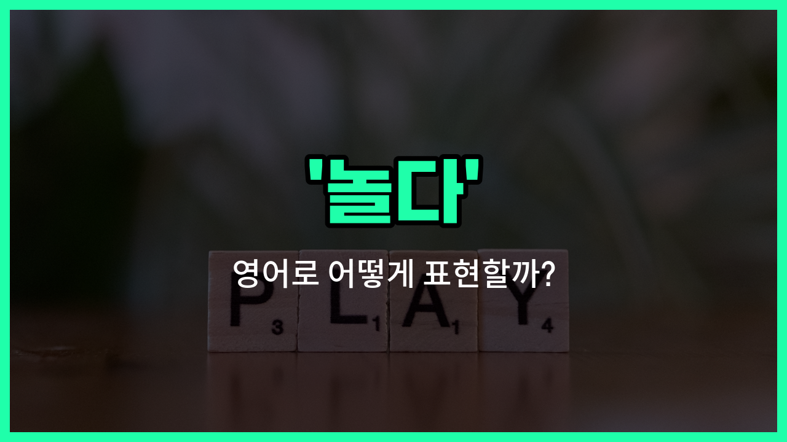

## 🌟 영어 표현 - play

안녕하세요 👋 오늘은 일상에서 자주 쓰는 표현인 '**놀다**'의 영어 표현 '**play**'에 대해 알아보려고 해요.

'**play**'는 주로 **아이들이 장난감이나 친구들과 함께 재미있게 시간을 보내는 것**을 의미해요. 하지만 꼭 어린이에게만 쓰는 건 아니고, 어른들도 게임을 하거나 스포츠를 즐길 때 사용할 수 있어요!

예를 들어, 친구와 공놀이를 하거나, 보드게임을 할 때, 또는 악기를 연주할 때도 'play'라는 단어를 쓸 수 있어요. 상황에 따라 '재미있게 놀다', '장난치다'라는 의미로도 자연스럽게 사용돼요.

## 📖 예문

1. "아이들이 공원에서 놀고 있어요."

   "The children are playing in the [park](/blog/in-english/463.park/)."

2. "우리 같이 게임할래요?"

   "Do you [want](/blog/in-english/1060.want/) to play a game [together](/blog/in-english/374.together/)?"

3. "그는 피아노를 잘 쳐요."

   "He plays the piano well."

## 💬 연습해보기

<ul data-interactive-list>

  <li data-interactive-item>
    학교 끝나고 애들은 어둡기 전까지 밖에서 놀기 좋아해요.
    After school, the kids <a href="/blog/in-english/1053.like/">like</a> to play <a href="/blog/in-english/974.outside/">outside</a> until it gets dark.
  </li>

  <li data-interactive-item>
    어렸을 때는 쉬는 시간에 술래잡기 많이 했었어요.
    We <a href="/blog/in-english/143.used-to/">used to</a> play tag during recess when I was younger.
  </li>

  <li data-interactive-item>
    주말에는 보통 친구들이랑 게임하곤 해요.
    On weekends, I usually play video games with my friends.
  </li>

  <li data-interactive-item>
    그들은 매일 오후마다 공원에서 농구하는 걸 좋아해요.
    They <a href="/blog/in-english/1074.love/">love</a> to play basketball at the park every afternoon.
  </li>

  <li data-interactive-item>
    놀이터 가서 잠깐 놀아볼까요?
    Let's go to the playground and play for a while.
  </li>

  <li data-interactive-item>
    강아지들이 새 장난감이 너무 신나서 놀고 있어요.
    The puppies were excited to play with their <a href="/blog/in-english/1056.new/">new</a> toys.
  </li>

  <li data-interactive-item>
    여름 캠프에서는 다양한 운동과 게임을 했어요.
    During summer camp, we played all sorts of sports and games.
  </li>

  <li data-interactive-item>
    요즘 일 쌓여서 놀 시간이 별로 없어졌어요.
    I don't get much free <a href="/blog/in-english/1055.time/">time</a> to play these <a href="/blog/in-english/1067.day/">days</a> with <a href="/blog/in-english/1064.work/">work</a> piling up.
  </li>

  <li data-interactive-item>
    어린이집에서는 애들이 정말 잘 놀아요.
    The children play so nicely together at the daycare center.
  </li>

  <li data-interactive-item>
    할머니 댁에 가면 저녁에 보드게임 하곤 해요.
    Whenever we visit grandma, we play board games in the evening.
  </li>

</ul>

## 🤝 함께 알아두면 좋은 표현들

### hang out

'[hang out](/blog/in-english/127.hang-out/)'은 친구들이나 사람들과 함께 시간을 보내며 편하게 놀거나 쉬는 것을 의미해요. 주로 캐주얼한 상황에서 쓰이고, 특별한 활동 없이 그냥 어울리는 느낌을 줘요.

- "We [decided to](/blog/in-english/062.decide-to/) hang out at the park after school."
- "우리는 방과 후에 공원에서 같이 놀기로 했어요."

### work

'work'는 '일하다'라는 뜻으로, 'play'의 반대말이에요. 놀거나 쉬는 대신에 어떤 일을 하거나 노동하는 상태를 나타내요.

- "I have to work all weekend, so I can't play with you."
- "나는 주말 내내 일해야 해서 너랑 놀 수 없어요."

### relax

'relax'는 '휴식을 취하다'라는 뜻으로, 'play'와 비슷하게 쉬는 시간을 보내는 것을 의미하지만 꼭 활동적으로 노는 것보다는 편안하게 쉬는 상태를 강조해요.

- "After a [long](/blog/in-english/1077.long/) day, I like to relax by [listening to](/blog/in-english/407.listen-to/) music."
- "긴 하루가 끝나면 나는 음악을 들으며 휴식을 취하는 걸 좋아해요."

---

오늘은 '**놀다**'라는 뜻을 가진 영어 표현 '**play**'에 대해 알아봤어요. 친구들과 시간을 보낼 때, 또는 취미 활동을 할 때 이 표현을 떠올려 보세요 😊

오늘 배운 표현과 예문들을 꼭 최소 3번씩 소리 내서 읽어보세요. 다음에도 더 재미있고 유익한 영어 표현으로 찾아올게요! 감사합니다!

