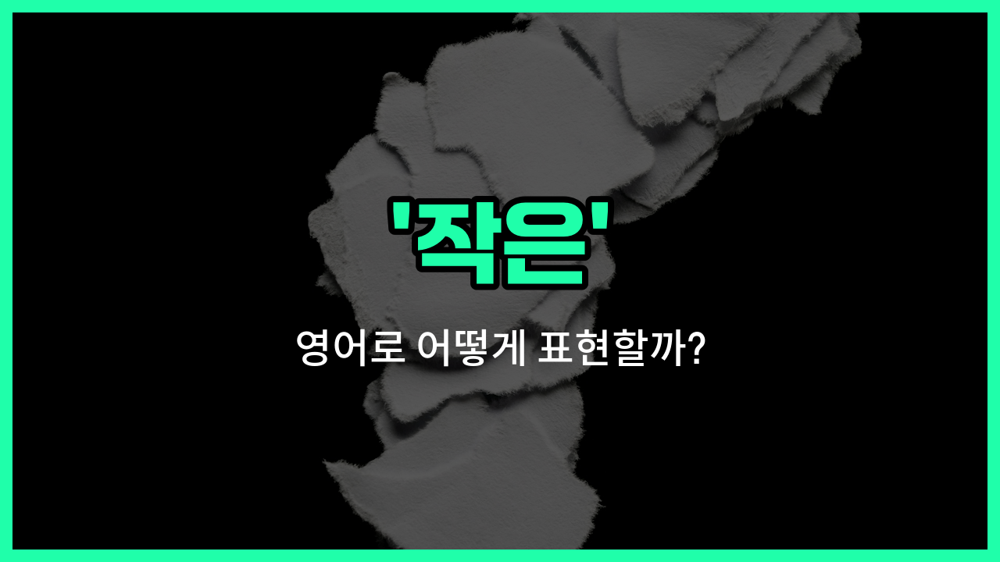

## 🌟 영어 표현 - little

안녕하세요 👋 오늘은 '작은', '조금의', '적은'이라는 뜻을 가진 영어 표현 '**little**'에 대해 알아보려고 해요.

'**little**'는 크기나 양이 매우 작거나 적을 때 사용하는 단어예요. 예를 들어, 아주 작은 물건이나 양이 많지 않은 상황을 표현할 때 자주 쓰여요.

이 단어는 명사 앞에 붙어서 '작은', '적은'이라는 의미를 더해줘요. 예를 들어, 'a little boy'라고 하면 '작은 소년'이라는 뜻이 되고, 'a little water'라고 하면 '조금의 물'이라는 뜻이 돼요.

또한, 'little'은 부정적인 뉘앙스를 줄 때도 있어요. 예를 들어, 'I have little money.'라고 하면 '나는 돈이 거의 없어.'라는 의미가 돼요.

## 📖 예문

1. "나는 작은 강아지를 키우고 있어요."

   "I have a little puppy."

2. "그는 조금의 시간이 필요해요."

   "He needs a little [time](/blog/in-english/1055.time/)."

3. "우리는 적은 정보만 가지고 있어요."

   "We have little information."

## 💬 연습해보기

<ul data-interactive-list>

  <li data-interactive-item>
    나는 시내에서 쇼핑할 때 너에게 줄 작은 선물을 샀어.
    I bought a little gift for you while I was shopping downtown.
  </li>

  <li data-interactive-item>
    모퉁이에 구수한 커피가 있는 작은 카페가 있어.
    There's a little cafe <a href="/blog/in-english/328.around-the-corner/">around the corner</a> that has the <a href="/blog/in-english/1073.best/">best</a> coffee.
  </li>

  <li data-interactive-item>
    그녀는 항상 에너지가 넘치는 작은 강아지를 키우고 있어.
    She has a little puppy that's always full of energy.
  </li>

  <li data-interactive-item>
    새 자켓을 넣으려고 내 옷장에 작은 공간을 만들어야 해.
    I need to make a little space in my closet for the <a href="/blog/in-english/1056.new/">new</a> jacket.
  </li>

  <li data-interactive-item>
    그는 숙제를 계속하기 전에 잠깐 쉬었어.
    He took a little break before continuing his homework.
  </li>

  <li data-interactive-item>
    그 영화는 모험을 떠나는 작은 소녀에 대한 이야기야.
    That movie is about a little girl who goes on an adventure.
  </li>

  <li data-interactive-item>
    어제 비가 조금 왔는데, 덕분에 계획이 엉망이 되지 않았어.
    We only had a little bit of rain yesterday, so it didn't mess up the plans.
  </li>

  <li data-interactive-item>
    내 핸드폰에 작은 기스가 생겼는데, 별로 심각하진 않아.
    I <a href="/blog/in-english/061.notice/">noticed</a> a little scratch on my phone but it's nothing <a href="/blog/in-english/146.serious/">serious</a>.
  </li>

  <li data-interactive-item>
    그가 미래에 대해 이야기할 때 목소리에 약간의 망설임이 있어.
    There's a little hesitation in his voice when he talks about the future.
  </li>

  <li data-interactive-item>
    맛을 더 달콤하게 하려고 레시피에 설탕을 조금 추가했어.
    I added a little sugar to the recipe to <a href="/blog/in-english/244.make-it/">make it</a> taste sweeter.
  </li>

</ul>

## 🤝 함께 알아두면 좋은 표현들

### tiny

'tiny'는 '아주 작은'이라는 뜻으로, 'little'보다 더 작고 귀여운 느낌을 줄 때 사용해요. 주로 크기나 양이 매우 작을 때 쓰여요.

- "She [found](/blog/in-english/1083.find/) a tiny kitten hiding under the porch."
- "그녀는 현관 아래에 숨어 있는 아주 작은 새끼 고양이를 발견했어요."

### small

'small'은 '작은'이라는 뜻으로 'little'과 거의 비슷하지만, 좀 더 일반적이고 객관적인 크기를 나타낼 때 사용해요. 크기나 양이 적다는 의미를 담고 있어요.

- "They live in a small apartment in the city."
- "그들은 도시에 있는 작은 아파트에 살고 있어요."

### big

'big'은 '큰'이라는 뜻으로 'little'의 반대말이에요. 크기나 양이 많거나 넓을 때 사용하며, '작은'과는 정반대의 의미를 가지고 있어요.

- "He bought a big [house](/blog/in-english/1088.house/) with a large garden."
- "그는 큰 정원이 있는 큰 집을 샀어요."

---

오늘은 '작은', '조금의', '적은'이라는 뜻을 가진 영어 단어 '**little**'에 대해 알아봤어요. 일상에서 크기나 양이 적을 때 이 표현을 활용해 보세요 😊

오늘 배운 표현과 예문들을 꼭 소리 내서 여러 번 읽어보세요. 다음에도 더 유익한 영어 표현으로 찾아올게요! 감사합니다

