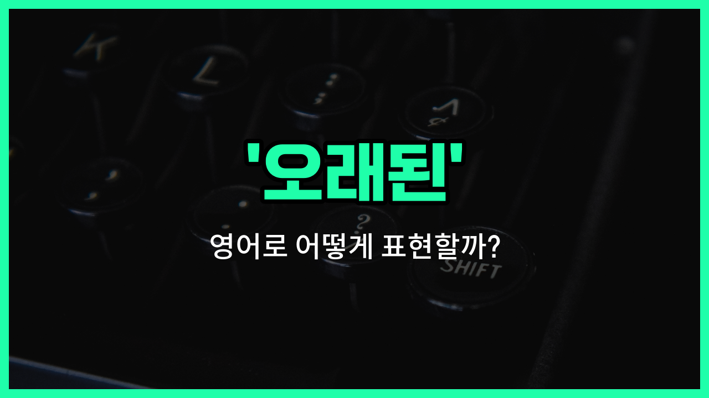

## 🌟 영어 표현 - old

안녕하세요 👋 오늘은 우리가 자주 쓰는 표현인 '**오래된**'을 영어로 어떻게 말하는지 알아볼 거예요. 바로 '**old**'라는 단어를 사용해요. 이 단어는 시간의 흐름에 따라 **오래되어 낡거나 예전의 것**을 말할 때 쓰여요.

'old'는 물건, 건물, 사람, 습관 등 다양한 상황에서 자연스럽게 사용할 수 있어요. 예를 들어, 오래된 책, 낡은 자동차, 구식의 방식 등 여러 가지를 표현할 때 쓸 수 있답니다!

예를 들어, "이 집은 오래됐어요."라고 말하고 싶을 때 "This [house](/blog/in-english/1088.house/) is old."라고 할 수 있어요.

또는, "그는 오래된 친구예요."라고 하면 "He is an old friend."가 돼요. 여기서 'old friend'는 오랫동안 알고 지낸 친구라는 뜻이에요.

## 📖 예문

1. "이 신발은 너무 오래됐어요."

   "These shoes are too old."

2. "나는 오래된 영화를 보는 걸 좋아해요."

   "I [like](/blog/in-english/1053.like/) watching old movies."

## 💬 연습해보기

<ul data-interactive-list>

  <li data-interactive-item>
    다락방에서 오래된 사진첩을 발견했어. 어릴 적의 기억들이 정말 많이 떠올랐어.
    I <a href="/blog/in-english/1083.find/">found</a> an old photo album in the attic. It brought back so many memories from when we were kids.
  </li>

  <li data-interactive-item>
    이 오래된 집은 우리가 이사 오기 전에 많은 수리가 필요해.
    This old house needs a lot of <a href="/blog/in-english/863.repair/">repairs</a> before we can move in.
  </li>

  <li data-interactive-item>
    나는 오래된 노트북을 쓰는게 좋아. 비록 구식이지만 아직도 잘 작동해.
    I <a href="/blog/in-english/191.prefer/">prefer</a> using my old laptop because it <a href="/blog/in-english/254.still/">still</a> <a href="/blog/in-english/1064.work/">works</a> great <a href="/blog/in-english/341.despite/">despite</a> being <a href="/blog/in-english/758.outdated/">outdated</a>.
  </li>

  <li data-interactive-item>
    그녀는 파티에 할머니가 남기신 오래된 드레스를 입고 갔어.
    She wore an old dress that belonged to her grandmother to the party.
  </li>

  <li data-interactive-item>
    박물관에는 수백 년 된 오래된 유물들이 있어.
    The museum has some old artifacts that date back hundreds of <a href="/blog/in-english/1065.year/">years</a>.
  </li>

  <li data-interactive-item>
    이 오래된 차가 이렇게 오랫동안 잘 돌아가다니 믿을 수가 없어.
    I can't believe this old car is still running after all these <a href="/blog/in-english/1066.years/">years</a>.
  </li>

  <li data-interactive-item>
    그가 우리에게 옛날 농담을 해줬는데, 다들 웃었어.
    He told us an old joke that had everyone <a href="/blog/in-english/321.laugh/">laughing</a>.
  </li>

  <li data-interactive-item>
    우리는 다른 시대에서 온 것 같은 건물들이 있는 오래된 마을을 방문했어.
    We visited an old town where the buildings <a href="/blog/in-english/1078.look/">looked</a> like they were from <a href="/blog/in-english/513.another/">another</a> era.
  </li>

  <li data-interactive-item>
    할아버지가 매일 착용하는 오래된 시계가 있어.
    My grandfather has an old watch that he wears every <a href="/blog/in-english/1067.day/">day</a>.
  </li>

  <li data-interactive-item>
    그들은 도서관에서 수세기 전에 쓰여진 오래된 책을 발견했어.
    They found an old <a href="/blog/in-english/447.book/">book</a> in the library that was written centuries ago.
  </li>

</ul>

## 🤝 함께 알아두면 좋은 표현들

### ancient

'ancient'는 '아주 오래된' 또는 '고대의'라는 뜻이에요. 'old'보다 훨씬 더 오래된 시대나 물건을 가리킬 때 사용해요. 역사적이거나 고대 문명과 관련된 것을 말할 때 자주 쓰여요.

- "The ancient ruins attracted many tourists [interested in](/blog/in-english/979.interested-in/) [history](/blog/in-english/532.history/)."
- "그 고대 유적지는 역사에 관심 있는 많은 관광객을 끌었어요."

### modern

'modern'은 '현대의' 또는 '최신의'라는 뜻으로, 'old'의 반대말이에요. 최신 기술이나 최근에 만들어진 것들을 나타낼 때 사용해요.

- "She prefers modern furniture over old antiques."
- "그녀는 오래된 골동품보다 현대 가구를 더 좋아해요."

### aged

'aged'는 '나이가 든' 또는 '오래된'이라는 뜻으로, 특히 사람이나 물건이 시간이 많이 지나서 낡거나 성숙해진 상태를 나타낼 때 사용해요. 'old'와 비슷하지만 좀 더 정중하거나 문어체 느낌이 있어요.

- "The aged wine tasted much [better](/blog/in-english/1082.better/) than the [new](/blog/in-english/1056.new/) one."
- "오래 숙성된 와인이 새 와인보다 훨씬 맛있었어요."

---

오늘은 '**오래된**', '**낡은**', '**구식의**'라는 뜻을 가진 영어 표현 '**old**'에 대해 알아봤어요. 일상에서 오래된 물건이나 사람, 추억을 이야기할 때 이 표현을 떠올려 보세요 😊

오늘 배운 표현과 예문들을 꼭 최소 3번씩 소리 내서 읽어보세요. 다음에도 더 재미있고 유익한 영어 표현으로 찾아올게요! 감사합니다!

