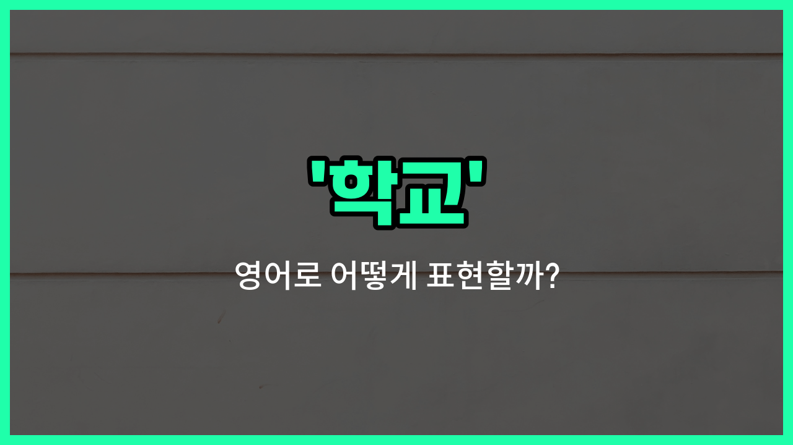

## 🌟 영어 표현 - school

안녕하세요 👋 오늘은 우리가 매일 듣고, 자주 사용하는 단어인 '**학교**'의 영어 표현 '**school**'에 대해 알아보려고 해요.

'**school**'은 학생들이 공부하고, 선생님에게 배우는 **교육기관**을 의미해요. 초등학교, 중학교, 고등학교, 대학교 등 다양한 형태의 학교가 모두 'school'이라는 단어로 표현돼요. 또한, '교정'이라는 뜻으로도 쓰일 수 있어요.

예를 들어, "나는 학교에 가고 있어요."라고 말하고 싶을 때 "I'm [going](/blog/in-english/1068.going/) to school."이라고 표현해요.

또한, 'school'은 단순히 건물이나 장소만을 의미하는 것이 아니라, **교육을 받는 곳**이라는 의미도 담고 있어요.

## 📖 예문

1. "그녀는 매일 아침 학교에 가요."

   "She goes to school every morning."

2. "이 학교는 학생 수가 많아요."

   "This school has many students."

## 💬 연습해보기

<ul data-interactive-list>

  <li data-interactive-item>
    내 조카가 드디어 학교에 입학했는데, 새로운 친구 사귀는 게 정말 신나나 봐요.
    My niece just started school, and she's really excited about making <a href="/blog/in-english/1056.new/">new</a> friends.
  </li>

  <li data-interactive-item>
    오늘 오후 3시에 아이들 학교를 데리러 가야 해요.
    I have to <a href="/blog/in-english/178.pick-up/">pick up</a> my kids from school at 3 PM today.
  </li>

  <li data-interactive-item>
    학교 첫 날 얼마나 긴장했는지 기억해요?
    Do you remember how <a href="/blog/in-english/115.nervous/">nervous</a> you were on your first <a href="/blog/in-english/1067.day/">day</a> of school?
  </li>

  <li data-interactive-item>
    학교에서 눈이 오니까 내일 수업이 취소됐다고 발표했어요.
    The school <a href="/blog/in-english/816.announce/">announced</a> a snow day, so classes are canceled tomorrow.
  </li>

  <li data-interactive-item>
    좋은 학교에 가고 싶어서 정말 열심히 공부해요.
    She studies really hard because she <a href="/blog/in-english/1060.want/">wants</a> to get into a good school.
  </li>

  <li data-interactive-item>
    학교 마치고 영화 보러 쇼핑몰에 갈 예정이에요.
    After school, we're going to the mall to catch a movie.
  </li>

  <li data-interactive-item>
    요즘 아프느라 학교를 많이 빠지고 있어요.
    He's been <a href="/blog/in-english/339.miss/">missing</a> a lot of school lately because he's been sick.
  </li>

  <li data-interactive-item>
    우리 학교에서 도서관 지원을 위한 기금 모금 행사를 이번 주말에 해요.
    Our school is having a fundraiser this weekend to support the library.
  </li>

  <li data-interactive-item>
    중학교 때 만난 절친이 있어요; 그때부터 지금까지 늘 함께해요.
    I met my <a href="/blog/in-english/1073.best/">best</a> friend back in middle school; we've been inseparable ever since.
  </li>

  <li data-interactive-item>
    길 건너에 새로운 학교가 지어졌는데, 정말 현대적이고 밝아 보여요.
    They built a new school down the street that <a href="/blog/in-english/1078.look/">looks</a> really modern and bright.
  </li>

</ul>

## 🤝 함께 알아두면 좋은 표현들

### academy (학원)

'academy'는 '학원'을 의미하며, 학교와 비슷하지만 보통 특정 과목이나 기술을 배우기 위해 다니는 사설 교육 기관을 말해요. 학교보다 더 전문적이거나 집중적인 교육을 제공할 때 사용해요.

- "She attends an academy to [improve](/blog/in-english/394.improve/) her English skills."
- "그녀는 영어 실력을 향상시키기 위해 학원에 다녀요."

### drop out (중퇴하다)

'[drop](/blog/in-english/361.drop/) out'은 '중퇴하다'라는 뜻으로, 학교를 중간에 그만두는 것을 의미해요. 학교에 다니지 않는 상태를 나타내는 반대 개념이에요.

- "He [decided to](/blog/in-english/062.decide-to/) drop out of school to start his own business."
- "그는 자신의 사업을 시작하기 위해 학교를 중퇴하기로 결정했어요."

### university (대학교)

'university'는 '대학교'를 뜻하며, 학교보다 더 높은 수준의 교육 기관이에요. 보통 고등학교 졸업 후에 진학하는 곳으로, 전문적인 학문과 연구를 하는 곳이에요.

- "After [high](/blog/in-english/1069.high/) school, she plans [to go](/blog/in-english/450.to-go/) to university to study [medicine](/blog/in-english/567.medicine/)."
- "고등학교를 졸업한 후에 그녀는 의학을 공부하기 위해 대학교에 갈 계획이에요."

---

오늘은 '**학교**'라는 뜻을 가진 영어 단어 '**school**'에 대해 알아봤어요. 학교와 관련된 다양한 상황에서 이 표현을 자연스럽게 사용할 수 있겠죠? 😊

오늘 배운 표현과 예문들을 꼭 소리 내서 여러 번 읽어보세요. 다음에도 더 유익한 영어 표현으로 찾아올게요! 감사합니다!

