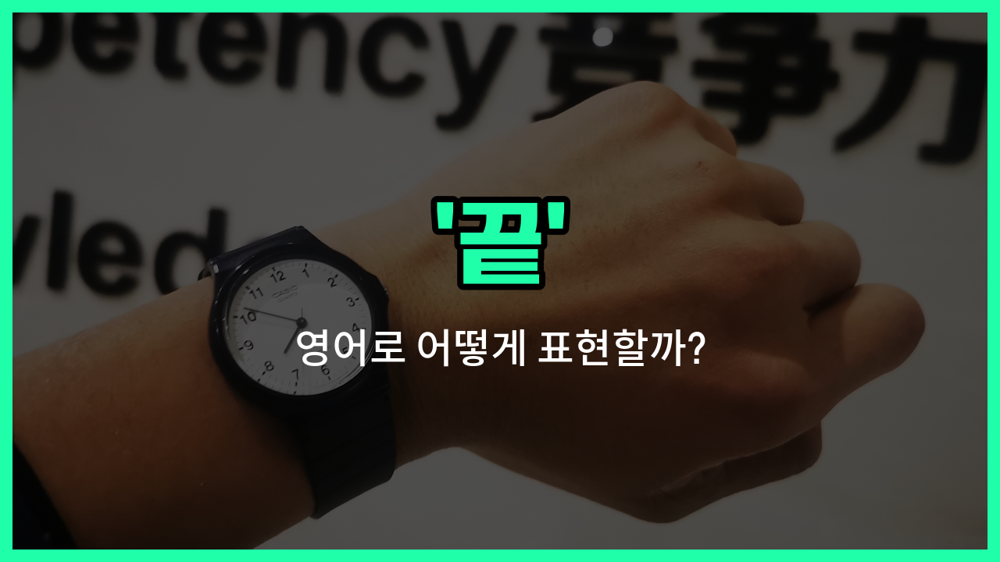

## 🌟 영어 표현 - end

안녕하세요 👋 오늘은 우리가 자주 쓰는 단어인 '**끝**'을 영어로 어떻게 표현하는지 알아보려고 해요. 바로 '**end**'라는 단어인데요, 이 단어는 어떤 일이나 과정, 시간 등이 더 이상 이어지지 않고 멈추는 순간을 의미해요.

예를 들어, 영화가 끝났을 때, 수업이 종료될 때, 또는 하루가 마무리될 때 모두 '**end**'라는 표현을 쓸 수 있어요. 상황에 따라 명사(끝, 종료)로도, 동사(끝내다, 마치다)로도 사용할 수 있어서 정말 유용한 단어예요!

## 📖 예문

1. "수업이 3시에 끝나요."

   "The class ends at 3 o'clock."

2. "이 영화의 끝이 정말 감동적이었어요."

   "The end of this movie was really touching."

3. "오늘 할 일을 모두 끝냈어요."

   "I finished all my [work](/blog/in-english/1064.work/) today."

## 💬 연습해보기

<ul data-interactive-list>

  <li data-interactive-item>
    하루가 끝나서 집에서 편히 쉴 수 있는 날이 어서 왔으면 좋겠어.
    I can't <a href="/blog/in-english/377.wait-for/">wait for</a> the <a href="/blog/in-english/1067.day/">day</a> to end so I can relax at <a href="/blog/in-english/1076.home/">home</a>.
  </li>

  <li data-interactive-item>
    영화가 약 10분 뒤에 끝날 거니까, 준비해서 나가자.
    The movie will end in about ten minutes, so let's get ready to <a href="/blog/in-english/402.leave/">leave</a>.
  </li>

  <li data-interactive-item>
    오늘 너의 근무가 언제 끝나?
    When does your shift end today?
  </li>

  <li data-interactive-item>
    우리의 휴가는 다음 주에 끝나는데, 벌써 조금 슬프다.
    Our <a href="/blog/in-english/516.vacation/">vacation</a> will end next week, and I'm already feeling a bit sad.
  </li>

  <li data-interactive-item>
    회의가 3시간 토론 후에 드디어 끝났어.
    The meeting <a href="/blog/in-english/182.finally/">finally</a> came to an end after three hours of discussion.
  </li>

  <li data-interactive-item>
    급해도 전화 통화는 예의 있게 끝내는 게 좋아.
    It's <a href="/blog/in-english/1073.best/">best</a> to end a phone call politely, even if you're <a href="/blog/in-english/174.in-a-hurry/">in a hurry</a>.
  </li>

  <li data-interactive-item>
    우리는 이 프로젝트를 이번 달 말까지 끝내야 해.
    We need to end this project by the end of the month.
  </li>

  <li data-interactive-item>
    그녀는 그 싸운 이후 그들의 우정을 끝내기로 결정했어.
    She <a href="/blog/in-english/062.decide-to/">decided to</a> end their friendship after the argument.
  </li>

  <li data-interactive-item>
    콘서트는 멋진 불꽃놀이로 끝날 거야.
    The concert will end with a big fireworks show.
  </li>

  <li data-interactive-item>
    좋은 음악과 함께 파티를 멋지게 마무리하자.
    Let's end the party on a <a href="/blog/in-english/1069.high/">high</a> note with some great music.
  </li>

</ul>

## 🤝 함께 알아두면 좋은 표현들

### finish

'[finish](/blog/in-english/295.finish/)'는 '끝내다' 또는 '마치다'라는 뜻이에요. 어떤 일이나 활동을 완전히 완료하는 것을 의미하며, 'end'와 비슷하게 사용돼요. 일상 대화에서 자주 쓰이는 표현이에요.

- "I need to finish my homework before dinner."
- "저는 저녁 먹기 전에 숙제를 끝내야 해요."

### begin

'begin'은 '시작하다'라는 뜻으로, 'end'의 반대말이에요. 어떤 일이 막 시작되는 시점을 나타낼 때 사용해요.

- "The meeting will begin at 3 PM."
- "회의는 오후 3시에 시작할 거예요."

### stop

'stop'은 '멈추다' 또는 '중단하다'라는 뜻이에요. 어떤 행동이나 상태를 끝내거나 중단하는 것을 의미하지만, 'end'보다 더 즉각적이고 강한 느낌을 줄 때 사용돼요.

- "Please stop talking during the movie."
- "영화 보는 동안 말하는 것을 멈춰 주세요."

---

오늘은 '**끝**', '**종료**', '**마치다**'라는 뜻을 가진 영어 표현 '**end**'에 대해 알아봤어요. 일상에서 무언가를 마무리할 때 이 표현을 떠올려 보세요 😊

오늘 배운 표현과 예문들을 꼭 소리 내서 여러 번 읽어보세요. 다음에도 더 유익한 영어 표현으로 찾아올게요! 감사합니다!

