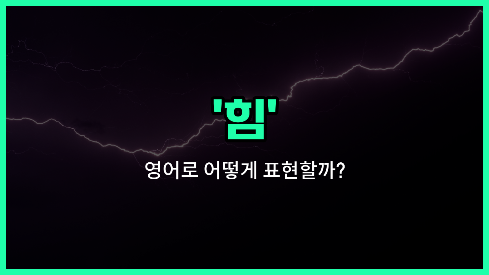

## 🌟 영어 표현 - power

안녕하세요 👋 오늘은 영어로 '힘'을 어떻게 표현하는지 알아보려고 해요. 바로 '**power**'라는 단어인데요~

'**power**'는 우리가 흔히 말하는 '힘', 즉 어떤 일을 할 수 있는 능력이나 에너지를 의미해요. 또, '권력'처럼 누군가를 통제하거나 영향을 미치는 힘을 나타낼 때도 자주 쓰여요~

예를 들어, 운동할 때 필요한 신체적인 힘도 'power'라고 하고, 전기나 에너지처럼 기계가 작동하는 데 필요한 힘도 'power'라고 해요. 그리고 정치나 사회에서 누군가가 가진 영향력이나 권한도 'power'로 표현할 수 있어요~

## 📖 예문

1. "그는 엄청난 힘을 가지고 있어요."

   "He has great power."

2. "전기가 갑자기 나갔어요."

   "The power went out suddenly."

3. "그녀는 회사에서 많은 권력을 가지고 있어요."

   "She has a lot of power in the company."

## 💬 연습해보기

<ul data-interactive-list>

  <li data-interactive-item>
    오늘 아침에 상쾌하게 일어났을 때, 좋은 잠의 힘을 정말 느꼈어요.
    I <a href="/blog/in-english/182.finally/">finally</a> <a href="/blog/in-english/1096.feel/">felt</a> the power of a good night's sleep when I <a href="/blog/in-english/300.wake-up/">woke up</a> refreshed this morning.
  </li>

  <li data-interactive-item>
    자연의 힘을 존중해야 해요; 우리가 생각하는 것보다 훨씬 강하거든요.
    You need to <a href="/blog/in-english/469.respect/">respect</a> the power of nature; it's stronger than we <a href="/blog/in-english/1059.think/">think</a>.
  </li>

  <li data-interactive-item>
    그는 영향력과 힘을 이용해서 프로젝트를 빠르게 승인받았어요.
    He <a href="/blog/in-english/171.used/">used</a> his <a href="/blog/in-english/941.influence/">influence</a> and power to get the project <a href="/blog/in-english/349.approve/">approved</a> quickly.
  </li>

  <li data-interactive-item>
    폭풍 중에 전기가 나가서 촛불을 켜야 했어요.
    The power went out during the storm, so we had to light some candles.
  </li>

  <li data-interactive-item>
    그녀는 몇 마디로 사람들의 마음을 바꿀 수 있는 힘이 있어요.
    She has the power to change <a href="/blog/in-english/1057.people/">people</a>'s minds with just <a href="/blog/in-english/911.a-few/">a few</a> words.
  </li>

  <li data-interactive-item>
    슈퍼히어로는 차 전체를 들어 올리면서 놀라운 힘을 보여줬어요.
    The superhero showed incredible power when he lifted the entire car.
  </li>

  <li data-interactive-item>
    그가 더 큰 결정을 내리기 시작하니까 힘을 얻고 있다는 게 느껴져요.
    You can tell he's gaining power because he's making bigger decisions now.
  </li>

  <li data-interactive-item>
    이 기계는 전기로 작동하고 에너지를 많이 절약해요.
    This machine runs on electric power and <a href="/blog/in-english/293.save/">saves</a> a lot of energy.
  </li>

  <li data-interactive-item>
    코치는 팀워크의 힘이 챔피언십에서 승리하는 데 얼마나 중요한지 강조했어요.
    The coach emphasized the power of teamwork in <a href="/blog/in-english/456.win/">winning</a> the championship.
  </li>

  <li data-interactive-item>
    가끔은 간단한 친절이 누군가에게 기분 전환이 필요한 전부일 때도 있어요.
    <a href="/blog/in-english/270.sometimes/">Sometimes</a>, the power of a kind gesture is all someone needs to <a href="/blog/in-english/1096.feel/">feel</a> <a href="/blog/in-english/1082.better/">better</a>.
  </li>

</ul>

## 🤝 함께 알아두면 좋은 표현들

### strength (강도)

'strength'는 '힘'과 비슷하게 물리적이거나 정신적인 '강도'를 의미해요. 어떤 대상이나 사람이 견디거나 버틸 수 있는 능력, 또는 영향력을 나타낼 때 사용해요.

- "The athlete showed incredible strength during the [competition](/blog/in-english/668.competition/)."
- "그 운동선수는 경기 중에 믿을 수 없는 강도를 보여줬어요."

### weakness (약점)

'weakness'는 '힘'의 반대말로, 힘이 부족하거나 약한 상태를 의미해요. 신체적, 정신적, 또는 상황적인 취약함이나 결점에 대해 말할 때 쓰여요.

- "His weakness in math made the exam very challenging."
- "그의 수학 약점 때문에 시험이 매우 어려웠어요."

### energy (에너지)

'energy'는 '힘'과 관련이 있지만, 좀 더 넓은 의미로 신체적 또는 정신적으로 활동할 수 있는 '활력'이나 '기운'을 뜻해요. 어떤 일을 할 수 있는 원동력으로 자주 사용돼요.

- "She has a lot of energy to [finish](/blog/in-english/295.finish/) her [work on](/blog/in-english/370.work-on/) [time](/blog/in-english/1055.time/)."
- "그녀는 제시간에 일을 끝낼 수 있는 많은 에너지를 가지고 있어요."

---

오늘은 '힘', '권력', '에너지'라는 뜻을 가진 영어 표현 '**power**'에 대해 알아봤어요. 다양한 상황에서 쓸 수 있으니 꼭 기억해 두세요~ 😊

오늘 배운 표현과 예문들을 소리 내서 여러 번 읽어보면 더 쉽게 익힐 수 있어요. 다음에도 더 유익한 영어 표현으로 찾아올게요! 감사합니다~

