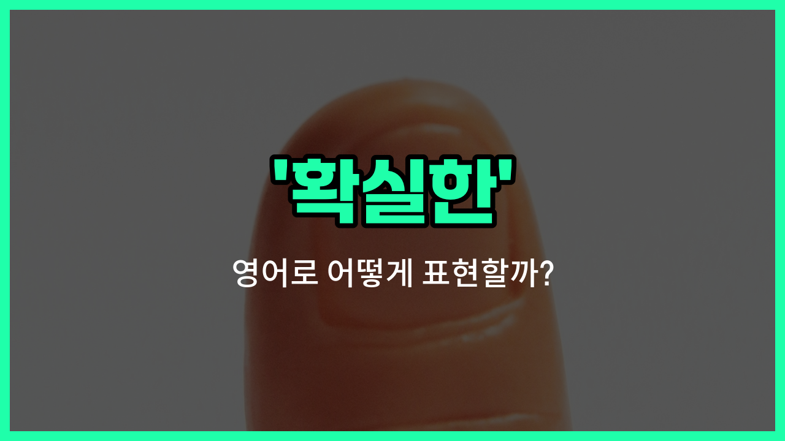

## 🌟 영어 표현 - sure

안녕하세요 👋 오늘은 우리가 자주 쓰는 표현인 '**확실한**'을 영어로 어떻게 말하는지 알아볼 거예요. 바로 '**sure**'라는 단어인데요, 이 단어는 어떤 사실이나 상황에 대해 **확신이 있을 때** 자주 사용해요.

예를 들어, 누군가가 "정말 그럴까?"라고 물었을 때, "응, 확실해!"라고 대답하고 싶다면 영어로는 "Yes, I'm sure!"라고 말할 수 있어요.

또한, '**sure**'는 상대방의 부탁이나 제안에 긍정적으로 답할 때도 쓸 수 있어요. 예를 들어, "이거 도와줄 수 있어?"라고 물으면, "Sure!"라고 대답하면 "물론이지!"라는 의미가 돼요.

이처럼 '**sure**'는 확신, 동의, 긍정의 의미로 정말 다양하게 쓰이는 단어예요!

## 📖 예문

1. "너가 그걸 했다는 게 확실해?"

   "Are you sure you did that?"

2. "이 약이 효과가 있는 게 확실해요."

   "I'm sure this [medicine](/blog/in-english/567.medicine/) [works](/blog/in-english/1064.work/)."

## 💬 연습해보기

<ul data-interactive-list>

  <li data-interactive-item>
    여기가 식당 가는 길 맞을 거 같아요. 지금쯤 길을 잃을 리는 없어요.
    I'm sure this is the <a href="/blog/in-english/1063.right/">right</a> <a href="/blog/in-english/1062.way/">way</a> to the restaurant. We can't be <a href="/blog/in-english/457.lose/">lost</a> at this point.
  </li>

  <li data-interactive-item>
    우리 나가기 전에 문 잠갔는지 확실해?
    Are you sure you locked the door before we <a href="/blog/in-english/402.leave/">left</a>?
  </li>

  <li data-interactive-item>
    그녀가 오늘 밤 파티에 올 거라는 확신이 들어.
    I'm pretty sure she's coming to the party tonight.
  </li>

  <li data-interactive-item>
    회의 중에 그는 자신의 대답에 확신이 있어 보였어.
    He sounded sure of his answer during the meeting.
  </li>

  <li data-interactive-item>
    내일 이벤트에 갈 수 있을지 잘 모르겠어.
    I'm not sure if I can <a href="/blog/in-english/244.make-it/">make it</a> to the event tomorrow.
  </li>

  <li data-interactive-item>
    그녀가 주방 카운터에 폰 두고 갔다는 건 확실해.
    She was sure that she left her phone on the kitchen counter.
  </li>

  <li data-interactive-item>
    오늘 날씨 예보 보니 나중에 비 올 확률 높대.
    It's sure to rain <a href="/blog/in-english/1024.later/">later</a> according to the weather <a href="/blog/in-english/416.forecast/">forecast</a>.
  </li>

  <li data-interactive-item>
    영화가 몇 시에 시작하는지 잘 모르겠어, 한번 확인해 줄래?
    I'm not sure what <a href="/blog/in-english/1055.time/">time</a> the movie starts, can you check?
  </li>

  <li data-interactive-item>
    그는 그 영화를 전에 본 것 같다고 확신하고 있어.
    He's sure that he's seen that movie before.
  </li>

  <li data-interactive-item>
    이 노래 듣고 나면 분명히 너도 좋아할 거야.
    I'm sure you'll <a href="/blog/in-english/1074.love/">love</a> this <a href="/blog/in-english/1056.new/">new</a> song once you hear it.
  </li>

</ul>

## 🤝 함께 알아두면 좋은 표현들

### certain (확실한)

'certain'은 '확실한'이라는 뜻으로, 어떤 사실이나 상황에 대해 의심의 여지가 없을 때 사용해요. 'sure'와 비슷하게 자신감이나 확신을 나타낼 때 자주 쓰여요.

- "I am certain that she will [arrive](/blog/in-english/403.arrive/) [on time](/blog/vocab-1/043.on-time/)."
- "나는 그녀가 제시간에 도착할 거라고 확신해요."

### doubtful (의심스러운)

'doubtful'은 '의심스러운'이라는 뜻으로, 어떤 일이 사실인지 확신하지 못하거나 믿기 어려울 때 사용해요. 'sure'의 반대 의미로, 불확실한 상황을 표현할 때 쓰여요.

- "It is doubtful that the project will be finished by next week."
- "그 프로젝트가 다음 주까지 끝날지는 의심스러워요."

### confident (자신 있는)

'[confident](/blog/in-english/420.confident/)'는 '자신 있는'이라는 뜻으로, 어떤 일에 대해 확신을 가지고 긍정적인 태도를 나타낼 때 사용해요. 'sure'와 비슷하지만, 주로 자신의 능력이나 판단에 대한 믿음을 강조할 때 쓰여요.

- "She is confident about passing the exam."
- "그녀는 시험에 합격할 거라고 자신 있어요."

---

오늘은 '**확실한**'이라는 뜻을 가진 영어 표현 '**sure**'에 대해 알아봤어요. 앞으로 누군가에게 확신을 표현하고 싶을 때 이 단어를 꼭 활용해 보세요 😊

오늘 배운 표현과 예문들을 소리 내서 여러 번 읽어보면 더 자연스럽게 쓸 수 있을 거예요. 다음에도 더 유익한 영어 표현으로 찾아올게요! 감사합니다!

