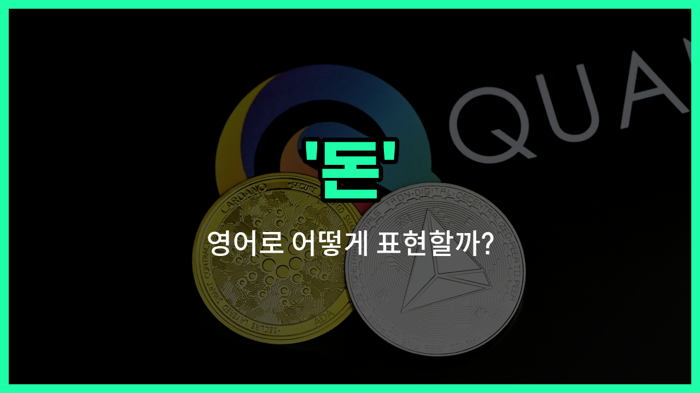

## 🌟 영어 표현 - money

안녕하세요 👋 오늘은 우리가 일상에서 정말 자주 쓰는 단어, 바로 '**돈**'을 영어로 어떻게 표현하는지 알아보려고 해요.

영어에서 '돈'은 '**money**'라고 해요. 이 단어는 우리가 물건을 사거나, 서비스를 이용할 때 쓰는 **화폐**를 의미해요. 즉, '자금', '현금'과 같은 의미로도 자주 사용돼요!

'**money**'는 동전, 지폐, 카드 등 다양한 형태의 화폐를 모두 포함하는 단어라서 정말 폭넓게 쓸 수 있어요. 예를 들어, 친구와 대화할 때 "돈이 필요해요", "돈을 모으고 있어요"와 같이 말할 수 있겠죠?

## 📖 예문

1. "저는 새 컴퓨터를 사기 위해 돈을 모으고 있어요."

   "I'm [saving money](/blog/in-english/726.save-money/) to buy a [new](/blog/in-english/1056.new/) computer."

2. "지갑에 돈이 하나도 없어요."

   "I don't have any money in my wallet."

## 💬 연습해보기

<ul data-interactive-list>

  <li data-interactive-item>
    "올해는 휴가를 갈 돈이 부족해요." 그녀는 실망했지만 다음에 더 저축하기로 했어요.
    "I don't have enough money <a href="/blog/in-english/450.to-go/">to go</a> on <a href="/blog/in-english/516.vacation/">vacation</a> this <a href="/blog/in-english/1065.year/">year</a>." She was <a href="/blog/in-english/302.disappoint/">disappointed</a> but <a href="/blog/in-english/062.decide-to/">decided to</a> <a href="/blog/in-english/293.save/">save</a> more next <a href="/blog/in-english/1055.time/">time</a>.
  </li>

  <li data-interactive-item>
    "돈 좀 빌려줄 수 있어요? 다음 주에 갚을게요." 그는 친구에게 가볍게 물어봤어요.
    "Can you <a href="/blog/in-english/467.lend/">lend</a> me some money? I'll pay you back next week." He asked his friend casually.
  </li>

  <li data-interactive-item>
    "돈이 행복을 살 수는 없지만, 삶을 더 쉽게 해줘요." 아빠가 항상 그렇게 말씀하시곤 해요.
    "Money can't buy happiness, but it <a href="/blog/in-english/1098.sure/">sure</a> makes <a href="/blog/in-english/1070.life/">life</a> easier." That's what my dad always says.
  </li>

  <li data-interactive-item>
    "이번 달에 옷에 너무 많은 돈을 쓰버렸어요." 그녀는 예산을 더 잘 관리해야겠다고 깨달았어요.
    "I <a href="/blog/in-english/258.spend/">spent</a> too much money on clothes this month." She <a href="/blog/in-english/166.realize/">realized</a> she needed to <a href="/blog/in-english/661.budget/">budget</a> <a href="/blog/in-english/1082.better/">better</a>.
  </li>

  <li data-interactive-item>
    "요즘 온라인으로 돈 버는 게 정말 인기예요." 많은 사람들이 다양한 방법으로 현금을 벌려고 해요.
    "Earning money online has become so popular lately." Many <a href="/blog/in-english/1057.people/">people</a> are trying different methods to make cash.
  </li>

  <li data-interactive-item>
    "어제 길에서 돈을 발견했는데 주인을 찾을 수가 없었어요." 그날은 정말 운이 좋았어요.
    "I <a href="/blog/in-english/1083.find/">found</a> some money on the street yesterday, but I couldn't find the owner." It was a lucky <a href="/blog/in-english/1067.day/">day</a> for him.
  </li>

  <li data-interactive-item>
    "프로젝트에 필요한 돈이 얼마예요?" 매니저가 회의 중에 물어봤어요.
    "How much money do you need for the project?" The manager asked during the meeting.
  </li>

  <li data-interactive-item>
    "비용이 많으면 돈을 저축하는 게 힘들어요." 그녀는 자신의 재정을 잘 관리하느라 힘들어했어요.
    "Saving money is hard when you have so many <a href="/blog/in-english/725.expense/">expenses</a>." She struggled to keep her finances in check.
  </li>

  <li data-interactive-item>
    "내가 좋아하는 일을 하면서 돈을 벌고 싶어요." 많은 젊은이들의 꿈이에요.
    "I <a href="/blog/in-english/1060.want/">want</a> to make money doing something I <a href="/blog/in-english/1074.love/">love</a>." That's the dream for many young people.
  </li>

  <li data-interactive-item>
    "돈이 있으면 말이 통하지만, 때로는 모든 문제를 해결해주지는 않아요." 그는 자신의 상황을 생각하며 한숨을 쉬었어요.
    "Money talks, but <a href="/blog/in-english/270.sometimes/">sometimes</a> it doesn't <a href="/blog/in-english/455.solve/">solve</a> all problems." He sighed, <a href="/blog/in-english/1059.think/">thinking</a> about his situation.
  </li>

</ul>

## 🤝 함께 알아두면 좋은 표현들

### cash

'cash'는 '현금'을 의미하며, 실제로 손에 쥘 수 있는 돈을 가리켜요. 주로 카드나 전자 결제와 대비되는 개념으로 사용돼요.

- "I always [carry](/blog/in-english/464.carry/) some cash [in case](/blog/in-english/253.in-case/) the card machine doesn't [work](/blog/in-english/1064.work/)."
- "카드 단말기가 작동하지 않을 경우를 대비해 항상 현금을 좀 가지고 다녀요."

### debt

'[debt](/blog/in-english/662.debt/)'는 '빚'을 뜻해요. 돈과 관련된 부정적인 개념으로, 빌린 돈이나 갚아야 할 금액을 의미해요.

- "She is trying hard to [pay off](/blog/in-english/199.pay-off/) her debt after [losing](/blog/in-english/457.lose/) her [job](/blog/in-english/1101.job/)."
- "그녀는 직장을 잃은 후 빚을 갚기 위해 열심히 노력하고 있어요."

### wealth

'wealth'는 '부' 또는 '재산'을 의미해요. 많은 돈이나 자산을 가진 상태를 나타내며, 돈의 긍정적인 측면을 강조할 때 사용돼요.

- "He accumulated great wealth through smart [investments](/blog/in-english/414.investment/)."
- "그는 현명한 투자로 큰 부를 축적했어요."

---

오늘은 '돈', '자금', '현금'이라는 뜻을 가진 영어 표현 '**money**'에 대해 알아봤어요. 앞으로 영어로 대화할 때 이 단어를 자연스럽게 사용해보면 좋겠어요 😊

오늘 배운 표현과 예문들을 꼭 최소 3번씩 소리 내서 읽어보세요. 다음에도 더 재미있고 유익한 영어 표현으로 찾아올게요! 감사합니다!

