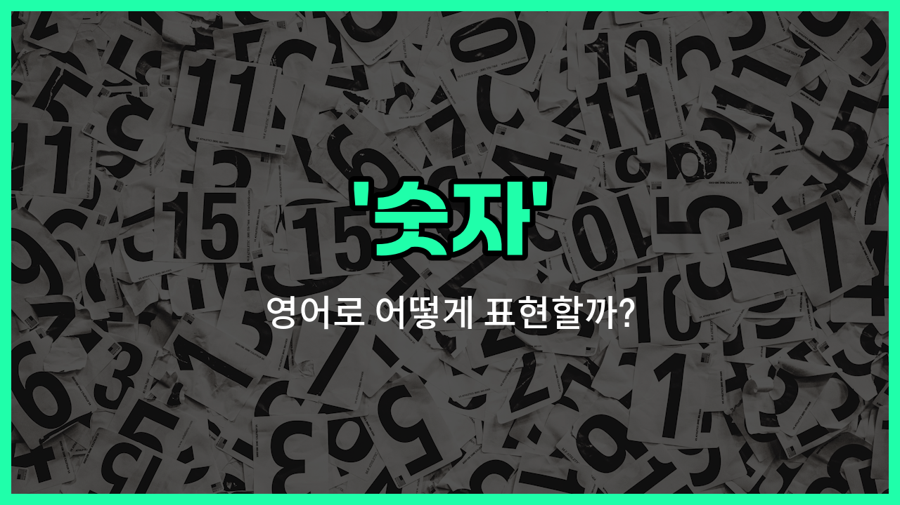

## 🌟 영어 표현 - number

안녕하세요 👋 오늘은 우리가 일상에서 자주 쓰는 단어인 '**숫자**'의 영어 표현 '**number**'에 대해 알아보려고 해요.

'**number**'는 '숫자', '수', '번호'와 같이 **수량이나 순서를 나타내는 기호**를 의미해요. 예를 들어, 1, 2, 3과 같은 것들이 모두 'number'에 해당해요.

이 단어는 전화번호, 집 주소, 시험 점수 등 다양한 상황에서 정말 자주 쓰여요. 예를 들어, "내 전화번호는 뭐야?"라고 물을 때 "What is your phone number?"라고 할 수 있어요.

또한, "몇 번이야?"라고 할 때도 "What number is it?"이라고 자연스럽게 사용할 수 있어요.

## 📖 예문

1. "이 숫자를 읽을 수 있어요?"

   "Can you [read](/blog/in-english/436.read/) this number?"

2. "내 전화번호를 알려줄게요."

   "I will tell you my phone number."

3. "시험에서 높은 숫자를 받았어요."

   "I got a [high](/blog/in-english/1069.high/) number on the test."

## 💬 연습해보기

<ul data-interactive-list>

  <li data-interactive-item>
    어젯밤에 그가 준 번호를 기억 못 했어. 그 번호 어디에 적어놓은 거 있어?
    I couldn't remember the number he gave me last night. Do you have that number written down somewhere?
  </li>

  <li data-interactive-item>
    너 번호 좀 알려줄래? 나중에 문자하고 싶어서.
    Can you give me your number? I <a href="/blog/in-english/1060.want/">want</a> to text you <a href="/blog/in-english/1024.later/">later</a>.
  </li>

  <li data-interactive-item>
    파티에 온 사람 수가 우리가 예상했던 것보다 훨씬 많았어.
    The number of <a href="/blog/in-english/1057.people/">people</a> who <a href="/blog/in-english/381.show-up/">showed up</a> to the party was <a href="/blog/in-english/1062.way/">way</a> more than we expected.
  </li>

  <li data-interactive-item>
    그녀가 실수로 잘못된 번호를 눌러서 다른 사람의 음성사서함에 연결됐어.
    She dialed the <a href="/blog/in-english/316.wrong/">wrong</a> number by mistake and got someone else's voicemail.
  </li>

  <li data-interactive-item>
    아직 이 양식에 적어야 할 올바른 번호를 찾고 있어.
    I'm <a href="/blog/in-english/254.still/">still</a> <a href="/blog/in-english/117.try-to/">trying to</a> <a href="/blog/in-english/170.figure-out/">figure out</a> the <a href="/blog/in-english/1063.right/">right</a> number to <a href="/blog/in-english/261.put-on/">put on</a> this form.
  </li>

  <li data-interactive-item>
    시험에 질문이 정말 많아서 시간 부족했어.
    There was a huge number of questions on the exam, and I <a href="/blog/in-english/340.run-out-of/">ran out of</a> <a href="/blog/in-english/1055.time/">time</a>.
  </li>

  <li data-interactive-item>
    코치님이 게임 시작하기 전에 모든 선수들 번호 확인하라고 하셨어.
    The coach wants every <a href="/blog/in-english/768.player/">player</a> to get their number checked before the <a href="/blog/in-english/1087.game/">game</a> starts.
  </li>

  <li data-interactive-item>
    그가 콘서트 티켓 여러 장 사면서 좋은 거래를 기대했어.
    He bought a number of tickets for the concert, hoping to get a good deal.
  </li>

  <li data-interactive-item>
    내 긴급 연락처 번호를 너희 시스템에 업데이트해야 해.
    I need to update my emergency contact number in your <a href="/blog/in-english/432.system/">system</a>.
  </li>

  <li data-interactive-item>
    그 영수증에 있는 번호가 잘못된 것 같아; 다시 한 번 확인해줄 수 있어?
    The number on that <a href="/blog/in-english/526.receipt/">receipt</a> seems to be off; can you double-check it?
  </li>

</ul>

## 🤝 함께 알아두면 좋은 표현들

### digit

'digit'은 '숫자' 중에서 특히 0부터 9까지의 한 자리 숫자를 의미해요. 숫자를 구성하는 기본 단위로, 전화번호나 암호 같은 곳에서 자주 사용돼요.

- "The number 345 has three digits: 3, 4, and 5."
- "숫자 345는 세 자리 숫자예요: 3, 4, 그리고 5."

### figure

'figure'는 '숫자' 또는 '수치'를 뜻하는 말로, 특히 통계나 금액 같은 구체적인 수치를 나타낼 때 많이 사용돼요. 공식적이고 비즈니스 상황에서 자주 쓰여요.

- "The company's [revenue](/blog/in-english/665.revenue/) figure increased by 20% last [year](/blog/in-english/1065.year/)."
- "그 회사의 매출 수치가 작년에 20% 증가했어요."

### word

'word'는 '숫자'의 반대 개념으로, 문자나 단어를 의미해요. 숫자가 아닌 글자나 언어 단위를 말할 때 사용돼요.

- "Please write your name in words, not numbers."
- "이름을 숫자가 아니라 글자로 써 주세요."

---

오늘은 '**숫자**', '**수**', '**번호**'라는 뜻을 가진 영어 표현 '**number**'에 대해 알아봤어요. 일상에서 숫자와 관련된 상황이 많으니 꼭 기억해두면 좋겠어요 😊

오늘 배운 표현과 예문들을 소리 내서 여러 번 읽어보세요. 다음에도 더 유익한 영어 표현으로 찾아올게요! 감사합니다!

