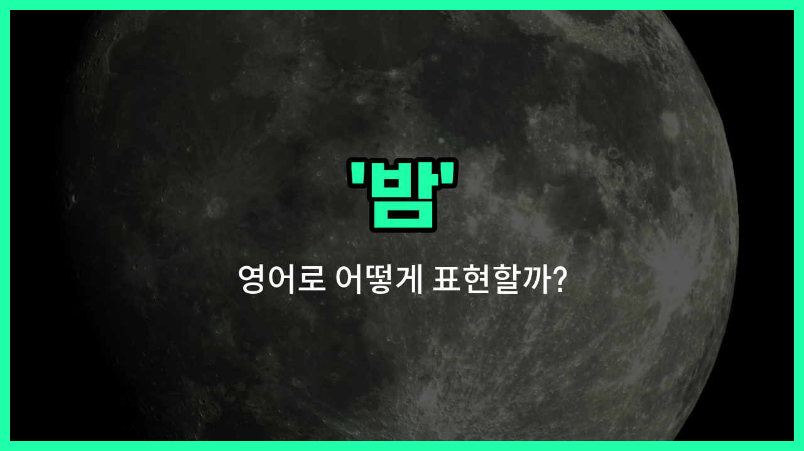

## 🌟 영어 표현 - night

안녕하세요 👋 오늘은 우리가 자주 쓰는 단어인 '**밤**'을 영어로 어떻게 표현하는지 알아보려고 해요. 바로 '**night**'라는 단어인데요~

'**night**'는 해가 지고 어두워진 시간, 즉 **밤**을 의미해요. 일상 대화에서 '오늘 밤', '밤에', '좋은 밤 되세요' 등 다양한 상황에서 자연스럽게 사용할 수 있어요~

또한, '야간 근무', '밤 산책', '저녁 모임'처럼 밤에 일어나는 여러 활동을 표현할 때도 'night'라는 단어가 자주 쓰여요. 예를 들어, '야간 근무'는 'night shift', '밤 산책'은 'night walk'라고 할 수 있어요~

## 📖 예문

1. "오늘 밤에 별이 많이 보여요."

   "There are a lot of stars in the sky tonight."

2. "밤에 산책하는 걸 좋아해요."

   "I [like](/blog/in-english/1053.like/) taking a walk at night."

## 💬 연습해보기

<ul data-interactive-list>

  <li data-interactive-item>
    마감이 너무 가까워서 밤새 프로젝트를 끝냈어요.
    I stayed up all night finishing the project because the <a href="/blog/in-english/830.deadline/">deadline</a> was so close.
  </li>

  <li data-interactive-item>
    저희는 밤에 시원하니까 공원에 산책하러 가기로 했어요.
    We decided <a href="/blog/in-english/450.to-go/">to go</a> for a walk in the <a href="/blog/in-english/463.park/">park</a> at night since it's cooler then.
  </li>

  <li data-interactive-item>
    어젯밤 게임이 진짜 대박이었어요, 최종 점수를 믿을 수가 없었어요!
    Last night's <a href="/blog/in-english/1087.game/">game</a> was incredible, I couldn't believe the final score!
  </li>

  <li data-interactive-item>
    우리 형은 야간 근무를 해서 낮에는 항상 자고 있어요.
    My brother <a href="/blog/in-english/1064.work/">works</a> the night shift, so he's usually asleep during the <a href="/blog/in-english/1067.day/">day</a>.
  </li>

  <li data-interactive-item>
    이 동네는 밤이 되면 정말 조용해져요.
    It gets really <a href="/blog/in-english/958.quiet/">quiet</a> around night <a href="/blog/in-english/1055.time/">time</a> in this neighborhood.
  </li>

  <li data-interactive-item>
    저는 밤에 창가에 앉아서 도시의 불빛을 바라보는 걸 좋아해요.
    I <a href="/blog/in-english/1074.love/">love</a> sitting by the window at night just watching the <a href="/blog/in-english/1108.city/">city</a> lights.
  </li>

  <li data-interactive-item>
    지난 주말에 온 가족을 위한 모닥불과 별 관찰 시간을 계획했어요.
    We planned a campfire and star-gazing night for the whole <a href="/blog/in-english/1100.family/">family</a> last weekend.
  </li>

  <li data-interactive-item>
    밤에는 거리가 훨씬 덜 붐비는데, 그게 사실 좋더라고요.
    At night, the streets are much less <a href="/blog/in-english/393.crowded/">crowded</a>, which I actually enjoy.
  </li>

  <li data-interactive-item>
    어젯밤 늦게 좋은 소식 전하려고 저한테 전화했어요.
    She called me <a href="/blog/in-english/391.late/">late</a> last night to tell me the good <a href="/blog/in-english/536.news/">news</a>.
  </li>

  <li data-interactive-item>
    밤에 수영장을 닫아서 저희는 9시 전에 가야 해요.
    They close the pool at night, so we need to get there before 9 PM.
  </li>

</ul>

## 🤝 함께 알아두면 좋은 표현들

### evening (저녁)

'evening'은 '밤'보다 조금 이른 시간대를 의미해요. 보통 해가 지고 어두워지기 시작하는 시간부터 잠들기 전까지를 가리켜요. 'night'보다 덜 어둡고 활동하기 좋은 시간으로 많이 사용돼요.

- "We usually have dinner [together](/blog/in-english/374.together/) in the evening."
- "우리는 보통 저녁에 함께 저녁 식사를 해요."

### daytime (낮)

'daytime'은 '밤'의 반대말로, 해가 떠 있는 낮 시간을 의미해요. 밝고 활동하기 좋은 시간대로, 주로 일을 하거나 밖에서 활동할 때를 가리켜요.

- "The park is busiest during the daytime."
- "공원은 낮 시간에 가장 붐벼요."

### midnight (자정)

'midnight'은 '밤' 중에서도 특히 12시, 즉 밤의 한가운데를 의미해요. 하루의 끝과 시작을 가르는 시간으로, 밤의 깊은 시간대를 강조할 때 사용돼요.

- "She [went to bed](/blog/in-english/240.go-to-bed/) [shortly](/blog/in-english/521.shortly/) after midnight."
- "그녀는 자정이 조금 지난 후에 잠자리에 들었어요."

---

오늘은 '**밤**'이라는 뜻을 가진 영어 표현 '**night**'에 대해 알아봤어요. 밤에 관련된 다양한 상황에서 이 단어를 활용해 보세요~ 😊

오늘 배운 표현과 예문들을 꼭 소리 내서 여러 번 읽어보세요. 다음에도 더 유익한 영어 표현으로 찾아올게요! 감사합니다~

