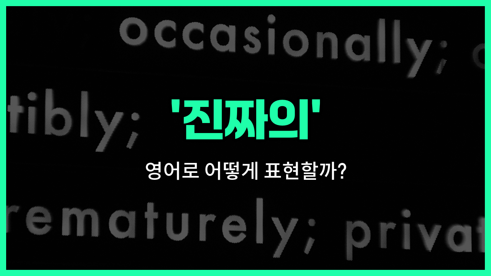

## 🌟 영어 표현 - real

안녕하세요 👋 오늘은 우리가 자주 쓰는 표현인 '**진짜의**'를 영어로 어떻게 말하는지 알아볼 거예요. 바로 '**real**'이라는 단어인데요, 이 단어는 '진짜의', '현실의', '실제의'라는 뜻을 가지고 있어요.

'**real**'은 어떤 것이 가짜가 아니라 **진짜임을 강조할 때** 자주 사용돼요. 예를 들어, 진짜 금인지 확인할 때 "Is this real gold?"라고 물어볼 수 있어요. 또, 상상이나 허구가 아닌 현실의 상황을 말할 때도 쓸 수 있답니다!

일상 대화에서 "진짜야?"라고 놀랄 때도 "Really?"처럼 'real'의 변형을 많이 쓰죠. 하지만 오늘은 형용사 '**real**'에 집중해서 설명해볼게요.

## 📖 예문

1. "이게 진짜 다이아몬드예요?"

   "Is this a real diamond?"

2. "그녀는 현실의 문제에 대해 이야기했어요."

   "She talked about real problems."

3. "실제의 친구가 온라인 친구보다 더 중요해요."

   "Real friends are more [important](/blog/in-english/318.important/) than online friends."

## 💬 연습해보기

<ul data-interactive-list>

  <li data-interactive-item>
    사인회에서 받은 사인이 진짜인지 가짜인지 전문가가 인증해주기 전까지는 잘 몰랐어요.
    I wasn't <a href="/blog/in-english/1098.sure/">sure</a> if the autograph was real or fake until the <a href="/blog/in-english/980.expert/">expert</a> confirmed it was <a href="/blog/in-english/902.genuine/">genuine</a>.
  </li>

  <li data-interactive-item>
    복고풍 시장에서 진짜 다이아몬드 반지를 발견했는데, 완전 꿀딜이었어요.
    She <a href="/blog/in-english/1083.find/">found</a> a real diamond ring at the vintage <a href="/blog/in-english/641.market/">market</a>, and it was a total steal.
  </li>

  <li data-interactive-item>
    그 영화는 진짜 오싹했어요, 너무 강렬했거든요!
    That movie gave me real <a href="/blog/in-english/867.chill/">chills</a>, it was so intense!
  </li>

  <li data-interactive-item>
    그 응급상황에서 그는 진정한 용기를 보여줬고, 아무도 그가 그럴 거라고 예상하지 못했어요.
    He showed real courage during the emergency situation, nobody expected that from him.
  </li>

  <li data-interactive-item>
    그녀가 가짜 확장 대신 본인의 진짜 머리를 그대로 하고 있는 모습이 너무 좋아요.
    I <a href="/blog/in-english/1074.love/">love</a> how she wears her real hair <a href="/blog/in-english/169.instead-of/">instead of</a> those fake extensions.
  </li>

  <li data-interactive-item>
    이 레시피는 마가린이 아니라 진짜 버터를 사용해서 맛이 많이 달라요.
    This recipe <a href="/blog/in-english/1079.use/">uses</a> real butter, not margarine, which makes a <a href="/blog/in-english/1095.big/">big</a> difference in the flavor.
  </li>

  <li data-interactive-item>
    그녀가 피아노를 치는 모습을 보면 진짜 재능이 있는 걸 느낄 수 있어요.
    You can tell she has real talent by the <a href="/blog/in-english/1062.way/">way</a> she <a href="/blog/in-english/1081.play/">plays</a> the piano.
  </li>

  <li data-interactive-item>
    새로운 언어를 배우는 건 진짜 도전이지만, 보람도 크답니다.
    It's a real challenge to <a href="/blog/in-english/245.learn/">learn</a> a <a href="/blog/in-english/1056.new/">new</a> language, but it's really rewarding too.
  </li>

  <li data-interactive-item>
    진짜 친구는 어떤 일이 있어도 곁에 있어줘요.
    Real friends stick by you <a href="/blog/in-english/229.no-matter-what/">no matter what</a> happens.
  </li>

  <li data-interactive-item>
    지난 밤 콘서트에서 정말 즐거운 시간을 보냈어요, 밴드가 정말 대단했답니다.
    We had a real good <a href="/blog/in-english/1055.time/">time</a> at the concert last <a href="/blog/in-english/1110.night/">night</a>, the band was amazing.
  </li>

</ul>

## 🤝 함께 알아두면 좋은 표현들

### genuine

'genuine'은 '진짜의' 또는 '진품의'라는 뜻으로, 어떤 것이 진실되고 진짜임을 강조할 때 사용해요. 특히 감정이나 물건이 진짜임을 표현할 때 많이 쓰여요.

- "She gave me a genuine smile that made me [feel](/blog/in-english/1096.feel/) welcome."
- "그녀가 진심 어린 미소를 지어줘서 환영받는 기분이 들었어요."

### fake

'fake'는 '가짜의'라는 뜻으로, 진짜가 아닌 모조품이나 거짓된 것을 의미해요. 진짜와 반대되는 의미로, 신뢰할 수 없거나 속임수를 나타낼 때 사용해요.

- "He was caught selling fake designer bags on the street."
- "그는 거리에서 가짜 명품 가방을 팔다가 잡혔어요."

### authentic

'authentic'은 '진짜의', '진품의'라는 뜻으로, 특히 문화적이거나 역사적인 맥락에서 진짜임을 강조할 때 사용해요. 신뢰할 수 있고 원본임을 나타내요.

- "We enjoyed an authentic Italian [meal](/blog/in-english/528.meal/) at the new restaurant."
- "우리는 새로 생긴 식당에서 진짜 이탈리아 음식을 맛있게 먹었어요."

---

오늘은 '**진짜의**', '**현실의**', '**실제의**'라는 뜻을 가진 영어 표현 '**real**'에 대해 알아봤어요. 앞으로 무언가가 진짜인지, 현실적인지 말하고 싶을 때 이 단어를 떠올려 보세요 😊

오늘 배운 표현과 예문들을 꼭 소리 내서 여러 번 읽어보세요. 다음에도 더 유익한 영어 표현으로 찾아올게요! 감사합니다!

