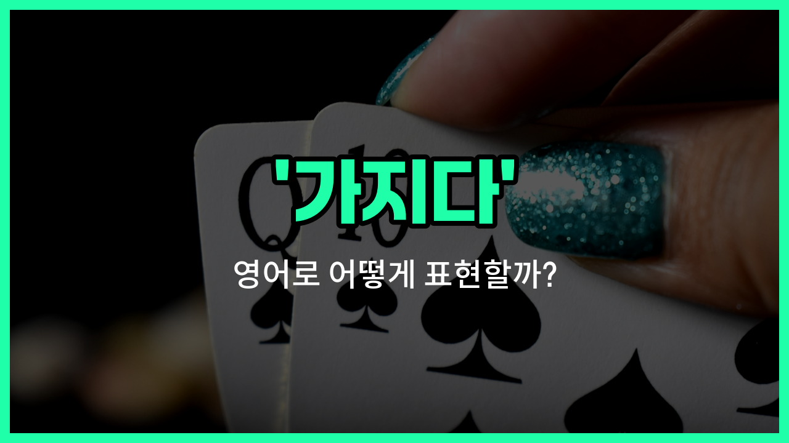

## 🌟 영어 표현 - having

안녕하세요 👋 오늘은 영어에서 '가지다', '소유하다', '지니다'라는 뜻을 가진 표현 '**having**'에 대해 알아보려고 해요.

'**having**'은 기본적으로 어떤 것을 **소유하거나 가지고 있는 상태**를 나타낼 때 사용해요. 일상 대화나 공식적인 상황 모두에서 자주 쓰이는 단어예요!

예를 들어, 무언가를 소유하고 있거나, 경험하고 있거나, 상태를 유지하고 있을 때 자연스럽게 쓸 수 있어요. 예를 들어, "나는 자동차를 가지고 있어요."라고 말하고 싶을 때 "I am having a car."라고 할 수 있지만, 일반적으로 소유를 표현할 때는 'have'를 더 많이 사용해요. 하지만 'having'은 진행형이나 특정 상황에서 경험, 상태, 소유를 강조할 때 자주 쓰여요.

또한, 'having'은 파티를 열거나, 식사를 하거나, 경험을 할 때도 쓸 수 있어요. 예를 들어, "우리는 저녁 식사를 하고 있어요."는 "We are having dinner."라고 표현해요.

## 📖 예문

1. "나는 좋은 시간을 보내고 있어요."

   "I am having a good [time](/blog/in-english/1055.time/)."

2. "그는 중요한 회의를 하고 있어요."

   "He is having an [important](/blog/in-english/318.important/) meeting."

3. "우리는 손님을 맞이하고 있어요."

   "We are having guests."

## 💬 연습해보기

<ul data-interactive-list>

  <li data-interactive-item>
    오늘 직장에서 진짜 바쁜 하루라서 점심시간에 못 갈 것 같아요.
    I'm having a really <a href="/blog/in-english/372.busy/">busy</a> <a href="/blog/in-english/1067.day/">day</a> at <a href="/blog/in-english/1064.work/">work</a> today, so I <a href="/blog/in-english/456.win/">won</a>'t be able to join you for lunch.
  </li>

  <li data-interactive-item>
    오늘 밤 파티에 뭐 입을지 결정하는 게 힘들대요.
    She's <a href="/blog/vocab-1/026.have-a-hard-time-ing/">having a hard time</a> deciding what to wear to the party tonight.
  </li>

  <li data-interactive-item>
    오늘 오후에 새 프로젝트에 대해 논의할 미팅이 있어요.
    We're having a meeting <a href="/blog/in-english/1024.later/">later</a> this afternoon to discuss the <a href="/blog/in-english/1056.new/">new</a> project.
  </li>

  <li data-interactive-item>
    그냥 차에 문제가 생겨서 빨리 고쳐야 해요.
    He's having some issues with his car that need to be fixed soon.
  </li>

  <li data-interactive-item>
    콘서트 재밌어요? 정말 즐거운 것 같아요!
    Are you having fun at the concert? It <a href="/blog/in-english/1078.look/">looks</a> <a href="/blog/in-english/1053.like/">like</a> a great time!
  </li>

  <li data-interactive-item>
    다음 달에 여행 가는 게 좀 고민돼요.
    I'm having <a href="/blog/in-english/1105.second/">second</a> <a href="/blog/in-english/1118.thought/">thoughts</a> about <a href="/blog/in-english/1068.going/">going</a> on that trip next month.
  </li>

  <li data-interactive-item>
    이번 주말에 친구 위해 아기 샤워 파티를 열어요.
    They're having a baby shower for their friend this weekend.
  </li>

  <li data-interactive-item>
    내 집에서 바비큐 할 건데, 오고 싶으면 와요.
    We're having a barbecue at my <a href="/blog/in-english/1089.place/">place</a> if you <a href="/blog/in-english/1060.want/">want</a> to come by.
  </li>

  <li data-interactive-item>
    기타 배우는 거 정말 재밌대요.
    She's having a lot of fun <a href="/blog/in-english/245.learn/">learning</a> to <a href="/blog/in-english/1081.play/">play</a> the guitar.
  </li>

  <li data-interactive-item>
    이 수학 문제 이해하는 데 어려움이 있는데, 도와줄 수 있어요?
    I'm having trouble understanding this math problem, can you <a href="/blog/in-english/1084.help/">help</a> me?
  </li>

</ul>

## 🤝 함께 알아두면 좋은 표현들

### possessing

'possessing'은 '무엇을 소유하거나 가지고 있다'는 뜻이에요. 'having'과 비슷하게 어떤 물건이나 특성을 소유하고 있음을 나타낼 때 사용해요. 좀 더 공식적이고 문어체에서 자주 쓰여요.

- "She is possessing a [rare](/blog/in-english/832.rare/) collection of stamps."
- "그녀는 희귀한 우표 컬렉션을 가지고 있어요."

### lacking

'lacking'은 '무엇이 부족하거나 갖고 있지 않다'는 뜻이에요. 'having'의 반대 의미로, 어떤 것이 없거나 결핍된 상태를 나타낼 때 사용해요.

- "The report is lacking important data."
- "그 보고서는 중요한 데이터를 가지고 있지 않아요."

### owning

'owning'은 '자신의 소유로 가지고 있다'는 뜻이에요. 'having'과 비슷하지만, 특히 재산이나 권리를 소유하고 있음을 강조할 때 많이 쓰여요.

- "He is owning several properties in the [city](/blog/in-english/1108.city/)."
- "그는 도시에 여러 부동산을 가지고 있어요."

---

오늘은 '가지다', '소유하다', '지니다'라는 뜻을 가진 영어 표현 '**having**'에 대해 알아봤어요. 일상에서 경험, 상태, 소유를 표현할 때 이 단어를 떠올려 보세요 😊

오늘 배운 표현과 예문들을 꼭 최소 3번씩 소리 내서 읽어보세요. 다음에도 더 재미있고 유익한 영어 표현으로 찾아올게요! 감사합니다!

