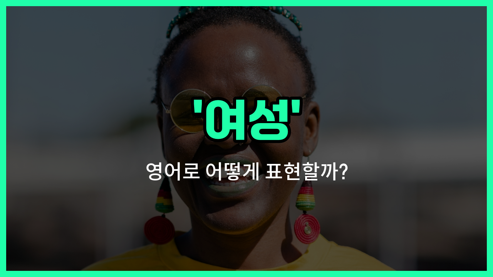

## 🌟 영어 표현 - women

안녕하세요 👋 오늘은 '여성', '여자'라는 뜻을 가진 영어 표현을 알아보려고 해요. 바로 '**women**'이라는 단어인데요. 이 단어는 '여성들', 즉 여자 여러 명을 가리킬 때 사용하는 복수형이에요.

'woman'이 한 명의 여성을 의미한다면, 'women'은 두 명 이상의 여성을 말할 때 쓰여요. 발음도 조금 다르니 주의해야 해요! 'woman'은 [우먼], 'women'은 [위민]으로 발음돼요.

이 단어는 일상 대화, 뉴스, 책 등 다양한 상황에서 자주 등장해요. 예를 들어, "There are many women in the room."이라고 하면 "방에 많은 여성들이 있어요."라는 뜻이에요.

또한, 여성의 권리, 건강, 사회적 역할 등 다양한 주제를 이야기할 때도 'women'이라는 단어가 자주 사용돼요.

## 📖 예문

1. "그 회사에는 여성 직원이 많아요."

   "There are many women [employees](/blog/in-english/700.employee/) in the [company](/blog/in-english/1111.company/)."

2. "여성들은 건강을 잘 챙겨야 해요."

   "Women should take good care of their health."

## 💬 연습해보기

<ul data-interactive-list>

  <li data-interactive-item>
    이번 컨퍼런스에서는 직장에서 여성이 겪는 문제들에 대한 패널이 있었어요.
    The conference had a panel <a href="/blog/in-english/186.focus-on/">focused on</a> issues women face in the <a href="/blog/in-english/048.workplace/">workplace</a>.
  </li>

  <li data-interactive-item>
    요즘 많은 스타트업을 여성들이 이끌고 있어서 참 감동적이에요.
    Women are leading many startups these <a href="/blog/in-english/1109.days/">days</a>, and it's inspiring to see.
  </li>

  <li data-interactive-item>
    제 친구가 북클럽에서 온 여성들을 파티에 초대했어요.
    My friend <a href="/blog/in-english/347.invite/">invited</a> a <a href="/blog/in-english/1120.group/">group</a> of women from her <a href="/blog/in-english/447.book/">book</a> club to the party.
  </li>

  <li data-interactive-item>
    여성들은 일과 가정의 책임을 놀라운 방법으로 잘 조화시켜요.
    Women <a href="/blog/in-english/326.often/">often</a> balance <a href="/blog/in-english/1064.work/">work</a> and <a href="/blog/in-english/1100.family/">family</a> <a href="/blog/in-english/932.responsibility/">responsibilities</a> in amazing <a href="/blog/in-english/1062.way/">ways</a>.
  </li>

  <li data-interactive-item>
    행사 중에는 프로젝트에 기여한 모든 여성들에게 감사의 인사를 전했어요.
    During the event, they gave shoutouts to all the women who contributed to the project.
  </li>

  <li data-interactive-item>
    여성들의 시각이 그 회의에서 논의를 더욱 깊이 있게 만들어줬어요.
    Women's perspectives really added depth to the discussion in that meeting.
  </li>

  <li data-interactive-item>
    연구에 따르면 여성이 평균적으로 남성보다 더 오래 사는 경향이 있다고 해요.
    The study highlighted how women typically live longer than <a href="/blog/in-english/1075.man/">men</a> on average.
  </li>

  <li data-interactive-item>
    젊은 여성을 교육적으로 지원하는 프로그램은 정말 중요해요.
    It's <a href="/blog/in-english/318.important/">important</a> to support programs that empower young women in education.
  </li>

  <li data-interactive-item>
    여성들이 스포츠에서 장벽을 허물며 놀라운 재능과 결단력을 보여주고 있어요.
    Women have been breaking barriers in sports, showing incredible talent and determination.
  </li>

  <li data-interactive-item>
    그가 지역 사회 리더들에 대해 연설하면서 여성들의 기여를 꼭 언급했어요.
    He <a href="/blog/in-english/232.make-sure/">made sure</a> to mention the contributions of women in his speech about community leaders.
  </li>

</ul>

## 🤝 함께 알아두면 좋은 표현들

### ladies

'ladies'는 '여성들'을 정중하고 공손하게 부르는 표현이에요. 공식적인 자리나 예의를 갖춰 말할 때 자주 사용돼요.

- "The event was [organized](/blog/in-english/355.organize/) especially for ladies [interested in](/blog/in-english/979.interested-in/) fashion."
- "그 행사는 패션에 관심 있는 여성들을 위해 특별히 준비되었어요."

### men

'men'은 '남성들'을 뜻하는 단어로, 'women'의 반대말이에요. 성별을 구분할 때 기본적으로 쓰이는 표현이에요.

- "The conference had more men than women attending this [year](/blog/in-english/1065.year/)."
- "이번 해 컨퍼런스에는 여성보다 남성 참석자가 더 많았어요."

### girls

'girls'는 주로 어린 여성이나 젊은 여성을 가리키는 말이에요. 'women'보다 나이가 어리거나 좀 더 친근한 느낌을 줄 때 사용돼요.

- "The girls went to the mall to [hang out](/blog/in-english/127.hang-out/) after [school](/blog/in-english/1090.school/)."
- "여자애들이 방과 후에 쇼핑몰에 놀러 갔어요."

---

오늘은 '여성', '여자'라는 뜻을 가진 영어 표현 'women'에 대해 알아봤어요. 한 명일 때는 'woman', 여러 명일 때는 'women'이라는 점 꼭 기억해 주세요!

오늘 배운 표현과 예문들을 소리 내서 여러 번 읽어보면 더 쉽게 익힐 수 있어요. 다음에도 더 유익한 영어 표현으로 찾아올게요! 감사합니다!

