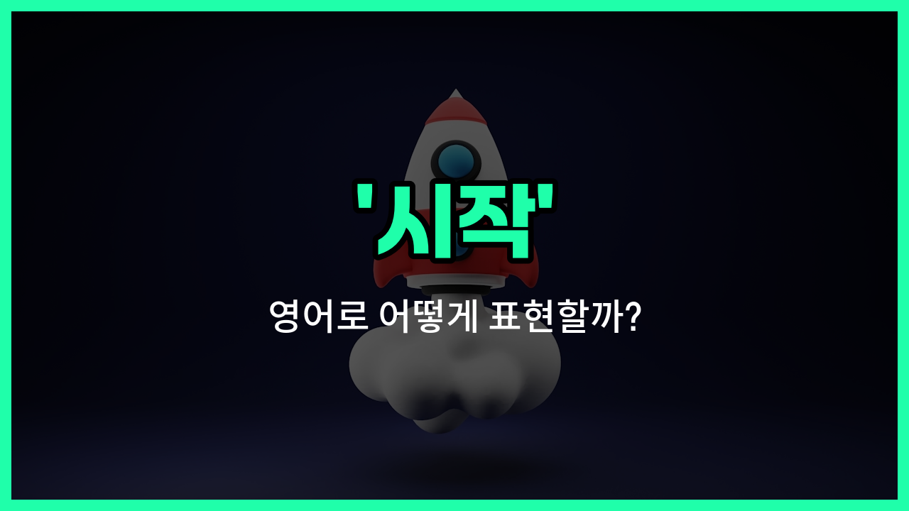

## 🌟 영어 표현 - start

안녕하세요 👋 오늘은 영어로 '시작하다', '출발하다'라는 뜻을 가진 표현을 알아보려고 해요. 바로 '**start**'라는 단어인데요. 이 단어는 무언가를 **처음으로 하거나, 어떤 일이 본격적으로 진행되기 시작할 때** 자주 사용돼요!

예를 들어, 새로운 프로젝트를 시작할 때, 또는 경주에서 출발 신호가 울릴 때 모두 'start'라는 단어를 쓸 수 있어요. 일상 대화뿐만 아니라 공식적인 상황에서도 정말 많이 쓰이는 단어랍니다.

또한, 'start'는 동사로 '시작하다', 명사로 '시작'이라는 뜻을 모두 가지고 있어서 상황에 따라 다양하게 활용할 수 있어요. 예를 들어, "[Let](/blog/in-english/1112.let/)'s start!"라고 하면 "시작하자!"라는 의미가 되고, "the start of the meeting"은 "회의의 시작"이라는 뜻이에요.

## 📖 예문

1. "수업이 9시에 시작해요."

   "The class starts at 9 o'clock."

2. "우리는 곧 새로운 프로젝트를 시작할 거예요."

   "We will start a [new](/blog/in-english/1056.new/) project soon."

3. "마라톤이 10시에 출발해요."

   "The marathon starts at 10 o'clock."

## 💬 연습해보기

<ul data-interactive-list>

  <li data-interactive-item>
    지금 숙제를 시작해야 해, 안 그러면 밤새 잠 못 자게 될 거야.
    I need to start my homework now or I'll be up all <a href="/blog/in-english/1110.night/">night</a>.
  </li>

  <li data-interactive-item>
    회의는 오전 10시에 시작하자, 그래야 모두 제시간에 참여할 수 있어.
    Let's start the meeting at 10 a.m. so everyone can join on <a href="/blog/in-english/1055.time/">time</a>.
  </li>

  <li data-interactive-item>
    그녀는 일 때문에 스트레스를 푸는 새로운 취미를 시작하기로 했어.
    She <a href="/blog/in-english/062.decide-to/">decided to</a> start a new hobby to relieve stress from <a href="/blog/in-english/1064.work/">work</a>.
  </li>

  <li data-interactive-item>
    요리하기 전에 모든 재료가 준비됐는지 확인하자.
    Before we start <a href="/blog/in-english/461.cook/">cooking</a>, let's <a href="/blog/in-english/232.make-sure/">make sure</a> we have all the ingredients ready.
  </li>

  <li data-interactive-item>
    예상치 못한 비용을 위해서는 일찍부터 돈을 모으는 게 중요해.
    It's <a href="/blog/in-english/318.important/">important</a> to start <a href="/blog/in-english/726.save-money/">saving money</a> early for unexpected <a href="/blog/in-english/725.expense/">expenses</a>.
  </li>

  <li data-interactive-item>
    좋은 항공권을 얻으려면 곧 휴가 계획을 세워야 해.
    We should start planning our <a href="/blog/in-english/516.vacation/">vacation</a> soon to get good deals on flights.
  </li>

  <li data-interactive-item>
    모두가 얘기하는 그 프로그램의 새 시즌 보기를 너무 기다려.
    I can't wait to start watching the new season of that show everyone is talking about.
  </li>

  <li data-interactive-item>
    짧은 휴식 후에 게임의 두 번째 파트를 시작할 거야.
    After a short break, we'll start the <a href="/blog/in-english/1105.second/">second</a> half of the <a href="/blog/in-english/1087.game/">game</a>.
  </li>

  <li data-interactive-item>
    그는 새 직장을 시작하는 게 긴장됐지만 결국 너무 좋아했어.
    He was <a href="/blog/in-english/115.nervous/">nervous</a> to start his new <a href="/blog/in-english/1101.job/">job</a> but ended up loving it.
  </li>

  <li data-interactive-item>
    먼저 새 팀원들에게 자기소개부터 하자.
    Let's start by <a href="/blog/in-english/262.introduce/">introducing</a> ourselves to the new <a href="/blog/in-english/1099.team/">team</a> members.
  </li>

</ul>

## 🤝 함께 알아두면 좋은 표현들

### begin

'begin'은 'start'와 매우 비슷한 의미로, 어떤 일을 처음으로 하거나 어떤 상태에 들어가는 것을 뜻해요. 'start'보다 조금 더 격식 있거나 문어체에서 자주 쓰여요.

- "The meeting will begin at 10 a.m."
- "회의는 오전 10시에 시작할 거예요."

### commence

'commence'는 'start'의 공식적이고 격식 있는 표현이에요. 주로 공식 행사나 중요한 일이 시작될 때 사용해요.

- "The graduation ceremony will commence [shortly](/blog/in-english/521.shortly/)."
- "졸업식이 곧 시작될 거예요."

### finish

'[finish](/blog/in-english/295.finish/)'는 'start'의 반대말로, 어떤 일을 끝내거나 마무리하는 것을 의미해요. 시작과는 반대되는 개념이에요.

- "She finished her homework before dinner."
- "그녀는 저녁 식사 전에 숙제를 끝냈어요."

---

오늘은 '시작', '출발', '개시'라는 뜻을 가진 영어 표현 '**start**'에 대해 알아봤어요. 앞으로 무언가를 새롭게 시작할 때 이 표현을 떠올려 보세요 😊

오늘 배운 표현과 예문들을 꼭 소리 내서 여러 번 읽어보세요. 다음에도 더 유익한 영어 표현으로 찾아올게요! 감사합니다!

