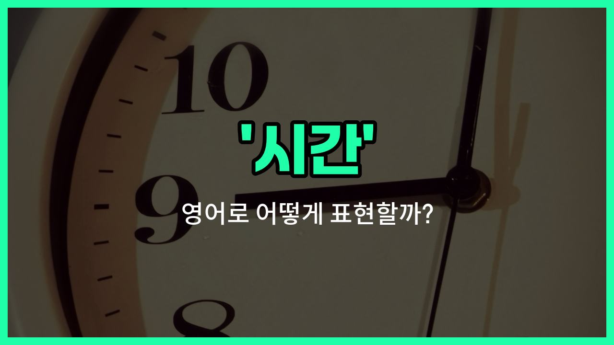

## 🌟 영어 표현 - times

안녕하세요 👋 오늘은 영어에서 자주 쓰이는 단어 '**[times](/blog/in-english/1055.time/)**'에 대해 알아보려고 해요. '시간', '때', '횟수'와 관련된 상황에서 이 표현이 어떻게 쓰이는지 궁금하지 않으세요? 지금부터 쉽게 설명해드릴게요.

'**times**'는 기본적으로 '몇 번', '횟수', '시기'를 나타낼 때 자주 사용돼요. 예를 들어, '몇 번 해봤어?'라고 물을 때 "How many times have you tried it?"라고 할 수 있어요. 또, '좋은 시절', '어려운 시기'처럼 '때'를 말할 때도 'times'를 쓸 수 있어요.

그리고 수학에서 '곱하기'를 말할 때도 'times'를 사용해요. 예를 들어, '2 곱하기 3은 6'은 "Two times three is six."이라고 해요.

## 📖 예문

1. "나는 세 번 시도해봤어요."

   "I tried it three times."

2. "요즘은 정말 바쁜 시기예요."

   "These are really [busy](/blog/in-english/372.busy/) times these [days](/blog/in-english/1109.days/)."

3. "2 곱하기 5는 10이에요."

   "Two times five is ten."

## 💬 연습해보기

<ul data-interactive-list>

  <li data-interactive-item>
    나는 보통 건강 유지하려고 주 3회 운동해요.
    I usually <a href="/blog/in-english/1064.work/">work</a> out three times a week to stay in shape.
  </li>

  <li data-interactive-item>
    그녀는 올해 벌써 그 박물관에 몇 번 가봤어요.
    She's visited that museum <a href="/blog/in-english/911.a-few/">a few</a> times already this <a href="/blog/in-english/1065.year/">year</a>.
  </li>

  <li data-interactive-item>
    나는 그 책을 두 번 읽어봤는데 두 번째 읽어도 여전히 좋아요.
    I've <a href="/blog/in-english/436.read/">read</a> that <a href="/blog/in-english/447.book/">book</a> two times, and it's just as good the <a href="/blog/in-english/1105.second/">second</a> time.
  </li>

  <li data-interactive-item>
    우리는 여러 번 너에게 전화해봤는데, 너는 한 번도 안 받았어.
    We tried calling you several times, but you never answered.
  </li>

  <li data-interactive-item>
    그는 이번 달에 출근이 여러 번 지각했어요.
    He's been <a href="/blog/in-english/391.late/">late</a> to work multiple times this month.
  </li>

  <li data-interactive-item>
    나는 그 영화를 다섯 번 정도 봤는데, 내 최애 영화 중 하나예요.
    I've watched that movie <a href="/blog/in-english/1053.like/">like</a> five times; it's one of my favorites.
  </li>

  <li data-interactive-item>
    레시피를 몇 번 확인해보면 놓치는 게 없을 거예요.
    You should check the recipe <a href="/blog/in-english/912.a-couple-of/">a couple of</a> times to <a href="/blog/in-english/232.make-sure/">make sure</a> you're not <a href="/blog/in-english/339.miss/">missing</a> anything.
  </li>

  <li data-interactive-item>
    그 콘서트는 두 번 연속 매진됐는데, 정말 대단해요.
    The concert's sold out two times <a href="/blog/in-english/195.in-a-row/">in a row</a>, which is pretty impressive.
  </li>

  <li data-interactive-item>
    나는 네게 여러 번 복도에 신발 두지 말라고 했잖아.
    I've asked you times not to <a href="/blog/in-english/402.leave/">leave</a> your shoes in the hallway.
  </li>

  <li data-interactive-item>
    그녀는 연속으로 3번이나 챔피언에 올라서 정말 대단해요!
    She's <a href="/blog/in-english/456.win/">won</a> the championship three times in a row, which is crazy!
  </li>

</ul>

## 🤝 함께 알아두면 좋은 표현들

### hours

'hours'는 '시간'을 나타내는 가장 기본적인 단위 중 하나로, 하루 24시간 중 한 단위를 의미해요. 일상 대화에서 특정 시간의 길이나 시간을 셀 때 자주 사용해요.

- "I worked for eight hours today."
- "나는 오늘 8시간 동안 일했어요."

### moments

'[moments](/blog/in-english/490.moment/)'는 '순간들'이라는 뜻으로, 아주 짧은 시간이나 특정한 순간을 강조할 때 사용해요. 'times'보다 더 짧고 순간적인 시간을 나타낼 때 적합해요.

- "Wait a few moments, I'll be [right](/blog/in-english/1063.right/) back."
- "잠깐만 기다려 주세요, 금방 돌아올게요."

### eternity

'eternity'는 '영원'이라는 뜻으로, 시간이 끝없이 계속되는 상태를 의미해요. 'times'와는 반대로 무한히 긴 시간을 나타내는 단어예요.

- "It [felt](/blog/in-english/1096.feel/) like an eternity before the bus [finally](/blog/in-english/182.finally/) [arrived](/blog/in-english/403.arrive/)."
- "버스가 드디어 도착하기까지 영원처럼 느껴졌어요."

---

오늘은 '시간', '때', '횟수'라는 뜻을 가진 영어 표현 '**times**'에 대해 알아봤어요. 일상 대화나 수학 문제를 풀 때 이 표현을 떠올리면 도움이 될 거예요 😊

오늘 배운 표현과 예문들을 꼭 소리 내서 여러 번 읽어보세요. 다음에도 더 유익한 영어 표현으로 찾아올게요! 감사합니다!

