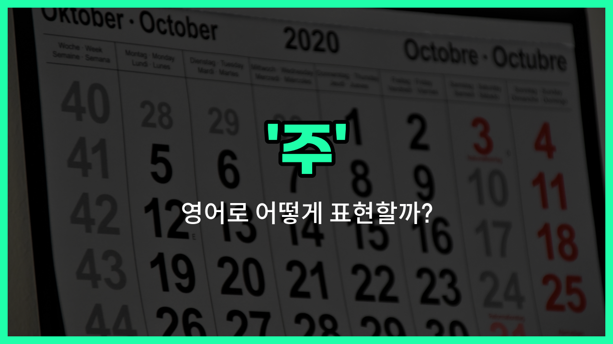

## 🌟 영어 표현 - week

안녕하세요 👋 오늘은 우리가 자주 쓰는 단어 '**주**'를 영어로 어떻게 표현하는지 알아볼 거예요. 바로 '**week**'라는 단어인데요, 이 단어는 **7일이 모여서 이루는 기간**을 의미해요.

예를 들어, 월요일부터 일요일까지의 한 주, 또는 어떤 일이 일주일 동안 진행될 때 모두 'week'라는 단어를 사용해요. 일상 대화, 학교, 회사 등 다양한 상황에서 정말 많이 쓰이는 단어예요!

예를 들어, "이번 주에 뭐 해요?"라고 물어보고 싶을 때는 "What are you doing this week?"라고 말할 수 있어요.

또한, "나는 일주일에 세 번 운동해요."는 "I exercise three [times](/blog/in-english/1128.times/) a week."처럼 표현할 수 있어요.

## 📖 예문

1. "이번 주에 중요한 시험이 있어요."

   "I have an [important](/blog/in-english/318.important/) exam this week."

2. "그 프로젝트는 일주일이 걸릴 거예요."

   "The project will take a week."

## 💬 연습해보기

<ul data-interactive-list>

  <li data-interactive-item>
    주말이 오기 너무 기다려져; 이번 주 정말 길었거든요.
    I can't <a href="/blog/in-english/377.wait-for/">wait for</a> the weekend; it's been a <a href="/blog/in-english/1077.long/">long</a> week at <a href="/blog/in-english/1064.work/">work</a>.
  </li>

  <li data-interactive-item>
    그녀는 다음 주에 해외 여행 가서 짐 싸는 것 때문에 정말 바빠요.
    She's traveling abroad next week, so she's been really <a href="/blog/in-english/372.busy/">busy</a> <a href="/blog/in-english/301.pack/">packing</a>.
  </li>

  <li data-interactive-item>
    다음 주에 프로젝트 업데이트에 대해 논의할 팀 미팅이 예정되어 있어요.
    We have a <a href="/blog/in-english/1099.team/">team</a> meeting scheduled for next week to discuss the project updates.
  </li>

  <li data-interactive-item>
    나는 매주 헬스장 가서 몸을 유지하려고 노력하고 있어요.
    I've been hitting the <a href="/blog/in-english/431.gym/">gym</a> every week to stay in shape.
  </li>

  <li data-interactive-item>
    날씨 예보에 따르면 일주일 내내 비가 올 거래요, 우산 잊지 마세요.
    The weather <a href="/blog/in-english/416.forecast/">forecast</a> says it'll rain all week, so don't <a href="/blog/in-english/023.forget/">forget</a> your umbrella.
  </li>

  <li data-interactive-item>
    그는 7월 마지막 주에 휴가를 예약했어요.
    He scheduled his <a href="/blog/in-english/516.vacation/">vacation</a> for the last week of July.
  </li>

  <li data-interactive-item>
    매주 친구들과 커피 마시면서 시간을 보내려고 해요.
    Every week, I <a href="/blog/in-english/117.try-to/">try to</a> <a href="/blog/in-english/021.catch-up-on/">catch up</a> with my friends <a href="/blog/in-english/504.over-coffee/">over coffee</a>.
  </li>

  <li data-interactive-item>
    그녀가 말하기를 소포가 주말까지 도착할 거래요.
    She mentioned that the package should <a href="/blog/in-english/403.arrive/">arrive</a> by the <a href="/blog/in-english/1093.end/">end</a> of the week.
  </li>

  <li data-interactive-item>
    이번 주가 너무 빨리 지나갔어요, 벌써 금요일이라니 믿기지가 않아요.
    The week flew by so quickly, I can't believe it's Friday already.
  </li>

  <li data-interactive-item>
    우리 월세는 매달 첫째 주에 내야 해요.
    Our rent is due every first week of the month.
  </li>

</ul>

## 🤝 함께 알아두면 좋은 표현들

### calendar week

'calendar week'은 '달력 주'라는 뜻으로, 일요일부터 토요일까지의 한 주를 의미해요. 일반적으로 공식적인 일정이나 계획을 세울 때 사용해요.

- "The project [deadline](/blog/in-english/830.deadline/) is [set](/blog/in-english/1117.set/) for the end of the calendar week."
- "프로젝트 마감일은 달력 주의 마지막 날로 정해져 있어요."

### weekend

'weekend'은 '주말'이라는 뜻으로, 보통 금요일 저녁부터 일요일까지의 휴식 기간을 말해요. 주중과는 달리 휴식이나 여가 활동을 하는 시간이죠.

- "We are planning a trip for the weekend."
- "우리는 주말에 여행을 계획하고 있어요."

### day

'[day](/blog/in-english/1067.day/)'는 '하루'라는 뜻으로, 'week'의 반대 개념이에요. 한 주는 여러 날(day)로 구성되어 있으니, 더 작은 시간 단위를 나타낼 때 사용해요.

- "I exercise every day to stay healthy."
- "나는 건강을 유지하기 위해 매일 운동해요."

---

오늘은 '주', '일주일', '7일'이라는 뜻을 가진 영어 표현 '**week**'에 대해 알아봤어요. 앞으로 일정을 이야기할 때 이 단어를 꼭 활용해 보세요 😊

오늘 배운 표현과 예문들을 꼭 최소 3번씩 소리 내서 읽어보세요. 다음에도 더 재미있고 유익한 영어 표현으로 찾아올게요! 감사합니다!

