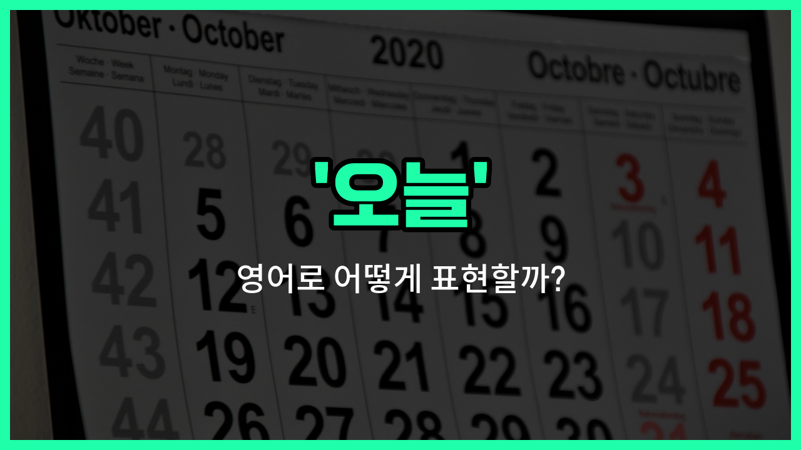

## 🌟 영어 표현 - today

안녕하세요 👋 오늘은 우리가 매일 쓰는 단어, '**오늘**'을 영어로 어떻게 표현하는지 알아볼게요

'**today**'는 바로 '오늘'이라는 뜻이에요. 즉, 지금 이 순간, 우리가 살고 있는 바로 이 날을 가리킬 때 쓰는 단어예요. 일상 대화, 일정, 약속 등 다양한 상황에서 정말 자주 쓰이는 표현이에요!

예를 들어, 친구에게 "오늘 뭐 해?"라고 물어보고 싶을 때 "What are you doing today?"라고 말할 수 있어요. 또, 회사나 학교에서 "오늘 회의가 있어요"라고 할 때도 "There is a meeting today"라고 자연스럽게 쓸 수 있어요.

'**today**'는 명사로도, 부사로도 사용할 수 있어서 정말 유용해요. 상황에 따라 문장 앞, 중간, 끝 어디에나 올 수 있으니 자유롭게 활용해 보세요!

## 📖 예문

1. "오늘 날씨가 정말 좋아요."

   "The weather is really nice today."

2. "오늘은 중요한 시험이 있어요."

   "I have an [important](/blog/in-english/318.important/) exam today."

## 💬 연습해보기

<ul data-interactive-list>

  <li data-interactive-item>
    오늘은 뭔가 모든 게 잘 맞는 날인 것 같아.
    Today is one of those <a href="/blog/in-english/1109.days/">days</a> where everything just <a href="/blog/in-english/1096.feel/">feels</a> <a href="/blog/in-english/1063.right/">right</a>.
  </li>

  <li data-interactive-item>
    우리 오늘 이 프로젝트 끝내야 한다니 믿기지가 않아.
    I can't believe we have to <a href="/blog/in-english/295.finish/">finish</a> this project by today.
  </li>

  <li data-interactive-item>
    오늘 만날 시간 있어? 아니면 다른 날로 미룰까?
    Are you <a href="/blog/in-english/1104.free/">free</a> to meet up today or should we plan for <a href="/blog/in-english/513.another/">another</a> <a href="/blog/in-english/1067.day/">day</a>?
  </li>

  <li data-interactive-item>
    오늘 날씨가 공원에서 소풍하기 딱 좋은 날이야.
    Today's weather is <a href="/blog/in-english/413.perfect/">perfect</a> for a picnic in the <a href="/blog/in-english/463.park/">park</a>.
  </li>

  <li data-interactive-item>
    오늘 치과 예약이 있어서 너무 가기 싫어.
    I have a dentist appointment today that I've been dreading.
  </li>

  <li data-interactive-item>
    너 바쁘지 않으면 오늘 한 번 만나자.
    <a href="/blog/in-english/1112.let/">Let</a>'s <a href="/blog/in-english/021.catch-up-on/">catch up</a> sometime today if you're not too <a href="/blog/in-english/372.busy/">busy</a>.
  </li>

  <li data-interactive-item>
    오늘 새로운 커피집에 가봤는데 진짜 맛있었어.
    Today, I tried that <a href="/blog/in-english/1056.new/">new</a> coffee shop and it was amazing.
  </li>

  <li data-interactive-item>
    오늘 콘서트 소식 봤어?
    Did you see the <a href="/blog/in-english/536.news/">news</a> today about the concert?
  </li>

  <li data-interactive-item>
    우리가 오늘 메뉴 정해야 케이터링 업체가 준비할 수 있어.
    We need to decide on the menu today so the caterer can <a href="/blog/in-english/1127.start/">start</a> prepping.
  </li>

  <li data-interactive-item>
    오늘 엄마한테 전화하려고 했는데 완전히 까먹었어.
    I was supposed to call my mom today but completely <a href="/blog/in-english/023.forget/">forgot</a>.
  </li>

</ul>

## 🤝 함께 알아두면 좋은 표현들

### nowadays

'nowadays'는 "요즘에는" 또는 "최근에"라는 뜻으로, 현재 시점의 일반적인 상황이나 트렌드를 말할 때 사용해요. 'today'보다 조금 더 넓은 시간 범위를 포함할 수 있어요.

- "Nowadays, many [people](/blog/in-english/1057.people/) [prefer](/blog/in-english/191.prefer/) [working](/blog/in-english/1064.work/) from [home](/blog/in-english/1076.home/)."
- "요즘에는 많은 사람들이 재택근무를 선호해요."

### yesterday

'yesterday'는 "어제"라는 뜻으로, 'today'의 반대 개념이에요. 오늘이 아닌 바로 전날을 가리킬 때 사용해요.

- "I met my friend yesterday at the cafe."
- "나는 어제 카페에서 친구를 만났어요."

### tomorrow

'tomorrow'는 "내일"이라는 뜻으로, 'today'의 반대 개념 중 하나예요. 오늘 다음 날을 가리킬 때 사용해요.

- "We have a meeting scheduled for tomorrow morning."
- "우리는 내일 아침에 회의가 예정되어 있어요."

---

오늘은 '오늘'이라는 뜻을 가진 영어 표현 '**today**'에 대해 알아봤어요. 일상에서 가장 많이 쓰이는 단어 중 하나니까 꼭 기억해 두세요 😊

오늘 배운 표현과 예문들을 소리 내서 여러 번 읽어보면 더 쉽게 익힐 수 있어요. 다음에도 더 유익한 영어 표현으로 찾아올게요! 감사합니다!

