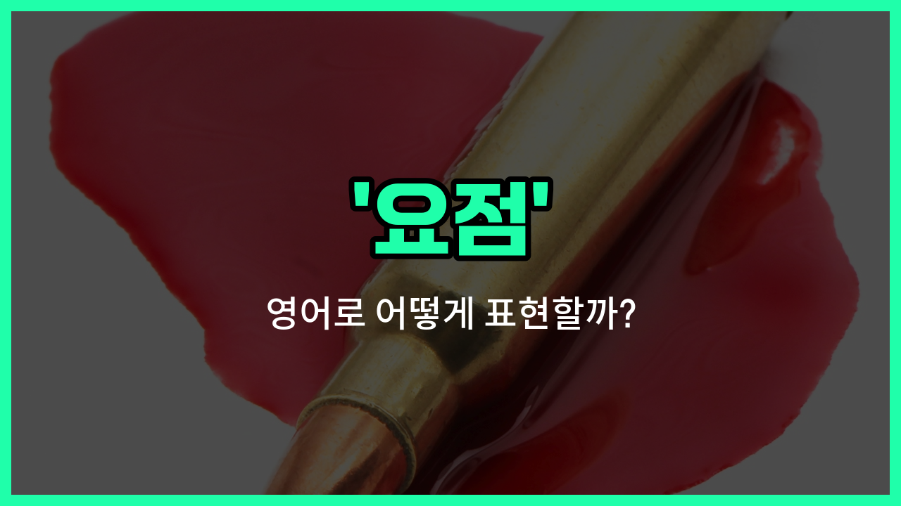

## 🌟 영어 표현 - point

안녕하세요 👋 오늘은 영어로 '요점'을 어떻게 표현하는지 알아보려고 해요. 바로 '**point**'라는 단어를 사용할 수 있어요. 'point'는 대화나 글에서 **가장 중요한 부분**이나 **핵심**을 말할 때 자주 쓰여요.

예를 들어, 누군가 긴 설명을 할 때 "요점만 말해줘"라고 하고 싶다면 영어로 "Get to the point."라고 표현할 수 있어요. 또, 회의나 토론에서 중요한 내용을 짚을 때도 'point'라는 단어를 자연스럽게 사용할 수 있어요.

'point'는 '포인트'라는 식으로도 많이 쓰이는데, 이때는 강조하고 싶은 부분이나 주목해야 할 부분을 의미해요. 그래서 일상 대화뿐만 아니라 비즈니스 상황에서도 정말 유용하게 쓸 수 있는 단어예요!

## 📖 예문

1. "요점을 말해 주세요."

   "Please tell me the point."

2. "그의 말에는 중요한 요점이 있어요."

   "There is an [important](/blog/in-english/318.important/) point in what he [said](/blog/in-english/1061.said/)."

## 💬 연습해보기

<ul data-interactive-list>

  <li data-interactive-item>
    일단 결론부터 말할게, 금요일까지 이 프로젝트를 끝내야 해요.
    <a href="/blog/in-english/1112.let/">Let</a> me get straight to the point, we need to <a href="/blog/in-english/295.finish/">finish</a> this project by Friday.
  </li>

  <li data-interactive-item>
    그의 이야기는 팀워크가 얼마나 중요한지를 보여주려는 거였어요.
    The point of his <a href="/blog/in-english/537.story/">story</a> was to show how teamwork makes a difference.
  </li>

  <li data-interactive-item>
    영화의 핵심을 놓쳤는데, 무슨 일이 있었는지 설명해 줄래요?
    I <a href="/blog/in-english/339.miss/">missed</a> the point of the movie, could you <a href="/blog/in-english/909.explain/">explain</a> what happened?
  </li>

  <li data-interactive-item>
    이 주장에서 당신이 하고 싶었던 주된 내용은 뭐예요?
    What's the main point you're <a href="/blog/in-english/117.try-to/">trying to</a> make in this argument?
  </li>

  <li data-interactive-item>
    그녀가 계속 이야기했지만, 그녀의 설명이 왜 중요한지 이해가 안 갔어요.
    She kept talking, but I couldn't see the point of her <a href="/blog/in-english/913.explanation/">explanation</a>.
  </li>

  <li data-interactive-item>
    내 주장을 잘 전달하기 위해 몇 가지 예시와 시각 자료를 사용했어요.
    To get my point across, I <a href="/blog/in-english/171.used/">used</a> <a href="/blog/in-english/911.a-few/">a few</a> examples and some visuals.
  </li>

  <li data-interactive-item>
    핵심은 지금 행동하지 않으면 상황이 더 나빠질 거라는 거예요.
    The point is, if we don't <a href="/blog/in-english/1138.act/">act</a> now, things will only <a href="/blog/in-english/234.get-worse/">get worse</a>.
  </li>

  <li data-interactive-item>
    그는 항상 무례하지 않게 자신의 주장을 명확히 해요.
    He always <a href="/blog/in-english/175.manage-to/">manages to</a> make his point clear without being rude.
  </li>

  <li data-interactive-item>
    언어를 배우는 전부는 의사소통을 잘 하기 위해서예요.
    The whole point of studying a language is to be able to communicate.
  </li>

  <li data-interactive-item>
    내 생각엔 당신이 본질을 놓치고 있어요; 이건 단순히 이기는 게 아니라 배우는 거예요.
    I <a href="/blog/in-english/1059.think/">think</a> you're <a href="/blog/in-english/368.missing/">missing</a> the point; it's not just about <a href="/blog/in-english/456.win/">winning</a> but <a href="/blog/in-english/245.learn/">learning</a>.
  </li>

</ul>

## 🤝 함께 알아두면 좋은 표현들

### main idea

'main idea'는 글이나 말에서 가장 중요한 중심 생각이나 요점을 의미해요. 주로 글의 핵심 내용을 파악할 때 사용하며, 'point'와 비슷한 의미로 쓰여요.

- "The main idea of the article is to promote environmental [awareness](/blog/in-english/990.awareness/)."
- "그 글의 요점은 환경 인식을 높이는 거예요."

### irrelevant detail

'irrelevant detail'은 주제나 논의와 관련 없는 세부사항을 뜻해요. 'point'와는 반대로 핵심이 아닌 부분을 가리킬 때 사용해요.

- "She kept mentioning irrelevant details that distracted from the main point."
- "그녀는 요점에서 벗어난 쓸데없는 세부사항들을 계속 언급했어요."

### key takeaway

'key takeaway'는 회의나 강의 등에서 가장 중요한 교훈이나 요점을 의미해요. 'point'와 유사하지만, 특히 배운 점이나 기억해야 할 핵심 내용을 강조할 때 쓰여요.

- "The key takeaway from the seminar was the importance of teamwork."
- "세미나의 요점은 팀워크의 중요성이었어요."

---

오늘은 '요점', '핵심', '포인트'라는 뜻을 가진 영어 표현 'point'에 대해 알아봤어요. 앞으로 대화나 글에서 중요한 부분을 짚고 싶을 때 이 표현을 꼭 활용해 보세요 😊

오늘 배운 표현과 예문들을 소리 내서 여러 번 읽어보면 더 쉽게 기억할 수 있어요. 다음에도 더 유익한 영어 표현으로 찾아올게요! 감사합니다!

