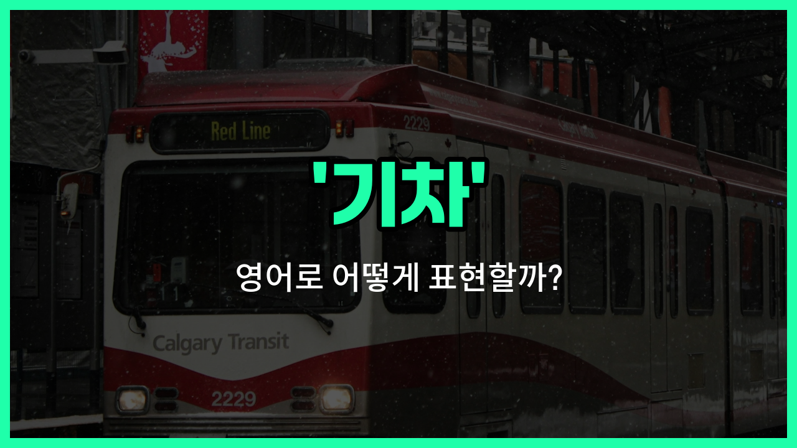

## 🌟 영어 표현 - train

안녕하세요 👋 오늘은 우리가 자주 이용하는 교통수단 중 하나인 '**기차**'를 영어로 어떻게 표현하는지 알아볼 거예요. 바로 '**train**'이라는 단어를 사용해요.

'**train**'은 선로 위를 달리는 긴 차량을 의미해요. 흔히 '열차', '철도차량'이라는 뜻으로도 쓰여요. 우리가 서울에서 부산까지 이동할 때 타는 KTX도 영어로는 'train'이라고 부를 수 있어요.

이 단어는 여행, 출퇴근, 장거리 이동 등 다양한 상황에서 자연스럽게 사용할 수 있어요. 예를 들어, "나는 내일 기차를 타고 대전에 갈 거야."라고 말하고 싶을 때 "I'm taking the train to Daejeon tomorrow."라고 표현할 수 있어요.

또한, 'train'은 명사로 '기차'를 뜻하지만, 동사로는 '훈련하다'라는 전혀 다른 의미도 있으니 문맥에 따라 구분해서 사용해야 해요!

## 📖 예문

1. "기차가 5분 후에 도착해요."

   "The train [arrives](/blog/in-english/403.arrive/) in 5 minutes."

2. "나는 매일 아침 기차를 타고 출근해요."

   "I take the train to [work](/blog/in-english/1064.work/) every morning."

## 💬 연습해보기

<ul data-interactive-list>

  <li data-interactive-item>
    우리는 교통체증을 피하려고 차 대신 기차를 타고 시내로 갔어요.
    We took the train to the <a href="/blog/in-english/1108.city/">city</a> <a href="/blog/in-english/169.instead-of/">instead of</a> driving to <a href="/blog/in-english/924.avoid/">avoid</a> <a href="/blog/in-english/384.traffic/">traffic</a>.
  </li>

  <li data-interactive-item>
    기차를 타고 있을 때 시골 풍경이 지나가는 걸 보는 게 너무 좋아요.
    I <a href="/blog/in-english/1074.love/">love</a> watching the countryside go by when I'm on a train.
  </li>

  <li data-interactive-item>
    그녀는 오늘 아침 기차를 놓쳐서 다음 기차를 기다려야 했어요.
    She <a href="/blog/in-english/339.miss/">missed</a> the train this morning and had to <a href="/blog/in-english/377.wait-for/">wait for</a> the next one.
  </li>

  <li data-interactive-item>
    출퇴근 시간에 기차가 정말 붐벼서 자리를 찾기가 힘들었어요.
    The train was really <a href="/blog/in-english/393.crowded/">crowded</a> during rush hour, so it was hard to <a href="/blog/in-english/1083.find/">find</a> a seat.
  </li>

  <li data-interactive-item>
    그는 매일 아침 8시에 같은 기차를 타고 출근해요.
    Every morning, he catches the same train to work at 8 a.m.
  </li>

  <li data-interactive-item>
    그들은 지역 기차를 타고 마을을 탐험하기로 했어요.
    They <a href="/blog/in-english/062.decide-to/">decided to</a> <a href="/blog/in-english/309.explore/">explore</a> the town by hopping on the local train.
  </li>

  <li data-interactive-item>
    추운 날 기차를 기다리는 게 힘들었지만, 제시간에 도착했어요.
    Waiting for the train in the cold was <a href="/blog/in-english/405.brutal/">brutal</a>, but <a href="/blog/in-english/167.at-least/">at least</a> it arrived <a href="/blog/vocab-1/043.on-time/">on time</a>.
  </li>

  <li data-interactive-item>
    아이들은 처음으로 기차를 타게 되어 너무 신났어요.
    The kids were so excited to ride the train <a href="/blog/in-english/807.for-the-first-time-ever/">for the first time ever</a>.
  </li>

  <li data-interactive-item>
    기차를 탈 때 시간을 보내려고 항상 책을 가지고 가요.
    I always <a href="/blog/in-english/1139.bring/">bring</a> a <a href="/blog/in-english/447.book/">book</a> with me when I ride the train to pass the <a href="/blog/in-english/1055.time/">time</a>.
  </li>

  <li data-interactive-item>
    우리는 기차가 역을 지나갈 때 많은 사람들이 손을 흔드는 걸 봤어요.
    We saw a bunch of <a href="/blog/in-english/1057.people/">people</a> waving at the train as it passed by the station.
  </li>

</ul>

## 🤝 함께 알아두면 좋은 표현들

### locomotive

'locomotive'는 '기관차'를 의미하며, 기차를 움직이게 하는 동력 장치를 가리켜요. 주로 철도 차량 중에서 동력을 제공하는 부분을 말할 때 사용해요.

- "The [old](/blog/in-english/1086.old/) steam locomotive was displayed in the railway museum."
- "오래된 증기 기관차가 철도 박물관에 전시되어 있었어요."

### subway

'subway'는 '지하철'을 뜻해요. 지하에 설치된 도시 철도 시스템으로, 일반적인 기차와는 달리 도시 내에서 빠르고 자주 운행되는 대중교통 수단이에요.

- "I take the subway to work every [day](/blog/in-english/1067.day/) because it's faster than driving."
- "저는 운전하는 것보다 더 빨라서 매일 지하철을 타고 출근해요."

### car

'car'는 '자동차'를 의미하며, 기차와는 달리 도로 위를 달리는 개인용 차량이에요. 기차와는 반대로 철로가 아닌 도로를 이용해 이동해요.

- "She [prefers](/blog/in-english/191.prefer/) to drive her car instead of taking the train."
- "그녀는 기차를 타는 대신 자동차를 운전하는 것을 더 좋아해요."

---

오늘은 '기차', '열차', '철도차량'이라는 뜻을 가진 영어 표현 '**train**'에 대해 알아봤어요. 다음에 기차를 탈 일이 있을 때 이 표현을 꼭 떠올려 보세요! 😊

오늘 배운 표현과 예문들을 소리 내서 여러 번 읽어보면 더 쉽게 기억할 수 있어요. 다음에도 더 유익한 영어 표현으로 찾아올게요! 감사합니다!

