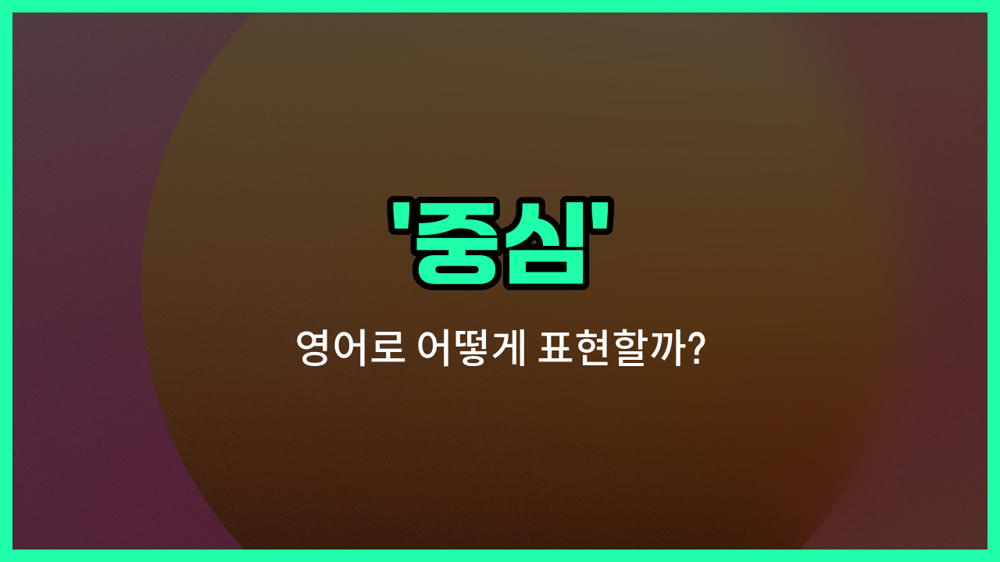

## 🌟 영어 표현 - centre

안녕하세요 👋 오늘은 우리가 자주 쓰는 단어인 '**중심**'을 영어로 어떻게 표현하는지 알아볼 거예요. 바로 '**centre**'라는 단어인데요~

'**centre**'는 어떤 것의 한가운데, 또는 가장 중요한 부분을 의미해요. 예를 들어, 도시의 중심, 문제의 핵심, 또는 원의 중심점 등 다양한 상황에서 쓸 수 있어요~

영국식 영어에서는 'centre'라고 쓰고, 미국식 영어에서는 'center'라고 표기해요. 뜻은 같으니 상황에 맞게 사용하면 돼요~

이 단어는 명사로 '중앙', '중심지'라는 뜻도 가지고 있어서, 장소나 위치를 말할 때도 자주 사용돼요. 예를 들어, '도시의 중심'은 'the centre of the [city](/blog/in-english/1108.city/)'라고 표현할 수 있어요~

## 📖 예문

1. "회의의 중심 주제는 무엇인가요?"

   "What is the central topic of the meeting?"

2. "우리는 도시의 중심에 살고 있어요."

   "We [live](/blog/in-english/1134.live/) in the centre of the city."

## 💬 연습해보기

<ul data-interactive-list>

  <li data-interactive-item>
    주말에는 도심이 모든 활동의 중심이 돼요.
    The city center is where all the action happens on weekends.
  </li>

  <li data-interactive-item>
    저는 토요일마다 장을 보러 쇼핑센터에 가요.
    I always go to the shopping centre to grab groceries on Saturdays.
  </li>

  <li data-interactive-item>
    우리의 이야기는 기후 변화라는 주제를 중심으로 진행될 거예요.
    Our discussion will center around the main topic of climate <a href="/blog/in-english/1133.change/">change</a>.
  </li>

  <li data-interactive-item>
    교실은 학교의 모든 활동이 이루어지는 중심이에요.
    The classroom is the center of all the <a href="/blog/in-english/1090.school/">school</a>'s <a href="/blog/in-english/546.activity/">activities</a>.
  </li>

  <li data-interactive-item>
    벽의 중앙에 그림을 걸어 주시면 균형이 잡힐 거예요.
    Please put the picture in the center of the wall for balance.
  </li>

  <li data-interactive-item>
    이 마을의 문화 센터에서는 매달 다양한 미술 전시회를 열어요.
    The town's cultural center hosts various art exhibitions every month.
  </li>

  <li data-interactive-item>
    우리의 노력을 이번 주 금요일까지 프로젝트 완성에 집중해 보아요.
    <a href="/blog/in-english/1112.let/">Let</a>'s center our efforts on finishing the project by Friday.
  </li>

  <li data-interactive-item>
    보건소에서는 평일에 무료 건강검진을 제공해요.
    The health center offers <a href="/blog/in-english/1104.free/">free</a> <a href="/blog/in-english/570.check-up/">check-ups</a> on weekdays.
  </li>

  <li data-interactive-item>
    토론은 재생 가능 에너지의 장점에 대해 이뤄질 거예요.
    The debate will center on the benefits of renewable energy.
  </li>

  <li data-interactive-item>
    그녀는 중요한 면접 전에 자신을 중심에 두는 용기를 찾았어요.
    She <a href="/blog/in-english/1094.found/">found</a> the courage to center herself before the <a href="/blog/in-english/1095.big/">big</a> interview.
  </li>

</ul>

## 🤝 함께 알아두면 좋은 표현들

### focus (초점)

'focus'는 어떤 대상이나 주제에 대해 주의를 집중하는 것을 의미해요. 'centre'가 공간적 중심을 뜻한다면, 'focus'는 관심이나 주의의 중심을 나타내는 표현이에요.

- "The focus of the meeting was to [improve](/blog/in-english/394.improve/) customer satisfaction."
- "회의의 초점은 고객 만족도를 향상시키는 것이었어요."

### periphery (주변부)

'periphery'는 중심에서 멀리 떨어진 가장자리나 주변 부분을 뜻해요. 'centre'의 반대 개념으로, 중심이 아닌 바깥쪽 영역을 나타낼 때 사용해요.

- "The houses on the periphery of the city are less [expensive](/blog/in-english/317.expensive/)."
- "도시 주변부에 있는 집들이 더 저렴해요."

### heart (핵심)

'heart'는 어떤 것의 가장 중요한 부분이나 핵심을 의미해요. 'centre'와 비슷하게 중심적인 의미를 가지며, 비유적으로 중요한 부분을 강조할 때 많이 쓰여요.

- "The heart of the problem lies in communication issues."
- "문제의 핵심은 의사소통 문제에 있어요."

---

오늘은 '**중심**'이라는 뜻을 가진 영어 표현 '**centre**'에 대해 알아봤어요. 일상에서 중심이나 중앙을 말할 때 이 단어를 떠올려 보세요~ 😊

오늘 배운 표현과 예문들을 꼭 소리 내서 여러 번 읽어보세요. 다음에도 더 유익한 영어 표현으로 찾아올게요! 감사합니다~

