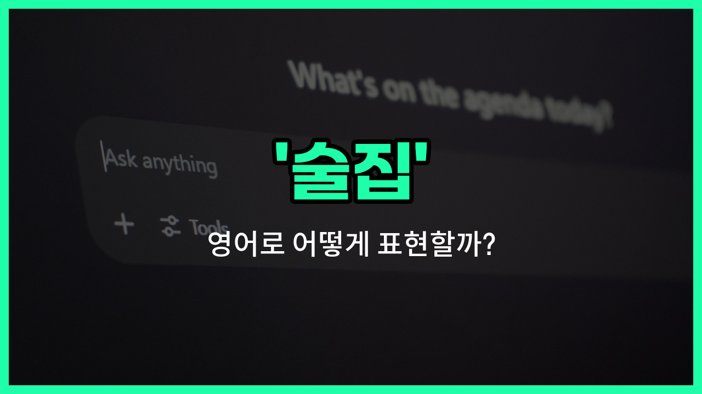

## 🌟 영어 표현 - bar

안녕하세요 👋 오늘은 영어로 '술집'을 어떻게 표현하는지 알아보려고 해요. 바로 '**bar**'라는 단어인데요~

'**bar**'는 술을 마실 수 있는 장소, 즉 우리가 흔히 말하는 술집이나 바, 주점을 의미해요. 친구들과 어울리거나, 가볍게 한 잔 하고 싶을 때 자주 가는 곳이죠~

이 단어는 미국, 영국 등 영어권 국가에서 아주 자연스럽게 사용돼요. 예를 들어, "[Let](/blog/in-english/1112.let/)'s go to a bar after [work](/blog/in-english/1064.work/)!"라고 하면 "퇴근하고 술집 가자!"라는 뜻이에요~

또한, 'bar'는 다양한 분위기의 술집을 모두 포괄할 수 있어서 정말 유용하게 쓸 수 있어요. 고급스러운 칵테일 바부터, 동네에 있는 소박한 술집까지 모두 'bar'라고 부를 수 있답니다~

## 📖 예문

1. "우리는 금요일 밤마다 바에 가요."

   "We go to a bar every Friday [night](/blog/in-english/1110.night/)."

2. "이 근처에 좋은 술집이 있나요?"

   "Is there a good bar around here?"

## 💬 연습해보기

<ul data-interactive-list>

  <li data-interactive-item>
    어젯밤에 새로 열린 바에 갔어요. 분위기가 아늑하고 수제 맥주가 진짜 맛있었어요.
    Last night, we went to a <a href="/blog/in-english/1056.new/">new</a> bar downtown that just opened. The bar had a really <a href="/blog/in-english/408.cozy/">cozy</a> <a href="/blog/in-english/773.vibe/">vibe</a> and great craft beers.
  </li>

  <li data-interactive-item>
    조용한 바에서 친구들이랑 대화하는 게 더 좋더라구요. 집 근처에 그런 작은 바가 있어서 딱이에요.
    I <a href="/blog/in-english/191.prefer/">prefer</a> <a href="/blog/in-english/127.hang-out/">hanging out</a> at a <a href="/blog/in-english/958.quiet/">quiet</a> bar where I can actually hear my friends talk. There's this small bar near my <a href="/blog/in-english/1089.place/">place</a> that's <a href="/blog/in-english/413.perfect/">perfect</a> for that.
  </li>

  <li data-interactive-item>
    퇴근하고 바에서 만날래요? 해피아워 할인도 좋다던데요.
    Do you <a href="/blog/in-english/1060.want/">want</a> to meet at the bar after work? They have happy hour <a href="/blog/in-english/1137.deal/">deals</a> that are pretty good.
  </li>

  <li data-interactive-item>
    골목 안에 숨겨진 바를 우연히 발견했어요. 겉보기엔 별로였는데 칵테일이 진짜 맛있었어요.
    We stumbled upon a hidden bar in an alley. It didn't <a href="/blog/in-english/1078.look/">look</a> <a href="/blog/in-english/1053.like/">like</a> much from <a href="/blog/in-english/974.outside/">outside</a>, but the cocktails were amazing.
  </li>

  <li data-interactive-item>
    금요일 밤에 바가 너무 붐벼서 테이블 잡으려 밖에서 좀 기다려야 했어요.
    The bar was <a href="/blog/in-english/301.pack/">packed</a> on Friday night, so we had to wait outside for a while before getting a table.
  </li>

  <li data-interactive-item>
    해변 쪽에 있는 그 바가 좋아요. 음료 마시면서 일몰을 즐길 수 있거든요. 주말에 제일 좋아하는 장소에요.
    I <a href="/blog/in-english/1074.love/">love</a> that bar by the beach because you can enjoy the sunset while <a href="/blog/in-english/1116.having/">having</a> a drink. It's my favorite spot on weekends.
  </li>

  <li data-interactive-item>
    주말에 바에서 일하면서 돈 좀 모아요. 그 바는 자정쯤에 정말 바빠져요.
    She works at a bar on weekends to <a href="/blog/in-english/293.save/">save</a> up some <a href="/blog/in-english/265.extra/">extra</a> <a href="/blog/in-english/1103.money/">money</a>. The bar gets really <a href="/blog/in-english/372.busy/">busy</a> around midnight.
  </li>

  <li data-interactive-item>
    5번가에 새로 생긴 바에 가보자. 라이브 음악과 훌륭한 칵테일이 있다던데.
    Let's hit up that new bar on 5th Street. I heard they have <a href="/blog/in-english/1134.live/">live</a> music and great cocktails.
  </li>

  <li data-interactive-item>
    길 건너에 옛날 록 음악 틀어주는 바가 있어요. 하루 일과 끝나고 unwind하기에 항상 재밌는 곳이에요.
    There's a bar down the street where they <a href="/blog/in-english/1081.play/">play</a> <a href="/blog/in-english/1086.old/">old</a> rock music. It's always a fun place to unwind after a <a href="/blog/in-english/1077.long/">long</a> <a href="/blog/in-english/1067.day/">day</a>.
  </li>

  <li data-interactive-item>
    저희는 바에서 저녁을 보내면서 수다도 떨고 TV로 경기 보고 있었어요. 항상 만나는 장소에요.
    We <a href="/blog/in-english/258.spend/">spent</a> the evening at the bar chatting and watching the <a href="/blog/in-english/1087.game/">game</a> on TV. It's our go-to spot for <a href="/blog/in-english/021.catch-up-on/">catching up</a>.
  </li>

</ul>

## 🤝 함께 알아두면 좋은 표현들

### pub

'pub'은 '술집'과 비슷한 의미로, 주로 영국과 아일랜드에서 사람들이 모여 술을 마시고 음식을 먹는 장소를 말해요. 'bar'보다 좀 더 캐주얼하고 전통적인 분위기를 가진 곳을 가리킬 때 많이 사용해요.

- "We met at the local pub for [a few](/blog/in-english/911.a-few/) drinks after work."
- "우리는 퇴근 후에 동네 술집에서 몇 잔 하려고 만났어요."

### nightclub

'nightclub'은 '술집'과는 달리 주로 밤에 영업하며 음악과 춤을 즐길 수 있는 장소를 말해요. 술을 마시는 공간이 포함되지만, 춤과 엔터테인먼트가 중심인 곳이에요.

- "They went to a nightclub to dance and have some cocktails."
- "그들은 춤추고 칵테일을 마시러 나이트클럽에 갔어요."

### dry place

'dry place'는 술을 판매하거나 마시는 것이 금지된 장소를 뜻해요. 'bar'의 반대 개념으로, 술집과는 달리 술이 없는 곳을 나타낼 때 사용해요.

- "This is a dry place, so no alcohol is allowed here."
- "여기는 금주 구역이라 술이 허용되지 않아요."

---

오늘은 '술집', '바', '주점'이라는 뜻을 가진 영어 표현 '**bar**'에 대해 알아봤어요. 다음에 친구들과 약속이 있을 때 이 표현을 꼭 써보세요~ 😊

오늘 배운 표현과 예문들을 소리 내서 여러 번 읽어보면 더 자연스럽게 쓸 수 있을 거예요. 다음에도 더 유익한 영어 표현으로 찾아올게요! 감사합니다~

