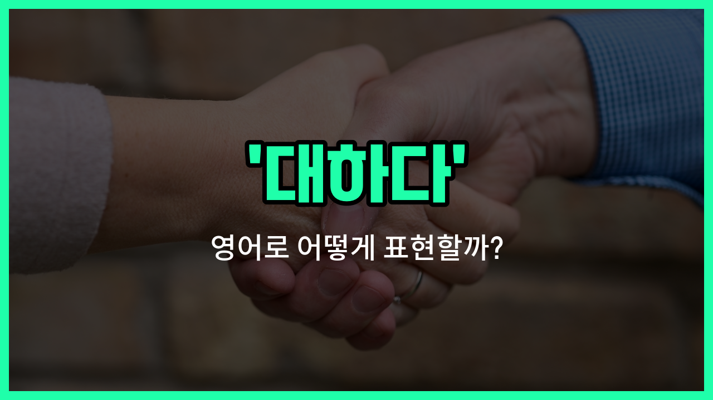

## 🌟 영어 표현 - treat

안녕하세요 👋 오늘은 사람이나 사물에 대해 어떻게 행동하거나 반응하는지를 나타내는 영어 표현, '**treat**'에 대해 알아보려고 해요.

'**treat**'는 '대하다', '취급하다', '다루다'와 같은 의미로, 누군가에게 어떤 태도나 방식으로 행동하는지를 표현할 때 자주 사용돼요. 예를 들어, 친구를 친절하게 대하거나, 손님을 정중하게 대하는 상황에서 쓸 수 있어요.

또한, '**treat**'는 사람뿐만 아니라 동물, 사물, 심지어 문제 상황에도 적용할 수 있어서 정말 유용한 단어예요. 예를 들어, "그를 가족처럼 대하다" 또는 "이 문제를 심각하게 다루다"와 같이 다양한 맥락에서 활용할 수 있어요.

## 📖 예문

1. "그녀는 모든 사람을 친절하게 대해요."

   "She treats everyone kindly."

2. "그들은 나를 아이처럼 대했어요."

   "They treated me [like](/blog/in-english/1053.like/) a child."

3. "이 문제를 신중하게 다뤄야 해요."

   "We need to treat this issue carefully."

## 💬 연습해보기

<ul data-interactive-list>

  <li data-interactive-item>
    나는 누구의 배경이든지 상관없이 모두에게 친절하게 대해보려고 해요.
    I <a href="/blog/in-english/117.try-to/">try to</a> treat everyone with kindness <a href="/blog/in-english/229.no-matter-what/">no matter what</a> their background is.
  </li>

  <li data-interactive-item>
    그녀는 항상 자신의 애완동물을 가족처럼 대해요.
    She always treats her pets like they are <a href="/blog/in-english/1100.family/">family</a> members.
  </li>

  <li data-interactive-item>
    스트레스 받는 한 주가 끝난 후엔 자기 자신을 잘 챙기는 게 중요해요.
    It's <a href="/blog/in-english/318.important/">important</a> to treat yourself well after a stressful <a href="/blog/in-english/1129.week/">week</a>.
  </li>

  <li data-interactive-item>
    그는 직원들을 공정하게 대해주는 편이라서 정말 좋은 보스예요.
    He <a href="/blog/in-english/259.tend-to/">tends to</a> treat his <a href="/blog/in-english/700.employee/">employees</a> fairly, which makes him a great boss.
  </li>

  <li data-interactive-item>
    이 문제를 가볍게 여지 말아요; 무시하면 상황이 더 악화될 수 있어요.
    Don't treat this problem lightly; it could <a href="/blog/in-english/234.get-worse/">get worse</a> if you <a href="/blog/in-english/348.ignore/">ignore</a> it.
  </li>

  <li data-interactive-item>
    사람들을 존중해서 대하면, 그들도 보통 그런 식으로 반응해요.
    When you treat <a href="/blog/in-english/1057.people/">people</a> with <a href="/blog/in-english/469.respect/">respect</a>, they usually respond in kind.
  </li>

  <li data-interactive-item>
    실패를 끝이라고 생각하지 말고, 배움의 기회로 여기세요.
    You shouldn't treat failure as the <a href="/blog/in-english/1093.end/">end</a>, but as a <a href="/blog/in-english/245.learn/">learning</a> <a href="/blog/in-english/415.experience/">experience</a>.
  </li>

  <li data-interactive-item>
    내 부모님은 내 생일을 맞아 나에게 깜짝 휴가를 선물해주셨어요.
    My parents treated me to a surprise <a href="/blog/in-english/516.vacation/">vacation</a> for my birthday.
  </li>

  <li data-interactive-item>
    그는 자신의 차를 자기 아기처럼 다루어서 항상 청소하고 수리해요.
    He treats his car like it's his baby, always cleaning and repairing it.
  </li>

  <li data-interactive-item>
    고객 서비스에서는 고객을 어떻게 대하느냐가 사업의 성쇠를 좌우할 수 있어요.
    In customer service, how you treat clients can make or break the <a href="/blog/in-english/1125.business/">business</a>.
  </li>

</ul>

## 🤝 함께 알아두면 좋은 표현들

### handle

'[handle](/blog/in-english/1152.handle/)'은 '다루다' 또는 '처리하다'라는 뜻으로, 사람이나 상황을 어떻게 대하거나 관리하는지를 나타내요. 'treat'와 비슷하게 누군가를 대하는 방식을 말할 때 자주 사용돼요.

- "She [knows](/blog/in-english/1058.know/) how to handle difficult customers with [patience](/blog/in-english/373.patience/)."
- "그녀는 까다로운 고객들을 인내심 있게 다루는 방법을 알고 있어요."

### ignore

'ignore'는 '무시하다'라는 뜻으로, 누군가를 대할 때 관심을 주지 않거나 신경 쓰지 않는 태도를 나타내요. 'treat'의 반대 의미로 볼 수 있어요.

- "He tends to ignore people who [disagree](/blog/in-english/843.disagree/) with him."
- "그는 자신과 의견이 다른 사람들을 무시하는 경향이 있어요."

### respect

'respect'는 '존중하다'라는 뜻으로, 누군가를 예의 바르고 공손하게 대하는 것을 의미해요. 'treat'와 비슷하지만 좀 더 긍정적이고 격식을 갖춘 느낌을 줘요.

- "It's important to respect others' [opinions](/blog/in-english/527.opinion/) even if you disagree."
- "비록 동의하지 않더라도 다른 사람들의 의견을 존중하는 것이 중요해요."

---

오늘은 '대하다', '취급하다', '다루다'라는 뜻을 가진 영어 표현 '**treat**'에 대해 알아봤어요. 앞으로 누군가를 어떻게 대하는지 말할 때 이 표현을 꼭 활용해 보세요 😊

오늘 배운 표현과 예문들을 소리 내서 여러 번 읽어보면 더 자연스럽게 쓸 수 있을 거예요. 다음에도 더 유익한 영어 표현으로 찾아올게요! 감사합니다!

