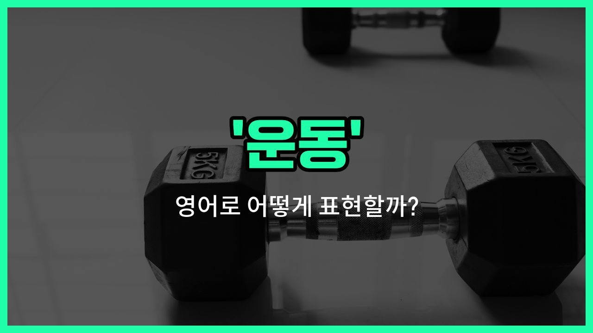

## 🌟 영어 표현 - exercise

안녕하세요 👋 오늘은 일상에서 자주 쓰는 단어인 '**운동**'의 영어 표현 '**exercise**'에 대해 알아보려고 해요.

'**exercise**'는 몸을 건강하게 만들기 위해 하는 신체 활동을 의미해요. 즉, 우리가 건강을 위해 하는 다양한 움직임이나 활동을 모두 포함하는 단어예요. 예를 들어, 달리기, 걷기, 스트레칭, 체조 등 모두 'exercise'라고 할 수 있어요.

또한, '**exercise**'는 '연습'이나 '체조'라는 뜻으로도 쓰여요. 예를 들어, 영어 듣기 연습을 할 때도 'listening exercise'라고 표현할 수 있어요.

이 단어는 명사와 동사로 모두 사용할 수 있어서 정말 유용해요! 명사로는 '운동', 동사로는 '운동하다'라는 뜻이에요. 상황에 맞게 자유롭게 활용해 보세요~

## 📖 예문

1. "나는 매일 아침 운동해요."

   "I exercise every morning."

2. "운동은 건강에 좋아요."

   "Exercise is good for your health."

3. "이 영어 연습문제를 풀어보세요."

   "Try this English exercise."

## 💬 연습해보기

<ul data-interactive-list>

  <li data-interactive-item>
    요즘 건강을 유지하려고 규칙적으로 운동하려고 노력하고 있어요.
    I've been <a href="/blog/in-english/117.try-to/">trying to</a> exercise more <a href="/blog/in-english/252.regularly/">regularly</a> to stay healthy <a href="/blog/in-english/417.these-days/">these days</a>.
  </li>

  <li data-interactive-item>
    이번 주말에 체육관에서 함께 운동할래요?
    Do you <a href="/blog/in-english/1060.want/">want</a> to exercise <a href="/blog/in-english/374.together/">together</a> at the <a href="/blog/in-english/431.gym/">gym</a> this weekend?
  </li>

  <li data-interactive-item>
    그녀는 일하기 전에 아침에 운동하는 걸 더 좋아해요. 하루를 에너지 있게 시작한다고 하더라고요.
    She <a href="/blog/in-english/191.prefer/">prefers</a> to exercise in the mornings before <a href="/blog/in-english/1064.work/">work</a> to get energized for the <a href="/blog/in-english/1067.day/">day</a>.
  </li>

  <li data-interactive-item>
    나는 운동하면서 팟캐스트 듣는 걸 좋아해요. 지루하지 않아서 좋아요.
    I <a href="/blog/in-english/1053.like/">like</a> to <a href="/blog/in-english/407.listen-to/">listen to</a> podcasts while I exercise to keep myself entertained.
  </li>

  <li data-interactive-item>
    그는 날씨가 정말 좋으니까 밖에서 운동하기로 했어요.
    He <a href="/blog/in-english/062.decide-to/">decided to</a> exercise <a href="/blog/in-english/974.outside/">outside</a> since the weather was really nice <a href="/blog/in-english/1132.today/">today</a>.
  </li>

  <li data-interactive-item>
    일관성 있게 운동하면 진짜 피트니스 향상을 느낄 수 있을 거예요.
    If you exercise consistently, you'll <a href="/blog/in-english/1127.start/">start</a> to see some <a href="/blog/in-english/1113.real/">real</a> improvements in your fitness.
  </li>

  <li data-interactive-item>
    새로운 운동을 시도할 때는 부상을 피하기 위해 주의해야 해요.
    We should exercise caution when trying <a href="/blog/in-english/1056.new/">new</a> workouts to <a href="/blog/in-english/924.avoid/">avoid</a> <a href="/blog/in-english/777.injury/">injuries</a>.
  </li>

  <li data-interactive-item>
    일하고 나서 보통 30분 정도 운동하면서 스트레스를 풀어요.
    After work, I usually exercise for about 30 minutes to unwind and relieve stress.
  </li>

  <li data-interactive-item>
    운동하기 전에 준비 운동하는 게 중요해요. 근육 부상을 예방할 수 있으니까요.
    It's <a href="/blog/in-english/318.important/">important</a> to warm up before you exercise to <a href="/blog/in-english/290.prevent/">prevent</a> muscle strains.
  </li>

  <li data-interactive-item>
    그녀는 혼자 하는 것보다 함께 운동하는 게 더 동기부여가 돼서 나를 초대했어요.
    She <a href="/blog/in-english/347.invite/">invited</a> me to exercise with her because she <a href="/blog/in-english/1083.find/">finds</a> it more motivating than <a href="/blog/in-english/1068.going/">going</a> alone.
  </li>

</ul>

## 🤝 함께 알아두면 좋은 표현들

### work out

'work out'은 '운동하다'라는 뜻으로, 주로 체력 단련이나 건강을 위해 몸을 움직이는 행위를 의미해요. 'exercise'와 거의 같은 의미로 일상 대화에서 자주 사용돼요.

- "I try to work out at the gym three [times](/blog/in-english/1128.times/) a [week](/blog/in-english/1129.week/)."
- "나는 일주일에 세 번 헬스장에서 운동하려고 해요."

### take a break

'[take a break](/blog/in-english/202.take-a-break/)'은 '휴식을 취하다'라는 뜻으로, 운동과는 반대되는 개념이에요. 몸을 쉬게 하거나 잠시 멈추는 상황에서 사용돼요.

- "After [running](/blog/in-english/1102.run/) for an hour, she decided to take a break and rest."
- "한 시간 동안 달린 후에 그녀는 휴식을 취하기로 했어요."

### stay inactive

'stay inactive'는 '활동하지 않다' 또는 '운동하지 않다'라는 뜻으로, 운동을 하지 않는 상태를 나타내요. 건강에 좋지 않은 습관을 표현할 때 쓰여요.

- "If you stay inactive for too [long](/blog/in-english/1077.long/), your muscles might weaken."
- "너무 오랫동안 활동하지 않으면 근육이 약해질 수 있어요."

---

오늘은 '운동', '연습', '체조'라는 뜻을 가진 영어 표현 '**exercise**'에 대해 알아봤어요. 앞으로 운동이나 연습에 대해 이야기할 때 이 표현을 꼭 떠올려 보세요~ 😊

오늘 배운 표현과 예문들을 소리 내서 여러 번 읽어보면 더 쉽게 기억할 수 있어요. 다음에도 더 유익한 영어 표현으로 찾아올게요! 감사합니다~

