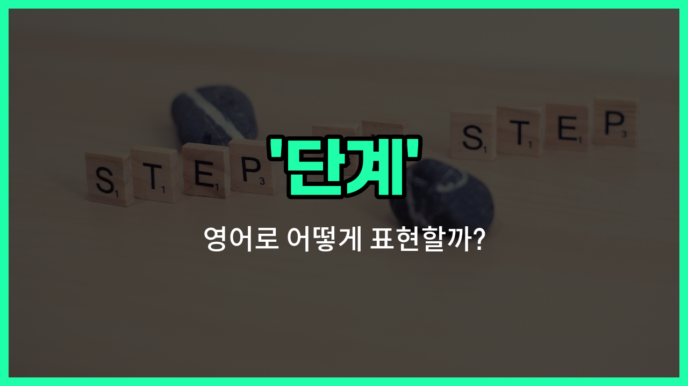

## 🌟 영어 표현 - phase

안녕하세요 👋 오늘은 영어 단어 '**phase**'에 대해 알아보려고 해요. '단계', '국면', '시기'와 같은 의미를 가진 단어인데요, 일이나 사건이 진행되는 **특정 시기나 구분된 부분**을 말할 때 자주 사용돼요.

예를 들어, 프로젝트를 여러 단계로 나눌 때, 또는 인생의 특정 시기를 이야기할 때 자연스럽게 쓸 수 있어요. 'phase'는 변화나 발전이 일어나는 **과정 중의 한 부분**을 강조할 때 특히 유용해요!

예를 들어, "우리는 지금 초기 단계에 있어요."라고 말하고 싶을 때 "We are in the initial phase."라고 표현할 수 있어요.

또한, 'phase'는 과학, 비즈니스, 일상 대화 등 다양한 분야에서 폭넓게 쓰이니 알아두면 정말 도움이 돼요!

## 📖 예문

1. "이 프로젝트는 세 단계로 나뉘어 있어요."

   "This project is divided into three phases."

2. "그는 인생의 새로운 시기에 들어섰어요."

   "He has entered a [new](/blog/in-english/1056.new/) phase of his [life](/blog/in-english/1070.life/)."

## 💬 연습해보기

<ul data-interactive-list>

  <li data-interactive-item>
    우리는 프로젝트 초반이라서 변화가 있을 수 있어요.
    We're <a href="/blog/in-english/254.still/">still</a> in the early phase of the project, so expect some <a href="/blog/in-english/1133.change/">changes</a>.
  </li>

  <li data-interactive-item>
    첫 번째 교육 단계는 기본을 배우는 거예요.
    The first phase of <a href="/blog/in-english/1147.train/">training</a> is all about <a href="/blog/in-english/245.learn/">learning</a> the basics.
  </li>

  <li data-interactive-item>
    계획 단계가 끝나면 개발 단계로 넘어가요.
    After the planning phase, we move on to development.
  </li>

  <li data-interactive-item>
    이 단계에서는 최대한 많은 피드백을 모으는 게 중요해요.
    During this phase, it's <a href="/blog/in-english/318.important/">important</a> to gather as much <a href="/blog/in-english/897.feedback/">feedback</a> as possible.
  </li>

  <li data-interactive-item>
    지금 힘든 단계에 들어섰는데, 일도 많이 늘어날 거예요.
    We're entering a <a href="/blog/in-english/183.tough/">tough</a> phase where the workload really ramps up.
  </li>

  <li data-interactive-item>
    그녀는 학교 간 전환 단계도 잘 처리했어요.
    She <a href="/blog/in-english/1152.handle/">handled</a> the transition phase between <a href="/blog/in-english/1090.school/">schools</a> really well.
  </li>

  <li data-interactive-item>
    이 단계의 작업은 세심한 주의가 필요해요.
    This phase of the operation <a href="/blog/in-english/155.require/">requires</a> careful attention to detail.
  </li>

  <li data-interactive-item>
    테스트 단계는 다음 주에 시작할 거고, 우리는 준비가 되어 있어야 해요.
    The testing phase will begin next <a href="/blog/in-english/1129.week/">week</a>, and we need to be <a href="/blog/in-english/371.prepare/">prepared</a>.
  </li>

  <li data-interactive-item>
    계획의 각 단계는 서로 다른 목표와 도전이 있어요.
    Each phase of the plan has <a href="/blog/in-english/1115.different/">different</a> goals and challenges.
  </li>

  <li data-interactive-item>
    지금 우리는 출시 전 마지막 단계에 있어요, 그래서 모두 바쁘게 움직이고 있어요.
    <a href="/blog/in-english/525.right-now/">Right now</a>, we're in the final phase before launch, so everyone's hands are full.
  </li>

</ul>

## 🤝 함께 알아두면 좋은 표현들

### stage

'[stage](/blog/in-english/1144.stage/)'는 '단계' 또는 '시기'라는 뜻으로, 어떤 과정이나 발전의 특정 시점을 나타낼 때 사용해요. 'phase'와 비슷하게 여러 단계 중 하나를 가리키지만, 좀 더 일반적이고 다양한 상황에서 쓸 수 있어요.

- "The project is currently in the testing stage before the final [release](/blog/in-english/1016.release/)."
- "그 프로젝트는 현재 최종 출시 전에 테스트 단계에 있어요."

### step

'step'은 '단계' 또는 '조치'라는 뜻으로, 어떤 일을 진행하는 데 필요한 개별적인 행동이나 절차를 의미해요. 'phase'보다 더 구체적이고 작은 단위를 나타낼 때 주로 사용해요.

- "We need to complete each step carefully to [ensure](/blog/in-english/356.ensure/) success."
- "우리는 성공을 위해 각 단계를 신중하게 완료해야 해요."

### whole process

'whole [process](/blog/in-english/1140.process/)'는 '전체 과정'이라는 뜻으로, 'phase'가 가리키는 개별 단계와 반대되는 개념이에요. 전체적인 흐름이나 모든 단계를 포함하는 큰 그림을 말할 때 사용해요.

- "Understanding the whole process [helps](/blog/in-english/1084.help/) in managing the project [better](/blog/in-english/1082.better/)."
- "전체 과정을 이해하는 것이 프로젝트를 더 잘 관리하는 데 도움이 돼요."

---

오늘은 '단계', '국면', '시기'라는 뜻을 가진 영어 표현 '**phase**'에 대해 알아봤어요. 앞으로 어떤 일의 진행 과정이나 변화의 시기를 말할 때 이 단어를 떠올려 보세요 😊

오늘 배운 표현과 예문들을 꼭 소리 내서 여러 번 읽어보세요. 다음에도 더 유익한 영어 표현으로 찾아올게요! 감사합니다!

