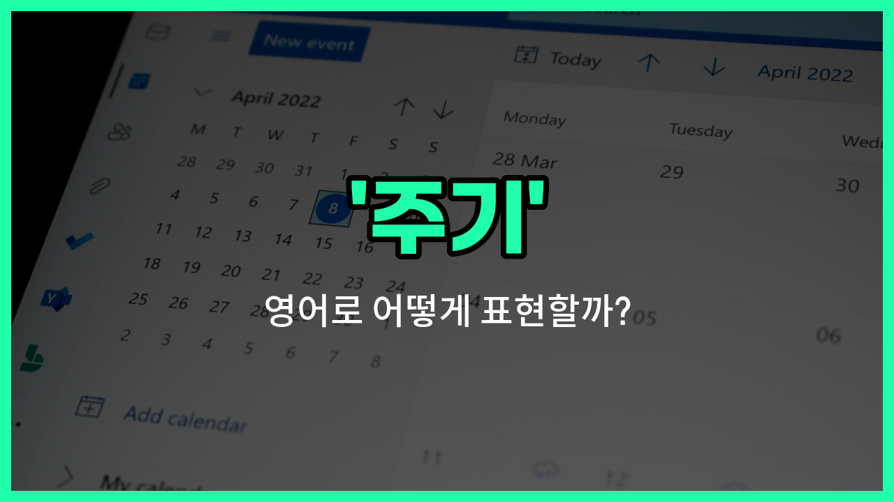

## 🌟 영어 표현 - cycle

안녕하세요 👋 오늘은 '주기', '순환', '반복'이라는 뜻을 가진 영어 표현 '**cycle**'에 대해 알아보려고 해요.

'**cycle**'은 어떤 일이 일정한 간격이나 규칙에 따라 반복되는 현상을 말할 때 사용해요. 예를 들어, 계절이 바뀌는 것처럼 자연스럽게 반복되는 현상이나, 업무에서 반복적으로 일어나는 일들을 표현할 때 쓸 수 있어요.

이 단어는 과학, 경제, 일상생활 등 다양한 분야에서 자주 등장해요. 예를 들어, "[business cycle](/blog/in-english/660.business-cycle/)"은 경기 순환을 의미하고, "sleep cycle"은 수면 주기를 뜻해요. 이렇게 'cycle'은 명사로도, 때로는 동사로도 활용할 수 있어요!

## 📖 예문

1. "계절은 일정한 주기로 반복돼요."

   "The seasons repeat in a regular cycle."

2. "수면 주기를 유지하는 것이 건강에 좋아요."

   "Maintaining a healthy sleep cycle is good for your health."

## 💬 연습해보기

<ul data-interactive-list>

  <li data-interactive-item>
    경제 순환이 종종 일자리 시장에 영향을 미쳐서 고용이 가끔 예측 불가능해져요.
    The economic cycle <a href="/blog/in-english/326.often/">often</a> affects <a href="/blog/in-english/1101.job/">job</a> <a href="/blog/in-english/641.market/">markets</a>, <a href="/blog/in-english/1135.making/">making</a> <a href="/blog/in-english/1161.employment/">employment</a> unpredictable <a href="/blog/in-english/270.sometimes/">sometimes</a>.
  </li>

  <li data-interactive-item>
    4년에 한 번, 선거 시즌이 가까워지면서 정치인들이 캠페인에 더 활발해져요.
    Every four <a href="/blog/in-english/1066.years/">years</a>, the <a href="/blog/in-english/614.election/">election</a> cycle heats up, and politicians become more active in their <a href="/blog/in-english/617.campaign/">campaigns</a>.
  </li>

  <li data-interactive-item>
    매년 봄 증상이 돌아왔다가 사라지는 걸 보면 알레르기 시즌이 시작됐구나 싶어요.
    You can tell it's <a href="/blog/in-english/578.allergy/">allergy</a> season by the cycle of <a href="/blog/in-english/568.symptom/">symptoms</a> that come and go each spring.
  </li>

  <li data-interactive-item>
    계절엔 자연의 순환이 있어서, 겨울은 가을 다음에 오잖아요.
    There's a natural cycle to the seasons, with winter <a href="/blog/in-english/1143.follow/">following</a> fall.
  </li>

  <li data-interactive-item>
    내 생산성에도 주기가 있는 것 같아; 아침에는 더 잘하고 오후가 되면 느려지는 느낌이 들어요.
    I've <a href="/blog/in-english/061.notice/">noticed</a> a cycle in my productivity; I <a href="/blog/in-english/1064.work/">work</a> <a href="/blog/in-english/1082.better/">better</a> in the mornings and slow down by the afternoon.
  </li>

  <li data-interactive-item>
    물의순환이 비가 내리고 다시 구름으로 증발하는 과정을 설명해줘요.
    The water cycle <a href="/blog/in-english/909.explain/">explains</a> how rain falls and then evaporates back into <a href="/blog/in-english/273.cloud/">clouds</a>.
  </li>

  <li data-interactive-item>
    우리의 에너지 요금도 시즌에 맞춰 주기가 있어서, 보통 여름과 겨울에 최고조에 달해요.
    Our energy <a href="/blog/in-english/620.bill/">bills</a> follow a seasonal cycle, usually peaking in summer and winter.
  </li>

  <li data-interactive-item>
    피트니스 전문가들은 동기와 번아웃의 주기가 있는 게 정상이라고 말해요.
    Fitness <a href="/blog/in-english/980.expert/">experts</a> say it's normal <a href="/blog/in-english/450.to-go/">to go</a> through cycles of <a href="/blog/in-english/306.motivation/">motivation</a> and burnout.
  </li>

  <li data-interactive-item>
    달의 주기는 조수에 영향을 미치고, 수 세기 동안 연구돼 왔어요.
    The lunar cycle affects the tides and has been studied for centuries.
  </li>

  <li data-interactive-item>
    모든 사업에는 성장 주기가 있어서, 스타트업에서 성숙기로, 가끔은 감소하기도 해요.
    Every <a href="/blog/in-english/1125.business/">business</a> has a growth cycle, from startup to maturity and sometimes <a href="/blog/in-english/987.decline/">decline</a>.
  </li>

</ul>

## 🤝 함께 알아두면 좋은 표현들

### period (기간)

'period'는 특정한 시간의 구간이나 기간을 의미해요. 'cycle'과 비슷하게 반복되는 시간 단위를 나타낼 때 쓰이지만, 좀 더 일반적이고 넓은 의미로 사용돼요.

- "The project will be completed in a six-month period."
- "그 프로젝트는 6개월 기간 안에 완료될 거예요."

### continuous (연속적인)

'continuous'는 끊임없이 이어지는 상태를 뜻해요. 'cycle'처럼 반복되는 주기와는 반대로, 중단 없이 계속되는 상황을 나타낼 때 사용해요.

- "The machine [operates](/blog/in-english/1162.operate/) in a continuous mode without stopping."
- "그 기계는 멈추지 않고 연속적으로 작동해요."

### interval (간격)

'interval'은 두 사건이나 상태 사이의 시간 간격을 의미해요. 'cycle'이 반복되는 주기를 강조한다면, 'interval'은 그 사이의 시간 차이를 더 구체적으로 나타낼 때 쓰여요.

- "There is a 10-minute interval between each class."
- "각 수업 사이에는 10분 간격이 있어요."

---

오늘은 '주기', '순환', '반복'이라는 뜻을 가진 영어 표현 '**cycle**'에 대해 알아봤어요. 일상에서 반복되는 일이나 규칙적인 현상을 말할 때 이 표현을 떠올려 보세요 😊

오늘 배운 표현과 예문들을 꼭 소리 내서 여러 번 읽어보세요. 다음에도 더 유익한 영어 표현으로 찾아올게요! 감사합니다!

