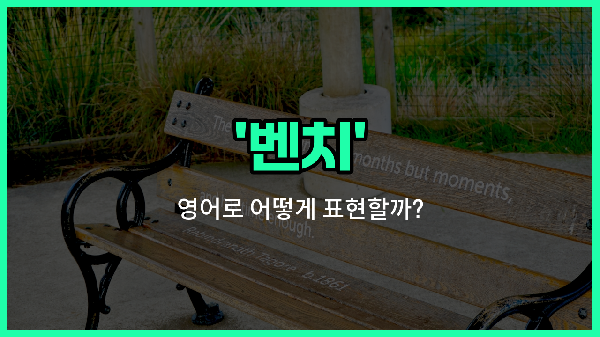

## 🌟 영어 표현 - bench

안녕하세요 👋 오늘은 공원이나 운동장, 또는 길거리에서 자주 볼 수 있는 '벤치'라는 단어의 영어 표현에 대해 알아보려고 해요.

'bench'는 영어로 '긴 의자' 또는 '여러 명이 함께 앉을 수 있는 야외 의자'를 의미해요. 주로 공원, 운동장, 정원 등 야외 공간에 놓여 있는 의자를 떠올리면 이해하기 쉬워요.

이 단어는 일상에서 정말 자주 쓰이는 표현이에요. 예를 들어, 친구와 산책하다가 잠시 쉬고 싶을 때 "[Let](/blog/in-english/1112.let/)'s sit on the bench."라고 말할 수 있어요.

또한, 운동 경기장에서는 선수들이 대기하는 자리도 'bench'라고 부르기도 해요. 그래서 스포츠 뉴스에서 "He is on the bench."라고 하면, 그 선수가 경기에 출전하지 않고 대기 중이라는 뜻이에요.

## 📖 예문

1. "공원에 벤치가 많이 있어요."

   "There are many benches in the [park](/blog/in-english/463.park/)."

2. "잠깐 벤치에 앉아서 쉴까요?"

   "Shall we sit on the bench for a while?"

## 💬 연습해보기

<ul data-interactive-list>

  <li data-interactive-item>
    경기 끝난 후에 우리 모두 벤치에 앉아서 플레이에 대해 이야기했어요.
    After the <a href="/blog/in-english/1087.game/">game</a>, we all just sat on the bench and talked about the <a href="/blog/in-english/1081.play/">plays</a>.
  </li>

  <li data-interactive-item>
    코치가 이번 시즌 벤치에 앉는다고 하셔서 더 열심히 해야 해요.
    The coach told me I'm <a href="/blog/in-english/1127.start/">starting</a> on the bench this season, so I need to <a href="/blog/in-english/1064.work/">work</a> harder.
  </li>

  <li data-interactive-item>
    타임아웃 시간에 선수들이 벤치에 앉아서 숨을 고셨어요.
    During the timeout, the <a href="/blog/in-english/768.player/">players</a> rested on the bench and caught their breath.
  </li>

  <li data-interactive-item>
    그 친구는 마지막 쿼터에 벤치에 앉았어요, 코치가 새로운 전략을 시도하고 싶어서 그랬어요.
    He got benched for the last quarter because the coach <a href="/blog/in-english/1060.want/">wanted</a> to try a <a href="/blog/in-english/1056.new/">new</a> strategy.
  </li>

  <li data-interactive-item>
    제가 어릴 때는 벤치에 앉아 코치가 저를 뛰게 해주길 바랐어요.
    When I was younger, I <a href="/blog/in-english/143.used-to/">used to</a> wait on the bench, hoping the coach would let me play.
  </li>

  <li data-interactive-item>
    벤치는 교체 선수들로 가득 차 있었어요, 모두 자기 차례를 기다리고 있었어요.
    The bench was <a href="/blog/in-english/393.crowded/">crowded</a> with substitute players <a href="/blog/in-english/377.wait-for/">waiting for</a> their turn.
  </li>

  <li data-interactive-item>
    그녀는 스타터들이랑 함께 뛰지 못하고 벤치에 앉아 있어서 너무 실망했어요.
    She was frustrated sitting on the bench <a href="/blog/in-english/169.instead-of/">instead of</a> playing with the starters.
  </li>

  <li data-interactive-item>
    팀의 최고의 수비수가 부상 때문에 벤치에 앉아 있게 되었어요.
    The <a href="/blog/in-english/1099.team/">team</a>'s <a href="/blog/in-english/1073.best/">best</a> defender ended up on the bench after the <a href="/blog/in-english/777.injury/">injury</a>.
  </li>

  <li data-interactive-item>
    공원에서 조용한 벤치를 찾아 앉아서 책을 읽었어요.
    I <a href="/blog/in-english/1094.found/">found</a> a <a href="/blog/in-english/958.quiet/">quiet</a> bench in the park to sit and <a href="/blog/in-english/436.read/">read</a> my <a href="/blog/in-english/447.book/">book</a>.
  </li>

  <li data-interactive-item>
    선수들이 자주 바뀌어서 아무도 벤치에 오래 있지 않았어요.
    They switched players frequently, so nobody stayed on the bench for too <a href="/blog/in-english/1077.long/">long</a>.
  </li>

</ul>

## 🤝 함께 알아두면 좋은 표현들

### substitute (교체 선수)

'substitute'는 경기 중에 원래 뛰고 있던 선수를 대신해 들어가는 선수를 의미해요. 'bench'가 주로 경기에 나가지 않고 대기하는 선수들을 가리킨다면, 'substitute'는 실제로 교체되어 경기에 투입되는 선수를 뜻해요.

- "The coach [decided to](/blog/in-english/062.decide-to/) [bring](/blog/in-english/1139.bring/) in a substitute during the [second](/blog/in-english/1105.second/) half to strengthen the defense."
- "감독님은 후반전에 수비를 강화하기 위해 교체 선수를 투입하기로 결정하셨어요."

### starter (선발 선수)

'starter'는 경기 시작부터 출전하는 주전 선수를 의미해요. 'bench'는 주로 벤치에 앉아 경기를 기다리는 선수들을 뜻하는 반면, 'starter'는 처음부터 경기에 나가는 선수들을 가리켜요.

- "She has been a starter for the team since last season because of her excellent skills."
- "그녀는 뛰어난 실력 덕분에 지난 시즌부터 팀의 선발 선수로 뛰고 있어요."

### play on the field (경기장에서 뛰다)

'play on the field'는 실제로 경기장에 나가서 경기를 하는 것을 의미해요. 'bench'는 경기에 나가지 않고 대기하는 상태를 뜻하는 반면, 이 표현은 적극적으로 경기에 참여하는 것을 나타내요.

- "He was excited to [finally](/blog/in-english/182.finally/) play on the field after sitting on the bench for several games."
- "그는 몇 경기 동안 벤치에 앉아 있다가 드디어 경기장에서 뛸 수 있어서 신이 났어요."

---

오늘은 '벤치', '긴 의자', '야외 의자'라는 뜻을 가진 영어 표현 'bench'에 대해 알아봤어요. 공원이나 운동장에 갈 때 이 표현을 떠올려 보세요 😊

오늘 배운 표현과 예문들을 꼭 최소 3번씩 소리 내서 읽어보세요. 다음에도 더 재미있고 유익한 영어 표현으로 찾아올게요! 감사합니다!

